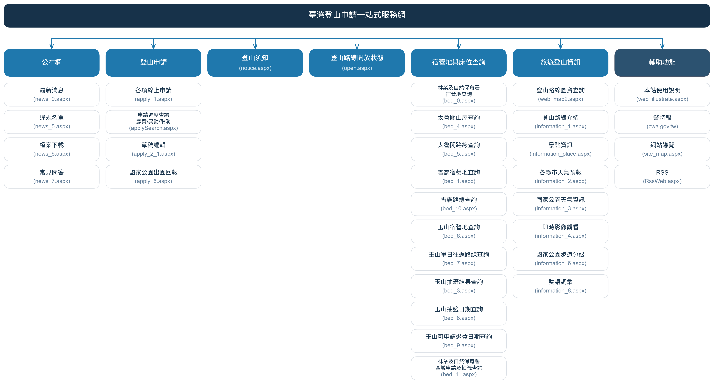
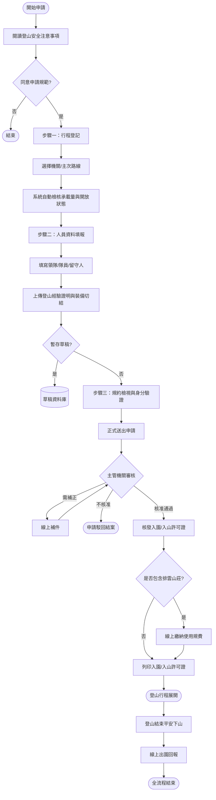

# 系統功能設計說明

> **內容正本**：章節層級文件，不對應單一舊站頁面。
> 內容綜合自舊站整體結構與 `04_Handover/` 的 code 分析（該批標的為**測試機**，見該資料夾 README）。
> **擷取來源／日期**：`[待確認]` —— 撰寫時未記錄；2026-09-16 補溯源欄位時已無法回溯。
> 核對內容一律以正式站 `hike.taiwan.gov.tw` 為準，**不得改用測試站 `service.skyeyes.tw`**（兩站內容會不一致，理由見 `README.md`「溯源慣例」）。

> **業務數值核對狀態**（2026-09-16 對正式站 `hike.taiwan.gov.tw`）
> - ✔ **已核對**：WebGIS「**22 項**跨機關圖層」—— `web_map2.aspx` 的「圖資」面板
>   實際有 22 個可勾選圖層（8 群組）。**註**：其中「底圖」群組 3 項（GoogleMap／
>   開放地圖／臺灣通用電子地圖(含等高線)）是互斥底圖，若只算疊加圖層是 19 項。
> - ✔ **已核對**：步道分級「**0 級至 6 級**」—— `information_6.aspx` 實際為第0～第6級共 7 級。

本文件說明「臺灣登山申請一站式服務網」之整體系統架構、功能模組劃分、外部介接資料源、業務作業流程與跨模組服務。各功能詳細畫面佈局、欄位規則與事件控制項請參閱各對應之規格文件。

---

## 一、系統架構

### （一）核心業務模型
系統整合內政部國家公園署（玉山、雪霸、太魯閣）、農業部林業及自然保育署、內政部警政署等跨機關山域管制申辦管道，提供登山民眾單一申辦入口、跨機關圖資整合、宿營地承載量透明化與山域安全資訊導引。

### （二）外部資料介接來源表

| 介接單位 / 系統 | 介接方式 / 格式 | 提供資訊內容 | 應用功能模組 |
| --- | --- | --- | --- |
| 內政部國家公園署（玉山/雪霸/太管處） | Web Service / API / DB | 步道生態保護區承載量、山屋抽籤名冊、路線開放狀態、規費訂單 | 宿營地床位查詢、線上申請、排雲繳退費 |
| 農業部林業及自然保育署 | API / 檔案介接 | 自然保護區進入承載量、抽籤結果、自然步道山屋營位資料 | 林業署自然保護區與山屋查詢 |
| 內政部警政署 | API 連線介接 | 入山管制區案件狀態、入山許可證核准編號驗證 | 登山申請、申請進度查詢 |
| 交通部中央氣象署 | Open API / JSON | 全臺各縣市一週天氣、國家公園高山氣象觀測站即時觀測資料 | 氣象資訊、各縣市天氣預報 |
| 交通部公路局 | RTSP / HLS 影音串流 | 國家公園聯外公路即時監視影像（CCTV） | 即時影像觀看 |
| 消防署 / 警政署山域事故資料庫 | 資料匯入 / 統計檔 | 近五年山域事故年度、原因、國家公園區域案件統計 | 山域事故統計儀表板 |
| 台灣金融通（土地銀行代收金流） | 金流 API / 虛擬帳號介接 | 信用卡線上刷卡、超商條碼代碼、ATM 轉帳、核銷回傳 | 排雲山莊線上繳費與退費 |

---

## 二、系統功能設計

### （一）公布欄模組
提供登山民眾最新公告、歷史消息、安全宣導、違規停權名冊、公開文件下載與常見問答。

| WBS 功能 | 頁面網址 | 原型檔案 | 功能重點 | 對應規格 |
| --- | --- | --- | --- | --- |
| 最新消息 | `news_0.aspx` `news_0_1.aspx` `news_0_HIS.aspx` | `news_0.html` `news_0_1.html` `news_0_his.html` | 機關篩選、日期區間、關鍵字查詢、置頂公告標籤、歷史消息與 RSS 訂閱；詳情頁支援多附件下載。 | [[01_最新消息\|最新消息]] |
| 違規名單 | `news_5.aspx` | `news_5.html` | 發布單位篩選、日期排序（新→舊／舊→新）；違規名冊展示、姓名去識別隱碼、准駁期間起訖分行。 | [[02_違規名單\|違規名單]] |
| 檔案下載 | `news_6.aspx` | `news_6.html` | 發布單位篩選、檔案名稱模糊搜尋；三欄式清單（單位、名稱、檔案下載），支援多格式（PDF、ODT）下載按鈕。 | [[03_檔案下載\|檔案下載]] |
| 常見問答 | `news_7.aspx` `news_7_1.aspx` | `news_7.html` | 發布單位篩選、查詢條件切換（標題、內容關鍵字、發布類別）；點擊問題以 Modal 彈窗檢視富文字答案。 | [[04_常見問答\|常見問答]] |
| 網站導覽 | `site_map.aspx` | `sitemap.html` | 階層樹呈現全站 7 大主分區、30+ 個子功能入口。 | [[32_網站導覽\|網站導覽]] |
| RSS 訂閱 | `rss.aspx` | `rss.html` | 最新消息與審核公告之標準 RSS 2.0 XML 訂閱服務。 | [[33_RSS訂閱\|RSS訂閱]] |

### （二）登山申請與草稿編輯模組
提供登山民眾跨機關線上申辦、多步驟資料填報、隊員檢核與進度管理。

- 進入申請提示與條款同意：展示最新登山安全宣導，強制閱讀並勾選同意申請規範後方可進入申請表單。詳見 [[07_草稿編輯|草稿編輯]]。
- 草稿編輯與多步驟申請：
  - 步驟一（行程登記）：選擇登山機關、主次路線、預計入出園日期，系統依路線自動檢核承載量與管制狀態。
  - 步驟二（人員填報）：填報領隊、隊員、留守人身分證號、緊急聯絡人、登山經驗佐證文件上傳，支援暫存草稿。
  - 步驟三（規約預覽與送出）：預覽完整隊伍資料，完成身分安全驗證後正式送交審核。
  - 草稿查詢清單：以身分證號與生日查詢未送出之暫存草稿並接續編輯。詳見 [[07_草稿編輯|草稿編輯]]。
- 申請進度查詢與許可證下載：輸入申請編號或領隊身分證號查詢審核狀態（待處理、補件中、已通過、不核准），通過者可直接下載入園許可證及入山許可證 PDF。詳見 [[06a_申請進度查詢與許可證下載|申請進度查詢與許可證下載]]。
- 申請資料異動及取消：提供已送出案件之隊員更換、領隊與隊員互換、縮短行程或整隊取消申請。詳見 [[06d_申請資料異動及取消|申請資料異動及取消]]。
- 國家公園出園回報：提供登山隊伍於完成行程下山後，回報全隊安全出園時間與狀況。詳見 [[08_國家公園出園回報|國家公園出園回報]]。

### （三）排雲山莊規費繳費與退費模組
專供玉山國家公園排雲山莊中籤隊伍進行使用規費繳納、查詢及因故退費作業。

- 線上繳費：支援信用卡即時線上刷卡、產生超商繳費代碼/條碼、ATM 轉帳帳號。詳見 [[06b_線上繳費(排雲)|線上繳費(排雲山莊)]]。
- 線上申請退費：符合天然災害封閉、不可抗力因素或法定退費期限前取消者，線上填寫匯款退款帳戶並上傳存摺影本。詳見 [[06c_線上申請退費(排雲)|線上申請退費(排雲山莊)]]。
- 繳費方式說明：
  - ATM 繳費指引：詳見 [[玉山繳費-ATM繳費說明]]。
  - 超商代碼繳費指引：詳見 [[玉山繳費-超商代碼繳費說明]]。
  - 郵局劃撥繳費指引：詳見 [[玉山繳費-郵局劃撥繳費說明]]。
  - 臨櫃繳費指引：詳見 [[玉山繳費-臨櫃繳費說明]]。

### （四）登山須知模組
提供法規依據、入園入山申辦流程與安全裝備防護指導。

- 登山須知：整合國家公園法、森林法、各國家公園生態保護區申請須知及安全注意事項。詳見 [[09_登山須知|登山須知]]。
- 網站使用說明：提供一站式申辦作業圖文指引與各階段常見操作問題排解。詳見 [[30_本站使用說明|網站使用說明]]。

### （五）登山路線開放狀態模組
提供全國各山域路線之即時管制與現況掌握。

- 登山路線開放狀態：整合國家公園、林業署、警政署路線清單，以徽章呈現各路線「本日開放」、「本日關閉」、「雪季管制」或「附經驗證明」。詳見 [[10_登山路線開放狀態|登山路線開放狀態]]。
- 路線注意事項與管制條件：點擊路線彈窗展示路線詳細注意事項、近期災損整修進度與通行條件。詳見 [[10_登山路線開放狀態|登山路線開放狀態]]。

### （六）宿營地及山屋可申請數量模組
提供各機關山屋床位、露營地營位總額、已核准數、申請中與餘額即時查詢。

- 宿營地及山屋查詢：綜合查詢全臺國家公園與林業署所屬宿營地餘額月曆。詳見 [[11_林業及自然保育署宿營地查詢|宿營地及山屋查詢]]。
- 雪霸宿營地查詢：詳見 [[14_雪霸宿營地查詢|雪霸宿營地查詢]]。
- 太魯閣山屋查詢：詳見 [[12_太魯閣山屋查詢|太魯閣山屋查詢]]。
- 太魯閣路線查詢：詳見 [[13_太魯閣路線查詢|太魯閣路線查詢]]。
- 雪霸路線查詢：詳見 [[15_雪霸路線查詢|雪霸路線查詢]]。
- 玉山宿營地查詢：詳見 [[16_玉山宿營地查詢|玉山宿營地查詢]]。
- 玉山單日往返查詢：排雲山莊單日往返每日名額剩餘狀況查詢。詳見 [[17_玉山單日往返路線查詢|玉山單日往返查詢]]。
- 玉山抽籤結果查詢：查詢玉山各營地山屋抽籤正取與候補名冊。詳見 [[18_玉山抽籤結果查詢|玉山抽籤結果查詢]]。
- 玉山未中籤抽籤日期查詢：查詢未中籤隊伍轉入後續遞補之抽籤期程。詳見 [[玉山未中籤抽籤日期查詢]]。
- 玉山可申請退費日期查詢：查詢各梯次因氣候封山符合全額退費之有效申請期間。詳見 [[20_玉山可申請退費日期查詢|玉山可申請退費日期查詢]]。
- 林業及自然保育署自然保護區與自然步道山屋查詢：包含保護區進入抽籤及山屋營地查詢。詳見 [[21_林業及自然保育署區域申請及抽籤查詢|林業及自然保育署自然保護區域申請及抽籤查詢]]。

### （七）旅遊登山資訊與圖資模組
提供登山行前規劃所需之地圖圖資、氣象、影像與步道分級資訊。

- 登山路線圖資查詢：以 WebGIS 圖台整合 Google Maps 底圖，支援「路線篩選」與「關鍵字搜尋」雙模式，並提供 22 項跨機關圖層疊加（山屋、營地、避難所、水源、步道分級等）及即時線上申辦跳轉。詳見 [[22_登山路線圖資查詢|登山路線圖資查詢]]。
- 登山路線介紹：詳解各百岳及熱門步道路況、建議行程天數、水源分布與等高線剖面圖。詳見 [[23_登山路線介紹|登山路線介紹]]。
- 景點資訊：展示山域代表性地標、動植物生態與解說據點。詳見 [[24_景點資訊|景點資訊]]。
- 各縣市天氣預報：提供全臺 22 縣市一週天氣概況、降雨機率與氣溫走勢。詳見 [[25_各縣市天氣預報|各縣市天氣預報]]。
- 氣象資訊：提供玉山北峰、合歡山、雪山圈谷等高山氣象測站即時觀測數據。詳見 [[26_國家公園天氣資訊|氣象資訊]]。
- 即時影像觀看：提供各大國家公園登山口與高山景觀即時監視器視訊串流。詳見 [[27_即時影像觀看|即時影像觀看]]。
- 國家公園步道分級：展示 0 級至 6 級步道難度評估標準與體能裝備要求。詳見 [[28_國家公園步道分級|國家公園步道分級]]。
- 雙語詞彙：提供登山申請與山域環境常見中英雙語對照詞典。詳見 [[29_雙語詞彙|雙語詞彙]]。
- 山域事故統計儀表板：以互動式長條圖呈現近五年太魯閣、玉山、雪霸之事故原因（迷路、墜谷、高山症、疾病等）、身分類別與年度交叉分析數據。詳見 [[35_山域事故統計儀表板|山域事故統計儀表板]]。

### （八）全域共用服務
- 快捷選單（依據登山經驗建議參考資料）：常駐於全站右側中央之浮動入口，依登山者準備歷程（學習登山者、規劃登山者、申請登山者、前往學習者、完成登山者）劃分 5 大卡片，點擊彈窗引導使用者直達對應系統功能或安全教育資源。詳見 [[36_快捷選單|快捷選單]]。

---

## 三、登山申請核心業務作業流程

---

## 四、功能規格對應總覽表

| 序號 | 功能模組 | 功能名稱 | 頁面網址 / 元件 | 對應規格書 |
| :---: | --- | --- | --- | --- |
| 1 | 公布欄 | 最新消息 | `news.aspx` | [[01_最新消息|最新消息]] |
| 2 | 公布欄 | 違規名單 | `blacklist.aspx` | [[02_違規名單|違規名單]] |
| 3 | 公布欄 | 檔案下載 | `download.aspx` | [[03_檔案下載|檔案下載]] |
| 4 | 公布欄 | 常見問答 | `faq.aspx` | [[04_常見問答|常見問答]] |
| 5 | 公布欄 | 網站導覽 | `sitemap.aspx` | [[32_網站導覽|網站導覽]] |
| 6 | 公布欄 | RSS 訂閱 | `rss.aspx` | [[33_RSS訂閱|RSS訂閱]] |
| 7 | 登山申請 | 線上申請 / 草稿編輯 | `apply_1.aspx`, `apply_2_1.aspx` | [[07_草稿編輯|草稿編輯]] |
| 8 | 登山申請 | 申請進度查詢與許可證下載 | `applySearch.aspx` | [[06a_申請進度查詢與許可證下載|申請進度查詢與許可證下載]] |
| 9 | 登山申請 | 申請資料異動及取消 | `applySearch.aspx` | [[06d_申請資料異動及取消|申請資料異動及取消]] |
| 10 | 登山申請 | 國家公園出園回報 | `apply_6.aspx` | [[08_國家公園出園回報|國家公園出園回報]] |
| 11 | 規費繳退費 | 線上繳費(排雲山莊) | `pay.aspx` | [[06b_線上繳費(排雲)|線上繳費(排雲山莊)]] |
| 12 | 規費繳退費 | 線上申請退費(排雲山莊) | `refund.aspx` | [[06c_線上申請退費(排雲)|線上申請退費(排雲山莊)]] |
| 13 | 規費繳退費 | 玉山繳費說明-ATM繳費 | `pay_atm.aspx` | [[玉山繳費-ATM繳費說明]] |
| 14 | 規費繳退費 | 玉山繳費說明-超商代碼繳費 | `pay_cvs.aspx` | [[玉山繳費-超商代碼繳費說明]] |
| 15 | 規費繳退費 | 玉山繳費說明-郵局劃撥繳費 | `pay_post.aspx` | [[玉山繳費-郵局劃撥繳費說明]] |
| 16 | 規費繳退費 | 玉山繳費說明-臨櫃繳費 | `pay_counter.aspx` | [[玉山繳費-臨櫃繳費說明]] |
| 17 | 登山須知 | 登山須知 | `notice.aspx` | [[09_登山須知|登山須知]] |
| 18 | 登山須知 | 網站使用說明 | `web_illustrate.aspx` | [[30_本站使用說明|網站使用說明]] |
| 19 | 路線開放狀態 | 登山路線開放狀態 | `open.aspx` | [[10_登山路線開放狀態|登山路線開放狀態]] |
| 20 | 宿營地床位 | 宿營地及山屋查詢 | `bed_0.aspx` | [[11_林業及自然保育署宿營地查詢|宿營地及山屋查詢]] |
| 21 | 宿營地床位 | 雪霸宿營地查詢 | `bed_1.aspx` | [[14_雪霸宿營地查詢|雪霸宿營地查詢]] |
| 22 | 宿營地床位 | 太魯閣山屋查詢 | `bed_2.aspx` | [[12_太魯閣山屋查詢|太魯閣山屋查詢]] |
| 23 | 宿營地床位 | 太魯閣路線查詢 | `bed_3.aspx` | [[13_太魯閣路線查詢|太魯閣路線查詢]] |
| 24 | 宿營地床位 | 雪霸路線查詢 | `bed_4.aspx` | [[15_雪霸路線查詢|雪霸路線查詢]] |
| 25 | 宿營地床位 | 玉山宿營地查詢 | `bed_5.aspx` | [[16_玉山宿營地查詢|玉山宿營地查詢]] |
| 26 | 宿營地床位 | 玉山單日往返查詢 | `bed_7.aspx` | [[17_玉山單日往返路線查詢|玉山單日往返查詢]] |
| 27 | 宿營地床位 | 玉山抽籤結果查詢 | `bed_3.aspx` | [[18_玉山抽籤結果查詢|玉山抽籤結果查詢]] |
| 28 | 宿營地床位 | 玉山未中籤抽籤日期查詢 | `bed_6_1.aspx` | [[玉山未中籤抽籤日期查詢]] |
| 29 | 宿營地床位 | 玉山可申請退費日期查詢 | `bed_8.aspx` | [[20_玉山可申請退費日期查詢|玉山可申請退費日期查詢]] |
| 30 | 宿營地床位 | 林業署自然保護區域申請及抽籤 | `bed_forestry.aspx` | [[21_林業及自然保育署區域申請及抽籤查詢|林業及自然保育署自然保護區域申請及抽籤查詢]] |
| 31 | 旅遊登山資訊 | 登山路線圖資查詢 | `web_map2.aspx` | [[22_登山路線圖資查詢|登山路線圖資查詢]] |
| 32 | 旅遊登山資訊 | 登山路線介紹 | `information_1.aspx` | [[23_登山路線介紹|登山路線介紹]] |
| 33 | 旅遊登山資訊 | 景點資訊 | `information_place.aspx` | [[24_景點資訊|景點資訊]] |
| 34 | 旅遊登山資訊 | 各縣市天氣預報 | `information_2.aspx` | [[25_各縣市天氣預報|各縣市天氣預報]] |
| 35 | 旅遊登山資訊 | 氣象資訊 | `information_3.aspx` | [[26_國家公園天氣資訊|氣象資訊]] |
| 36 | 旅遊登山資訊 | 即時影像觀看 | `information_4.aspx` | [[27_即時影像觀看|即時影像觀看]] |
| 37 | 旅遊登山資訊 | 國家公園步道分級 | `information_6.aspx` | [[28_國家公園步道分級|國家公園步道分級]] |
| 38 | 旅遊登山資訊 | 雙語詞彙 | `information_7.aspx` | [[29_雙語詞彙|雙語詞彙]] |
| 39 | 旅遊登山資訊 | 山域事故統計儀表板 | `MountainDashboard.aspx` | [[35_山域事故統計儀表板|山域事故統計儀表板]] |
| 40 | 全域共用服務 | 快捷選單(依據登山經驗建議參考資料) | `#search_modal` | [[36_快捷選單|快捷選單]] |
