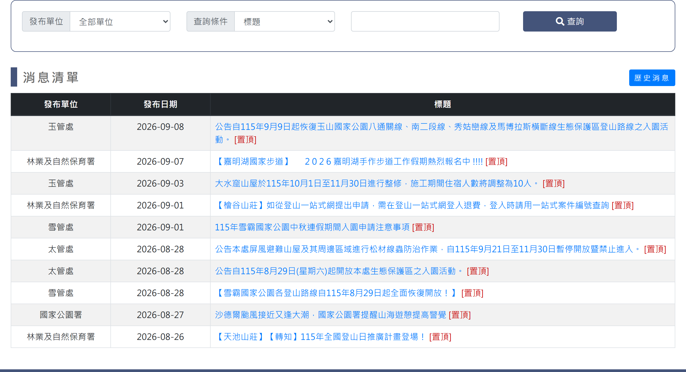
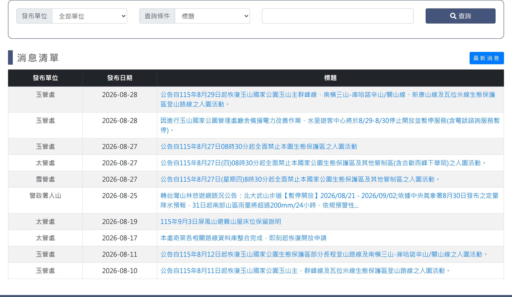
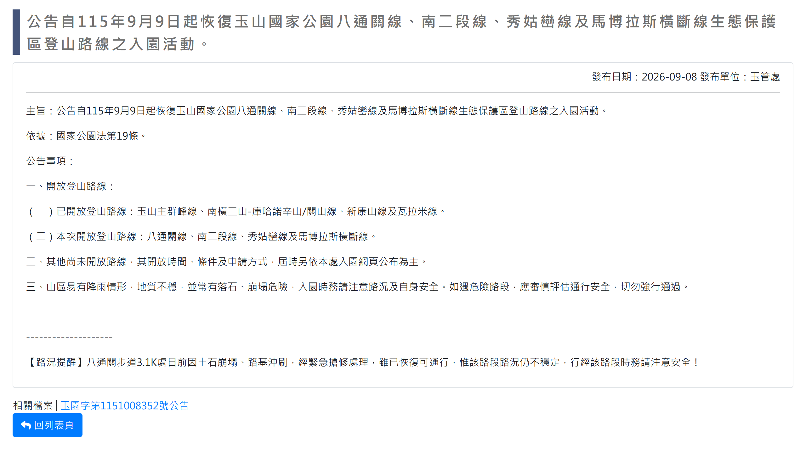

# 最新消息

> **內容正本**：正式站 `https://hike.taiwan.gov.tw/news_0.aspx`（2026-09-16 實測 HTTP 200）。
> **擷取來源／日期**：`[待確認]` —— 撰寫時未記錄；2026-09-16 補溯源欄位時已無法回溯。
> 核對內容一律以正式站 `hike.taiwan.gov.tw` 為準，**不得改用測試站 `service.skyeyes.tw`**（兩站內容會不一致，理由見 `README.md`「溯源慣例」）。

## 一、最新消息-列表頁

> 功能路徑：首頁 > 公布欄 > 最新消息  
> 頁面網址：news_0.aspx

- RSS訂閱：連結，點擊後開啟 RSS 頁面（`rss.aspx`）。
- 查詢條件
  - 發布單位：下拉選單，選項為全部單位、林業及自然保育署、內政部國家公園署、太魯閣國家公園管理處、玉山國家公園管理處、雪霸國家公園管理處、警政署入山，預設為全部單位。
  - 查詢條件：下拉選單，選項為標題、內容關鍵字、發布日期，預設為標題。
  - 關鍵字：文字輸入框，依選取之查詢條件進行模糊查詢；查詢條件為「標題」或「內容關鍵字」時顯示。
  - 發布日期：起訖日期選擇器，起訖區間判斷（起日 <= 發布日期 <= 訖日）；查詢條件為「發布日期」時顯示。
  - 查詢：按鈕，點擊後依設定條件篩選並重新載入列表。
- 消息清單
  - 歷史消息：按鈕，點擊後導向歷史消息列表頁。
  - 列表：
    - 欄位：發布單位、發布日期、標題。
    - 排序：置頂消息優先排於最前，同為置頂時依發布日期降冪排序。
    - 標題：連結，點擊後導向檢視頁；置頂消息於標題後方附加 [置頂] 標記。

---

## 二、最新消息-檢視頁

> 功能路徑：首頁 > 公布欄 > 最新消息 > 消息內容  
> 頁面網址：news_0_1.aspx?id={消息ID}

- 頁面內容
  - 消息標題：純文字。
  - 發布日期、發布單位：純文字，靠右顯示。
  - 消息內容：富文字 HTML。
- 回列表頁：按鈕，點擊後返回最新消息列表頁。

---

## 三、歷史消息-列表頁

> 功能路徑：首頁 > 公布欄 > 歷史消息  
> 頁面網址：news_0_HIS.aspx

- 非發布期間（發布區間以外）之消息。
- 除無 RSS 訂閱連結外，其他同最新消息-列表頁。

---

## 四、歷史消息-檢視頁

> 功能路徑：首頁 > 公布欄 > 歷史消息 > 消息內容  
> 頁面網址：news_0_1.aspx?id={消息ID}

同最新消息-檢視頁。

---

## 內部註記

- 舊系統技術架構：ASP.NET WebForms（`.aspx`）。
- 控制項識別碼：
  - 發布單位下拉選單：`ctl00$con$ddlOrg`（`#con_ddlOrg`）。
  - 查詢條件下拉選單：`ctl00$con$ddlCon`（`#con_ddlCon`；值 A＝標題、B＝內容關鍵字、C＝發布日期）。
  - 關鍵字容器：`#con_keycontrol`（文字框 `ctl00$con$keyword` / `#con_keyword`）。
  - 日期區間容器：起日 `#con_datecontrol`（`ctl00$con$sdate$txtDate`）、訖日 `#con_datecontrol2`（`ctl00$con$edate$txtDate`）。
  - 查詢按鈕：`ctl00$con$btnQry`（`#con_btnQry`，觸發 `__doPostBack`）。
  - 歷史消息按鈕：超連結按鈕導向 `news_0_HIS.aspx`。
  - RSS 連結：`#con_hlRss`（`rss.aspx`）。
  - 下一頁：`#con_lnkNext`。
- 前端動態切換腳本：
  - 透過前端函式 `closep(ok)` 切換：`ok == "1"` 顯示日期區間並隱藏關鍵字框；`ok != "1"` 顯示關鍵字框並隱藏日期區間。
