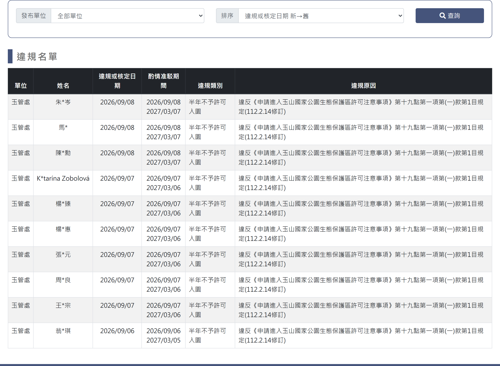

# 違規名單

## 一、列表頁

> 功能路徑：首頁 > 公布欄 > 違規名單  
> 頁面網址：news_5.aspx

- 查詢條件
  - 發布單位：下拉選單，選項為全部單位、林業及自然保育署、太魯閣國家公園管理處、玉山國家公園管理處、雪霸國家公園管理處、警政署入山，預設為全部單位。
  - 排序：下拉選單，選項為違規或核定日期 新→舊、違規或核定日期 舊→新，預設為違規或核定日期 新→舊。
  - 查詢：按鈕，點擊後依設定條件篩選並重新載入列表。
- 違規名單
  - 列表：
    - 欄位：單位、姓名、違規或核定日期、酌情准駁期間、違規類別、違規原因。
    - 排序：依「排序」選單設定排序。
    - 姓名：第二字元以「*」遮罩。
    - 酌情准駁期間：起日與訖日分行顯示。

---

## 內部註記

- 舊系統技術架構：ASP.NET WebForms（`.aspx`）。
- 控制項識別碼：
  - 發布單位下拉選單：`ctl00$con$ddlOrg`（`#con_ddlOrg`）。
  - 排序下拉選單：`ctl00$con$ddlCon`（`#con_ddlCon`；值 DESC＝新→舊、ASC＝舊→新）。
  - 查詢按鈕：`ctl00$con$btnQry`（`#con_btnQry`，觸發 `__doPostBack`）。
- 資料呈現與個資規範：
  - 本功能為純列表唯讀展示，無跳轉檢視頁。
  - 姓名欄位依個資保護要求進行去識別化隱碼處理。
