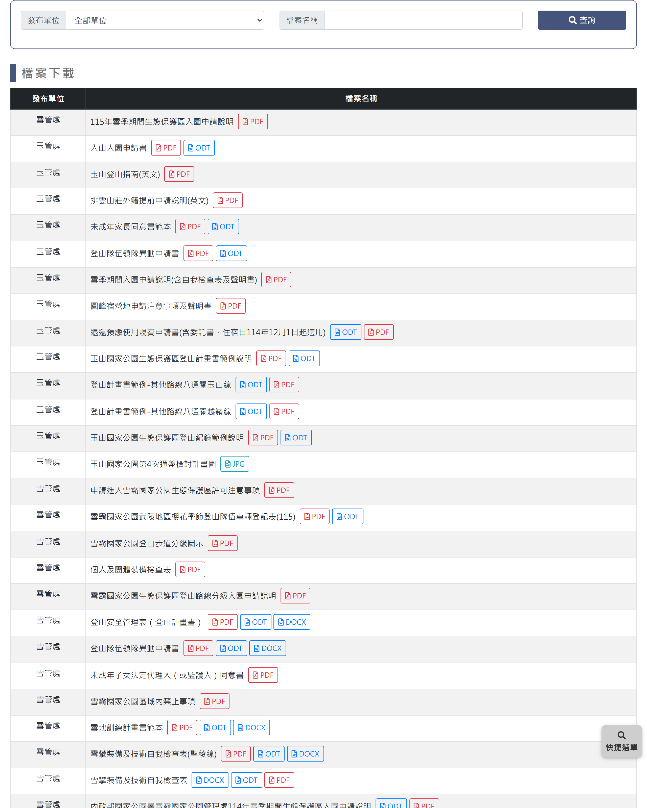

# 檔案下載

> **內容正本**：正式站 `https://hike.taiwan.gov.tw/news_6.aspx`（2026-09-16 實測 HTTP 200）。
> **擷取來源／日期**：`[待確認]` —— 撰寫時未記錄；2026-09-16 補溯源欄位時已無法回溯。
> 核對內容一律以正式站 `hike.taiwan.gov.tw` 為準，**不得改用測試站 `service.skyeyes.tw`**（兩站內容會不一致，理由見 `README.md`「溯源慣例」）。

## 一、列表頁

> 功能路徑：首頁 > 公布欄 > 檔案下載  
> 頁面網址：news_6.aspx

- 查詢條件
  - 發布單位：下拉選單，選項為全部單位、太魯閣國家公園管理處、玉山國家公園管理處、雪霸國家公園管理處、警政署入山，預設為全部單位。
  - 檔案名稱：文字輸入框，模糊查詢檔案名稱。
  - 查詢：按鈕，點擊後依設定條件篩選並重新載入列表。
- 檔案清單
  - 列表：
    - 欄位：發布單位、檔案名稱、檔案下載。
    - 檔案名稱：字重 500，字級 16px。
    - 檔案下載：獨立欄位，依提供之格式並列下載按鈕（如 PDF、ODT，搭配框線檔案圖示），點擊後下載或開啟對應檔案。

---

## 內部註記

- 舊系統技術架構：ASP.NET WebForms（`.aspx`）。
- 控制項識別碼：
  - 發布單位下拉選單：`ctl00$con$ddlOrg`（`#con_ddlOrg`）。
  - 檔案名稱輸入框：`ctl00$con$keyword`（`#con_keyword`）。
  - 查詢按鈕：`ctl00$con$btnQry`（`#con_btnQry`，觸發 `__doPostBack`）。
- 資料呈現與檔案格式：
  - 本功能為純列表唯讀展示，無跳轉檢視頁。
  - 單一項目支援多檔案格式同時提供下載（如 PDF、ODT）。
