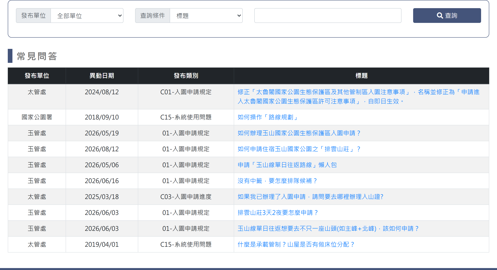
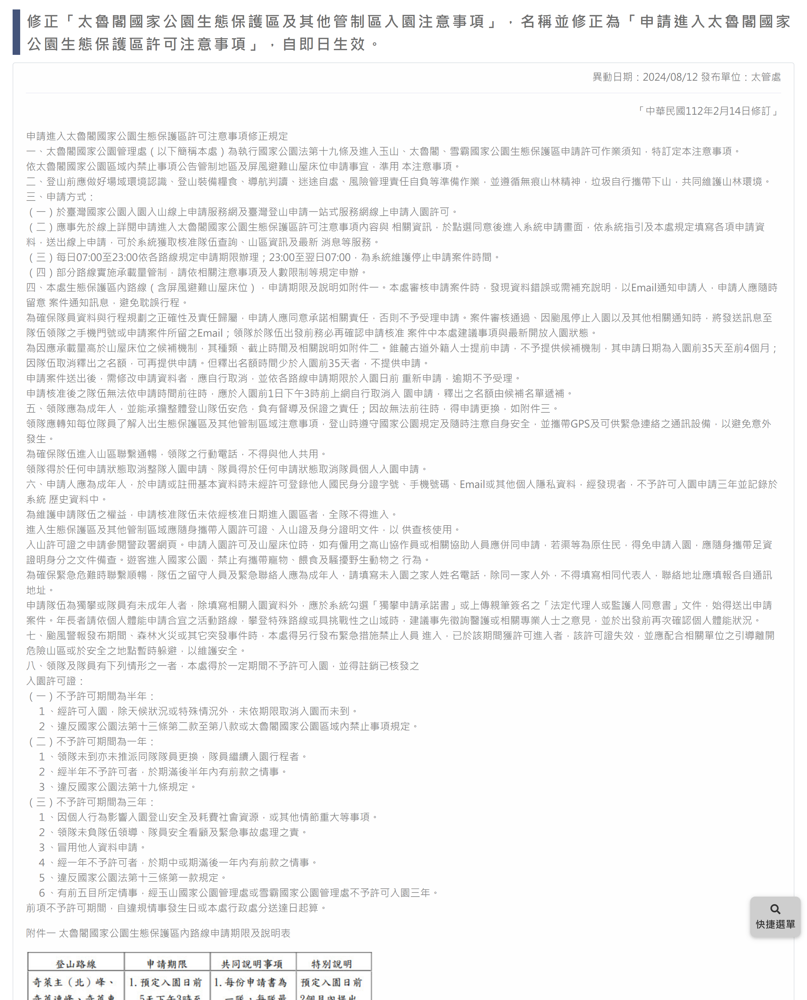

# 常見問答

> **內容正本**：正式站 `https://hike.taiwan.gov.tw/news_7.aspx`（2026-09-16 實測 HTTP 200）。
> **擷取來源／日期**：`[待確認]` —— 撰寫時未記錄；2026-09-16 補溯源欄位時已無法回溯。
> 核對內容一律以正式站 `hike.taiwan.gov.tw` 為準，**不得改用測試站 `service.skyeyes.tw`**（兩站內容會不一致，理由見 `README.md`「溯源慣例」）。

## 一、列表頁

> 功能路徑：首頁 > 公布欄 > 常見問答  
> 頁面網址：news_7.aspx

- 查詢條件
  - 發布單位：下拉選單，選項為全部單位、林業及自然保育署、內政部國家公園署、太魯閣國家公園管理處、玉山國家公園管理處、雪霸國家公園管理處、警政署入山，預設為全部單位。
  - 查詢條件：下拉選單，選項為標題、內容關鍵字、發布類別，預設為標題。
  - 關鍵字：文字輸入框，依選取之查詢條件進行模糊查詢。
  - 查詢：按鈕，點擊後依設定條件篩選並重新載入列表。
- 常見問答
  - 列表：
    - 欄位：發布單位、異動日期、發布類別、標題。
    - 標題：連結，字重 500，字級 16px，點擊後以互動 Modal 彈窗或導向檢視頁展示內容。

---

## 二、檢視內容（Modal 彈窗 / 檢視頁）

> 功能路徑：首頁 > 公布欄 > 常見問答 > 常見問答內容  
> 頁面網址：news_7_1.aspx?ID={問答ID}（原型以 Modal 彈窗呈現於 `news_7.html`）

- 頁面／彈窗內容
  - 標題：純文字。
  - 發布單位、異動日期：純文字 meta 資訊（`發布單位：{單位} | 異動日期：{日期}`）。
  - 問答內容：富文字 HTML。
- 關閉／回列表：按鈕，點擊後關閉彈窗或返回列表頁。

---

## 內部註記

- 舊系統技術架構：ASP.NET WebForms（`.aspx`）。
- 控制項識別碼：
  - 發布單位下拉選單：`ctl00$con$ddlOrg`（`#con_ddlOrg`）。
  - 查詢條件下拉選單：`ctl00$con$ddlCon`（`#con_ddlCon`；值 A＝標題、B＝內容關鍵字、C＝發布類別）。
  - 關鍵字輸入框：`ctl00$con$keyword`（`#con_keyword`）。
  - 查詢按鈕：`ctl00$con$btnQry`（`#con_btnQry`，觸發 `__doPostBack`）。
  - 回列表頁按鈕：`#con_hlNews_4`。
