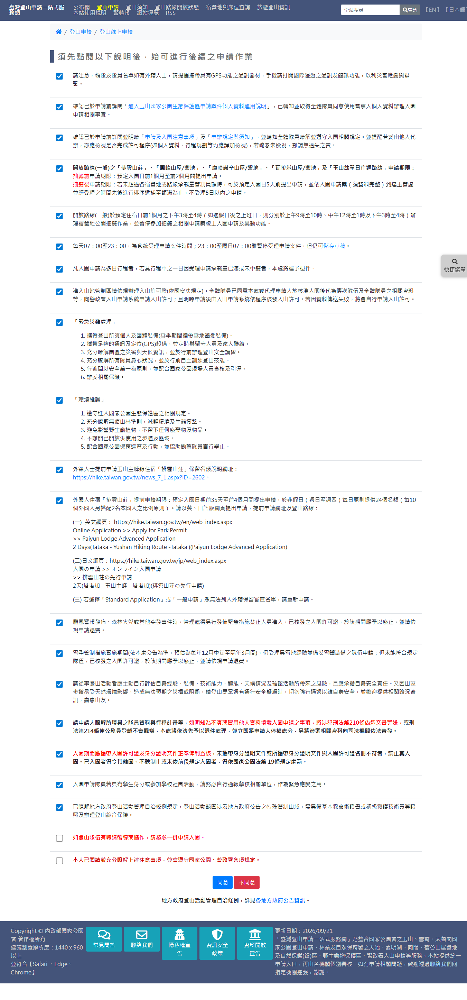
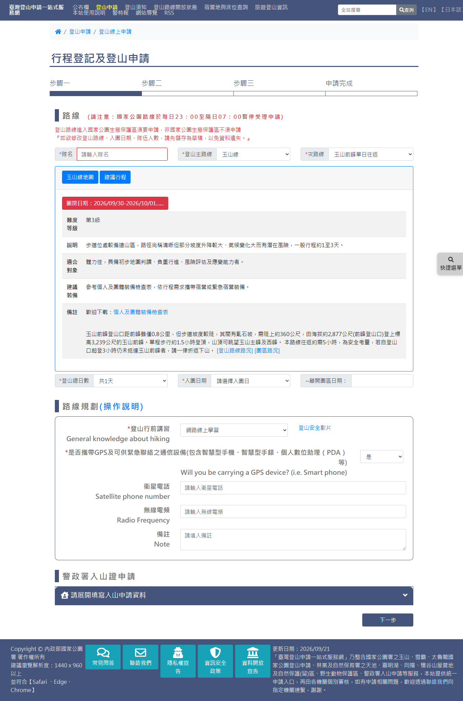
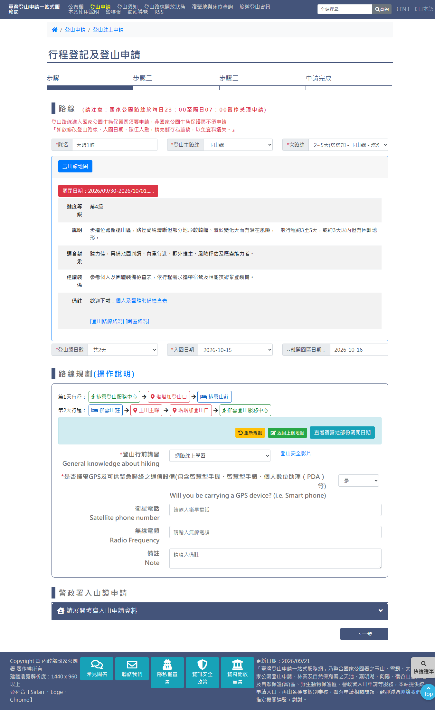
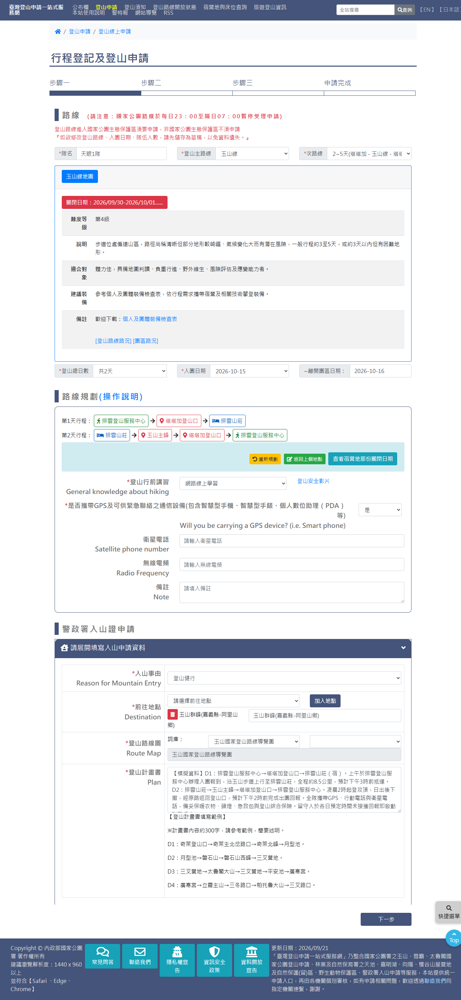
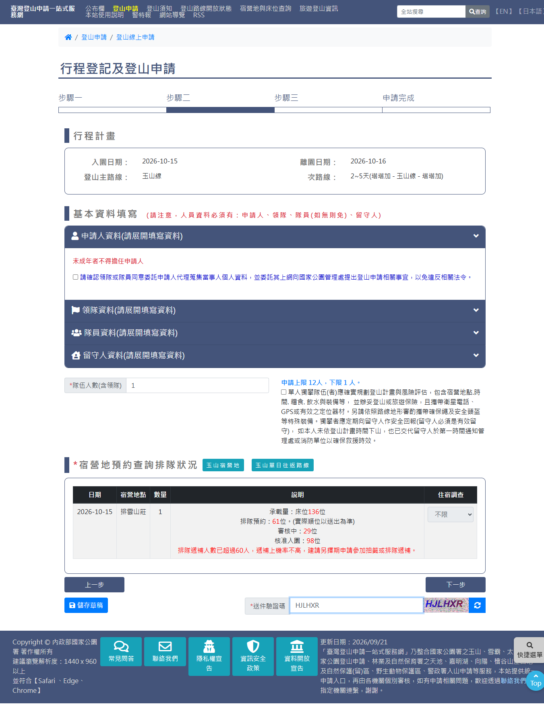
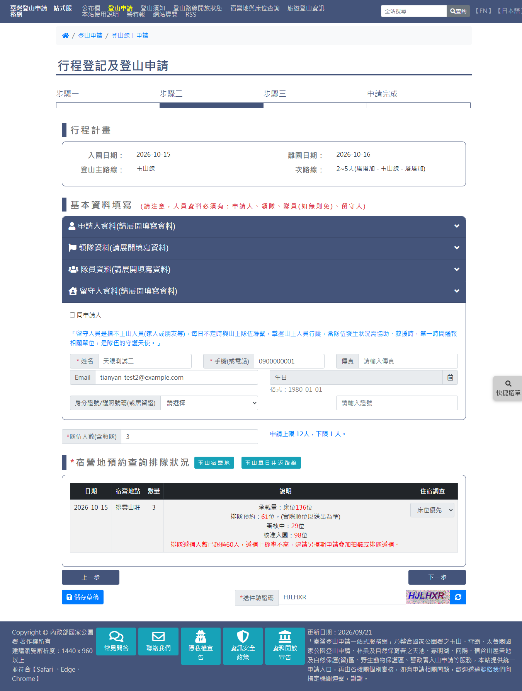
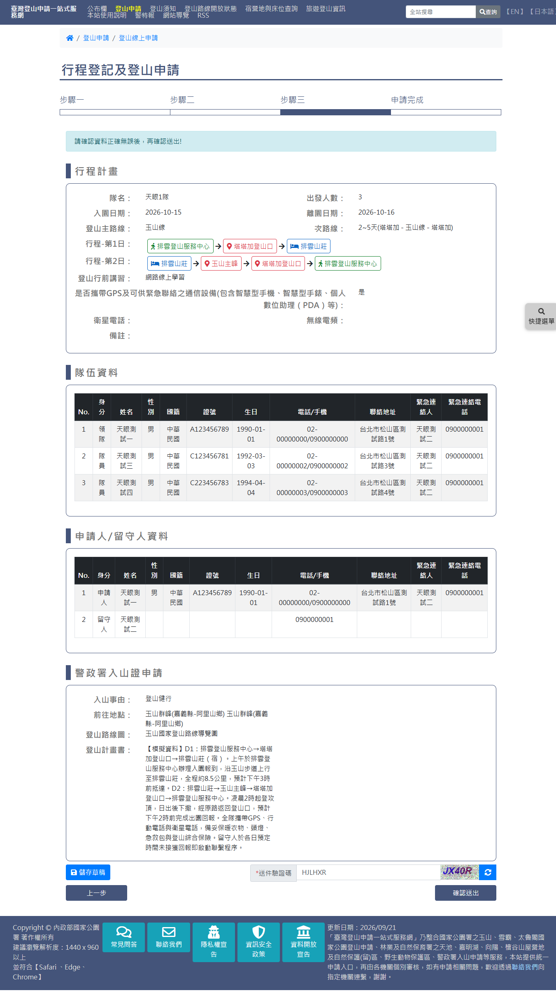

# 國家公園入園線上申請（玉山國家公園）

> **內容正本**：正式站 `https://hike.taiwan.gov.tw/apply_1_2.aspx`（同意書）與
> `apply_1_4.aspx`（三步驟申請表），2026-09-21 實測 HTTP 200。
> **擷取來源／日期**：2026-09-21 由正式站實走擷取，全程未按「確認送出」。
> 走的路線：`unit=c951cdcd-b75a-46b9-8002-8ef952ec95fd`，
> 前峰線（`cid=3&fid=1`，單日往返）與 2~5 天玉山線（`cid=2&fid=1`）各一輪。
> 核對內容一律以正式站 `hike.taiwan.gov.tw` 為準，
> **不得改用測試站 `service.skyeyes.tw`**（兩站內容不一致，理由見 `README.md`「溯源慣例」）。

> **本檔隸屬 `05_各項線上申請`**（該母檔尚未撰寫）。
> `05a` 記錄玉山管理處這一條申請線的實走結果；雪霸（`apply_1_3.aspx`）與
> 太魯閣（`apply_1_5.aspx`）是平行的機關分支，各自另立檔案。
> **`1_N` 是機關分支，不是步驟序號**（見 `README.md:209`）。

> **業務數值核對狀態**（2026-09-21 對正式站）
> - ✔ 已核對：同意書 21 條、預設勾選 19 條、隊伍人數上限 12 下限 1、
>   入園日期 56 個可選（已排除關閉日）、排雲山莊承載量床位 136
> - `[待確認]` 各主路線底下的次路線清單：只擷取了玉山線（`fId=1`）的 3 條，
>   其餘 10 個主路線未逐一切換擷取
> - `[待確認]` 「最後一天行程的點必須為登山口」的實際判定範圍：
>   實測塔塔加登山口**不被接受**、必須是排雲登山服務中心，
>   與 alert 文字不符，尚不確定哪些點算「登山口」

---

## 一、流程總覽

正式站的流程是四頁、六個步驟：

| 步驟 | 頁面 | 說明 |
|---|---|---|
| 1 選擇路線 | `apply_1.aspx` | 選機關與路線 |
| 2 閱讀同意書 | `apply_1_2.aspx` | 逐條確認，21 條 |
| 3 行程規劃 | `apply_1_4.aspx` 步驟一 | 路線、日期、路線規劃、講習、入山證 |
| 4 人員資料 | `apply_1_4.aspx` 步驟二 | 申請人／領隊／隊員／留守人、宿營地 |
| 5 確認資料 | `apply_1_4.aspx` 步驟三 | 唯讀彙整 + 送件驗證碼 |
| 6 申請完成 | — | 未走到（不送出） |

步驟 3~5 在同一頁 `apply_1_4.aspx` 內切換，**網址不變**。

---

## 二、步驟 2：閱讀同意書（`apply_1_2.aspx`）



- 21 個 checkbox：20 條個別條款 + 1 條總括。
- **預設勾選 19 條**；未勾的是最後兩條：
  - 「如登山隊伍有聘請嚮導或協作，請務必一併申請入園。」
  - 「本人已閱讀並充分瞭解上述注意事項，並會遵守國家公園、警政署各項規定。」（紅字粗體）
- 條文含 `<ol>` 編號清單（第 9 條「緊急災難處理」6 項、第 10 條「環境維護」5 項）
  與多個外部連結，**富文本由機關後台維護**。
- 按鈕：`con_btnagree`「同意」／`con_btndisagree`「不同意」（紅色）。
- **按鈕下方另有附註**（不在 checkbox 清單內）：
  「地方政府登山活動管理自治條例，詳見[各地方政府公告資訊](notice.aspx)。」

> **與測試站的差異**：測試站 20 條，第一條是已廢止的 COVID-19 防疫條款，
> 另有「登山健行活動防疫自主檢核表」；正式站兩條皆已移除。
> 雛形原本的資料來自測試站 dump（19 條），2026-09-21 已依正式站重建。

---

## 三、步驟 3：行程規劃（`apply_1_4.aspx` 步驟一）



### 3.1 欄位（18 個控制項）

| 控制項 | 型別 | 必填 | 說明 |
|---|---|---|---|
| `teams_name` | text | ✔ | 隊名。離開欄位時 postback（伺服器端檢查） |
| `climblinemain` | select | ✔ | 登山主路線，11 項 |
| `climbline` | select | ✔ | 次路線，**依主路線連動** |
| `sumday` | select | ✔ | 登山總日數，**依次路線連動** |
| `applystart` | select | ✔ | 入園日期，**依天數連動**，且排除關閉日 |
| — | 唯讀 | | 離開園區日期（入園日 + 天數 − 1） |
| `seminar` | select | ✔ | 登山行前講習：網路線上學習／團體自行辦理講習 |
| `gps` | select | ✔ | 是否攜帶 GPS 及緊急聯絡通信設備 |
| `satellitephone` | text | | 衛星電話 |
| `frequency` | text | | 無線電頻 |
| `note_user` | textarea | | 備註 |
| `NpaReasons` | select | ✔ | 入山事由，26 項 |
| `NpaPlacesInfo` | select | ✔ | 前往地點，**依路線篩選並預先帶入** |
| `AddNpaPlacesInfo` | submit | | 加入地點 |
| `lisNpaPlacesList_desc_N` | text | | 已加入的地點清單，可刪除 |
| `NpaPaths` | select | | 登山路線圖詞庫，8 項 |
| `RouteMap_V` | text | 唯讀 | 選定的路線圖 |
| `NpaPlan` | textarea | ✔ | 登山計畫書，約 300 字，附填寫範例 |

`NpaReasons` 之後的欄位歸在「警政署入山證申請」區塊。

### 3.2 連動關係（實測）

次路線一變，下方**四處同時重繪**：

| 元件 | 單日往返 | 2~5 天 |
|---|---|---|
| `sumday` | 只有「共1天」 | 共 2／3／4／5 天 |
| `NpaPlacesInfo` | 3 個點（玉山前峰／西峰／達芬尖山） | 1 個點（玉山群峰） |
| `desc_N` 已帶入地點 | 3 筆 | 1 筆 |
| `applystart` | 56 個可選日 | **整個下拉消失**，需先選天數才重算 |

也就是**天數 → 入園日是第二層連動**；單日往返因天數固定為 1，載入即有日期。

### 3.3 入園日期排除關閉日

正式站 **56 個**可選日期，**排除 2026-09-30、10-01**
（頁面標示「關閉日期：2026/09/30-2026/10/01」）。
測試站同一路線是 58 個、無排除——**入園日不是連續日期清單**。

### 3.4 路線規劃



**單日往返與多日行為不同**：

- **單日往返**：系統自動帶入完整行程，不必手選
  （排雲登山服務中心 → 塔塔加登山口 → 玉山前峰 → 塔塔加登山口 → 排雲登山服務中心）
- **多日**：「請選擇起點」逐點手選，每選一個點就重算下一批可選節點

多日的規則（實測，含 alert 原文）：

1. **每天的行程必須結束在宿營地**，否則按「完成路線」跳
   **「只有宿營地才能完成今日路線」**
2. **最後一天必須結束在「排雲登山服務中心」**，停在塔塔加登山口會跳
   **「最後一天行程的點必須為登山口」**
   `[待確認]` 訊息文字與實際判定不一致
3. 按「完成路線」後才進入下一天；達最大天數後該按鈕消失
4. 節點清單**每次重新計算且順序會變**，不可用固定索引

按鈕：`btnreset` 重新規劃／`btnBackNode` 返回上個地點／`btnover` 完成路線／
`stopdate` 查看宿營地部份關閉日期



---

## 四、步驟 4：人員資料（`apply_1_4.aspx` 步驟二）



### 4.1 版面結構

由上而下：行程計畫摘要（唯讀）→ 四個人員區塊（手風琴）→ 隊伍人數 →
單人獨攀勾選 → 宿營地預約查詢排隊狀況 → 上一步／下一步／儲存草稿 → 送件驗證碼。

**手風琴收合時欄位不在 DOM**：空白狀態 27 個控制項，
展開申請人並新增 2 位隊員後變 66 個。

### 4.2 四個人員區塊的欄位差異

| 角色 | 欄位數 | 特點 |
|---|---|---|
| 申請人 | 13 | **需先勾「委託同意」`applycheck` 才渲染**；「未成年者不得擔任申請人」 |
| 領隊 | 12 | 有「**同申請人**」`copyapply` 一鍵帶入；無「是否為學生」 |
| 隊員 | 13／人 | **逐筆新增**（`lbInsMember`），不是輸入人數自動產生 |
| 留守人 | 7 | **只有姓名與手機必填**；無地址、無緊急聯絡人、無性別 |

隊員欄位 id 格式：`lisMem_member_<欄位>_<索引>`。
隊員區塊所有下拉共用 `lbCom` 作為 postback target
（`member_nation`／`ddlmember_country` 的 onchange 皆設 `#hCom` 後 `__doPostBack('lbCom')`）。

生日欄位是 **readonly 的 jQuery datepicker**。

隊員區的業務規則（畫面文字，**前端未檢核、由審核人工處理**）：
「請填個人手機號碼(勿共用)，隊員如非同住家人，e-mail、地址、緊急聯絡人請勿重複，
如填寫資料重複會請申請人修改，耽誤您等候審核時間」

### 4.3 人數與單人獨攀

- 隊伍人數**唯讀**，跟著隊員數走（領隊 1 + 隊員 N）
- **申請上限 12 人、下限 1 人**
- **1 人時**出現「單人獨攀」勾選 `cbOneMan`，未勾則按下一步被 alert 擋下：
  **「請勾選單人獨攀注意事項」**
- **2 人以上時 `cbOneMan` 整個從 DOM 消失**

### 4.4 宿營地預約查詢排隊狀況

欄位：日期／宿營地點／數量／說明／住宿調查

實測內容（排雲山莊 2026-10-15）：

```
承載量：床位136位
排隊預約：61位。(實際順位以送出為準)
審核中：29位
核准入園：98位
排隊遞補人數已超過60人，遞補上機率不高，建請另擇期申請參加抽籤或排隊遞補。
```

最後那句**警示只在超過 60 人時出現**。
「住宿調查」是下拉 `lisText_bedorcamp_N`：不限／床位優先／營位優先。
單日往返也有這張表，但顯示的是當日承載量排隊狀態，沒有床位。



---

## 五、步驟 5：確認資料（`apply_1_4.aspx` 步驟三）



唯讀彙整頁，只有一個可編輯欄位（送件驗證碼）。組成：

| 區塊 | 內容 |
|---|---|
| 行程計畫 | 隊名、出發人數、入園／離園日、主路線／次路線、**逐日行程**、講習、GPS、衛星電話、無線電頻、備註 |
| 隊伍資料 | 11 欄表格：No./身分/姓名/性別/國籍/證號/生日/電話-手機/聯絡地址/緊急聯絡人/緊急聯絡電話（領隊 + 隊員） |
| 申請人／留守人資料 | 同 11 欄，**另成一張表**；留守人只有姓名與手機，其餘空白 |
| 警政署入山證 | 入山事由、前往地點、登山路線圖、登山計畫書 |
| 底部 | 儲存草稿 `btnbak`、送件驗證碼、上一步、**確認送出 `btnsave`** |

`[待確認]` 確認頁的「前往地點」顯示了兩次相同內容
（「玉山群峰(嘉義縣-阿里山鄉) 玉山群峰(嘉義縣-阿里山鄉)」），疑為重複渲染。

---

## 六、與雛形的落差

| 項目 | 正式站 | 雛形 | 狀態 |
|---|---|---|---|
| 同意書條數 | 21 | 原 19（測試站 dump） | **2026-09-21 已修**，重建為 21 條 |
| 預設勾選 | 19 | 原 15 | **已修** |
| 按鈕文案 | 同意／不同意 | 原「上一步／下一步」 | **已修** |
| 步驟條 | 六步 | 原四步 | **已修**（`apply-2` 的 stepper） |
| 步驟 3~5 的頁面 | `apply_1_4.aspx` | `apply-3-v2.html` 建置中；`apply-4`、`apply-5` 未建 | 進行中 |
| 入園日排除關閉日 | 有 | `[待確認]` | 待實作 |
| 路線規劃的三條規則 | 有 | `apply-3-v2` 已實作 | 待接線 |
| 單人獨攀分支 | 有 | 未實作 | 待實作 |

---

## 七、證據位置

- 擷取檔：`.scratch/outputs/正式站申請流程盤點/extracts/prod-YUS00*.json`、
  `yushan-consent-full.json`（逐條 HTML + checked 狀態）
- 截圖原檔：`.scratch/outputs/正式站申請流程盤點/screenshots/20260921T*.png`
- 盤點工具：`tools/inventory.py`（從 HTML 列控制項）、`tools/verify.py`（三方比對）
- 實走紀錄：知識庫任務卡 `登山一站式-玉山前峰線實走與apply-2改版`
