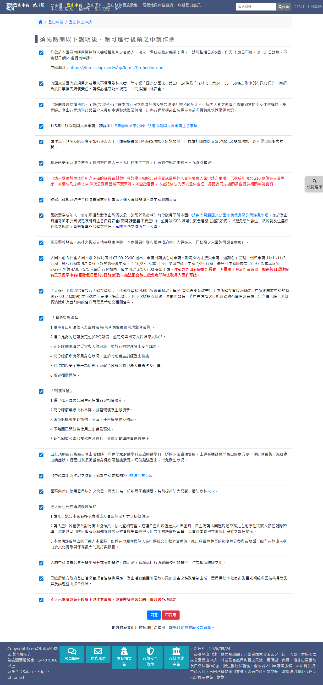
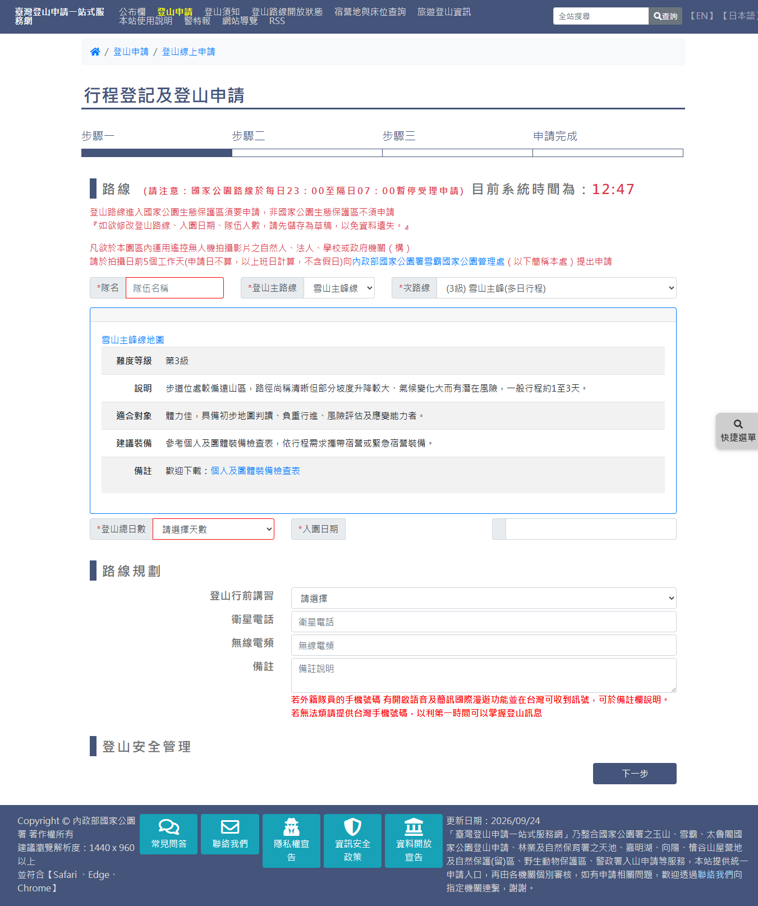
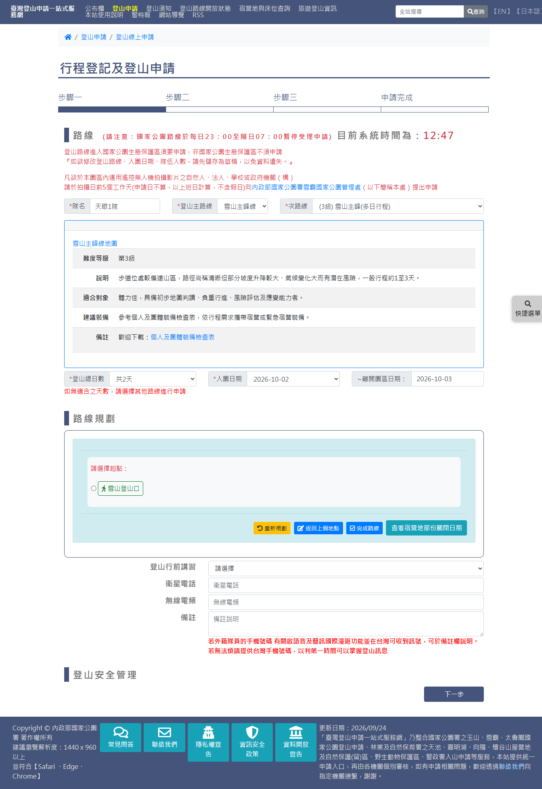
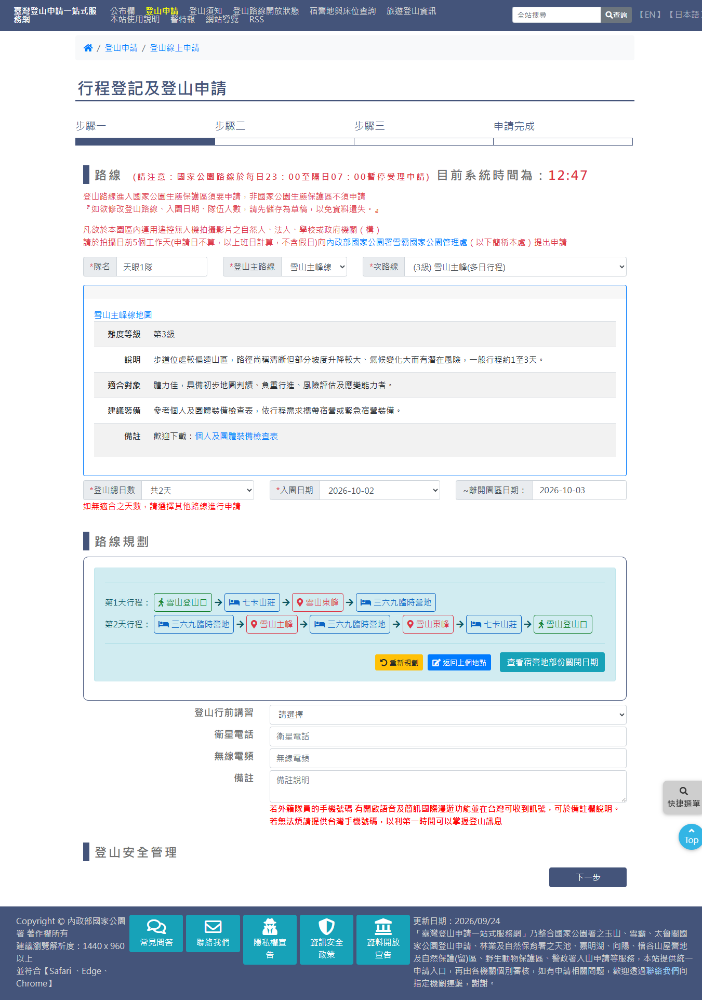
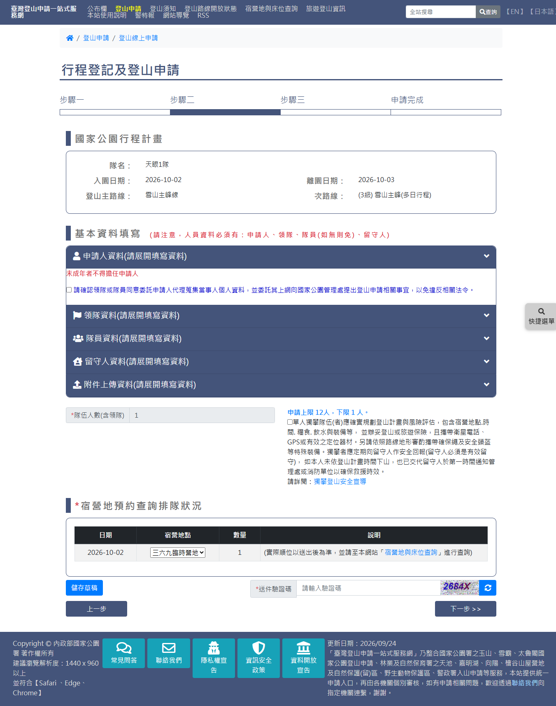
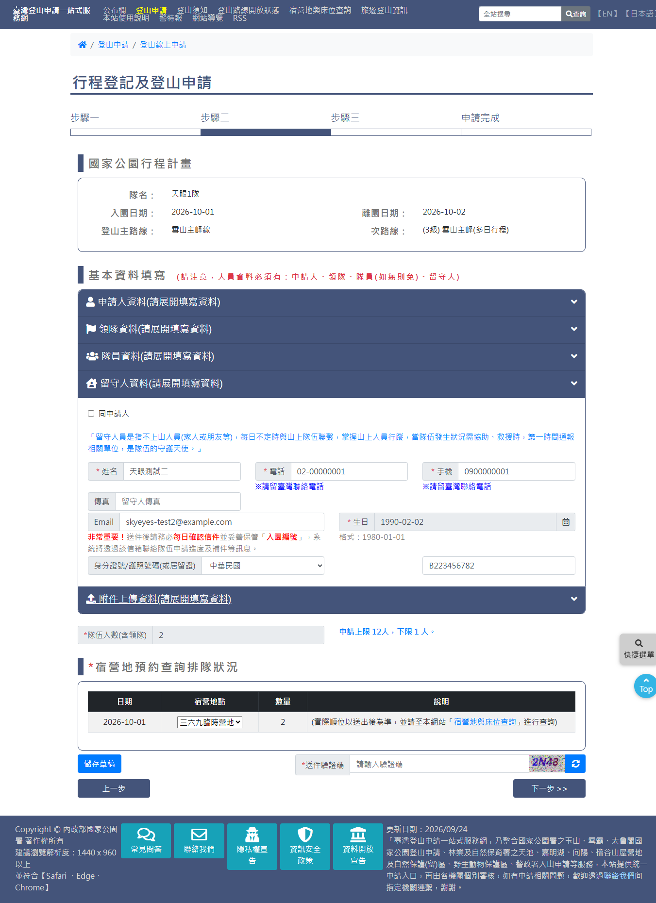
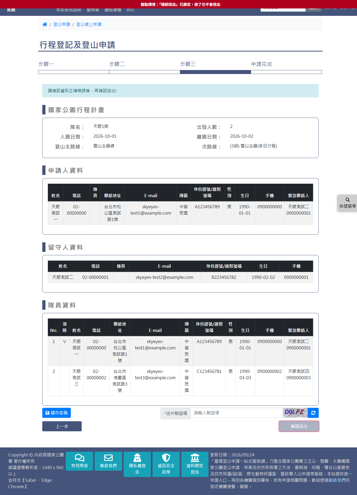

# 國家公園入園線上申請（雪霸國家公園）

> **內容正本**：正式站 `https://hike.taiwan.gov.tw/apply_1_2.aspx`（同意書）與
> `apply_1_3.aspx`（三步驟申請表），2026-09-24 實測。
> **擷取來源／日期**：2026-09-24 由正式站實走擷取，走到步驟三確認頁，**全程未送出**
> （確認送出鈕已由盤點環境的畫面鎖停用，見 `.scratch/outputs/正式站申請流程盤點/tools/survey_daemon.py` 的 `SUBMIT_LOCK_JS`）。
> 走的路線：`unit=e6dd4652-2d37-4346-8f5d-6e538353e0c2`，
> 雪山主峰線 ／ (3級) 雪山主峰(多日行程)（`cid=99&fid=4`），排 2 天。
> 核對內容一律以正式站 `hike.taiwan.gov.tw` 為準，
> **不得改用測試站 `service.skyeyes.tw`**（理由見 `README.md`「溯源慣例」）。

> **本檔隸屬 `05_各項線上申請`**（該母檔尚未撰寫）。與 `05a`（玉山，`apply_1_4.aspx`）
> 是平行的機關分支，**骨架相同、細節不同**，本檔以「與玉山的差異」為主軸，
> 相同處只列結論並指回 05a。**`1_N` 是機關分支，不是步驟序號**。

> **fid 來源注意**：`cid=99` 的 `fid` 是 **4**（取自正式站路線清單
> `01_Raw_Input/raw/正式站路線清單.csv`）。
> 更正（2026-10-01）：初稿寫「雛形 `OpenStatusData.js` 的 `fId` 寫成 99，有誤」不成立——
> 該欄照抄正式站 `open.aspx` 每列的隱藏欄位 `_f_id_`，489 列全部等於 c_id，
> 是**同名但意義不同**的欄位（開放狀態頁存的是次路線 id），雛形也沒有用它做邏輯，不改。

> **業務數值核對狀態**（2026-09-24 對正式站）
> - ✔ 已核對：同意書 21 條、預設勾選 18 條、本路線 2～4 天、入園日期 56 個可選（無關閉日）、
>   隊伍人數上限 12 下限 1
> - ✔ 雪霸**整頁沒有警政署入山證區塊**（測試機 `apply_1_3.aspx`／`.cs` 零個 `Npa` 字樣，正式站擷取亦同）
> - `[待確認]` 「登山安全管理」表單：程式碼顯示雪霸 29 條路線皆應出現，但只在**切換次路線**時才觸發，
>   本次從網址直接帶入而未出現，正式站行為待驗證（見 3.4）
> - `[待確認]` 入園日最早為 6 天後，同意書第 11 條寫「入園日前 5 日」，差一天原因不明

---

## 一、流程總覽

與玉山相同的四頁、六步驟；步驟 3～5 都在 `apply_1_3.aspx` 內切換，網址不變。

| 步驟 | 頁面 | 說明 |
|---|---|---|
| 1 選擇路線 | `apply_1.aspx` | 選機關與路線 |
| 2 閱讀同意書 | `apply_1_2.aspx` | 21 條 |
| 3 行程規劃 | `apply_1_3.aspx` 步驟一 | 路線、日期、路線規劃、講習 |
| 4 人員資料 | `apply_1_3.aspx` 步驟二 | 申請人／領隊／隊員／留守人／附件、宿營地 |
| 5 確認資料 | `apply_1_3.aspx` 步驟三 | 唯讀彙整 |
| 6 申請完成 | — | 未走到（不送出） |

---

## 二、步驟 2：閱讀同意書（`apply_1_2.aspx`）

（截圖為全部勾選後的狀態。）

- **21 個 checkbox**，數量與玉山相同但**內容完全不同**，由各管理處後台各自維護。
- **預設勾選 18 條**（玉山 19 條）；未勾的是：
  - 第 3 條：國家賠償法規、風險評估與緊急應變計畫
  - 第 4 條：「115年中秋假期間入園申請，請詳閱115年雪霸國家公園中秋連假期間入園申請注意事項」
    ——**有時效的條文**，連假過後可能下架
  - 第 21 條：「本人已閱讀並充分瞭解上述注意事項，並會遵守國家公園、警政署各項規定。」（總括）
- 雪霸特有內容：遙控無人機拍攝須提前 5 個工作天申請、三六九山莊施工工區勿入（改申請三六九臨時營地）、
  雪山西稜線請詳閱 230 林道注意事項、原住民族（泰雅族、賽夏族）傳統領域須知。
- 按下「同意」後導向 `apply_1_3.aspx`。

> **雛形資料過期**：雛形 `ConsentData.generated.js` 的雪霸（orgId `E6DD4652…`）只有 14 條，
> 來自 2026-04-28 的 DB dump，**正式站現為 21 條**。需依本次擷取重建，
> 條文全文見 `extracts/prod-SHP001-S00-consent-items.json`。

---

## 三、步驟 3：行程規劃（`apply_1_3.aspx` 步驟一）

### 3.1 欄位

| 控制項 | 型別 | 必填 | 說明 | 與玉山比較 |
|---|---|---|---|---|
| `teams_name` | text | ✔ | 隊名 | 同 |
| `climblinemain` | select | ✔ | 登山主路線，9 項（雪山主峰線、志佳陽線、雪劍線、雪山西稜線、武陵四秀線⋯） | 項目不同 |
| `climbline` | select | ✔ | 次路線，依主路線連動 | 同 |
| `sumday` | select | ✔ | 登山總日數，本路線 2～4 天 | 同 |
| `applystart` | select | ✔ | 入園日期，**選了天數才出現** | 同 |
| — | 唯讀 | | 離開園區日期 | 同 |
| `seminar` | select | | 登山行前講習，**預設空白** | 玉山預設已選「網路線上學習」 |
| — | — | — | **無 GPS 欄位** | 玉山有 `gps`（必填） |
| `satellitephone`、`frequency`、`note_user` | text／textarea | | 衛星電話、無線電頻、備註 | 同 |
| — | — | — | **沒有「警政署入山證申請」區塊** | 玉山內嵌於步驟一 |

**雪霸整頁沒有警政署區塊**，是機關層級的差異：測試機 `apply_1_3.aspx` 與 `.cs` 沒有任何 `Npa` 字樣，
正式站擷取的 HTML 也是 0（`F1三家比對.md` Q4 從程式碼得到同一結論）。
> 更正：本檔初稿（2026-09-24 13:37）曾推定為「依路線決定」，依據只是本路線不需入山證，已由程式碼推翻。

頁面上的說明文字（紅字）：
- 「請注意：國家公園路線於每日 23:00 至隔日 07:00 暫停受理申請」＋「目前系統時間為：hh:mm」
- 「登山路線進入國家公園生態保護區須要申請，非國家公園生態保護區不須申請」
- 「如欲修改登山路線、入園日期、隊伍人數，請先儲存為草稿，以免資料遺失。」
- 無人機空拍須於拍攝日前 5 個工作天申請（同同意書第 1 條）
- 天數下方：「如無適合之天數，請選擇其他路線進行申請」
- 備註下方：「若外籍隊員的手機號碼有開啟語音及簡訊國際漫遊功能並在台灣可收到訊號，可於備註欄說明。
  若無法煩請提供台灣手機號碼，以利第一時間可以掌握登山訊息」

路線資訊表（難度等級／說明／適合對象／建議裝備／備註）與「<主路線>地圖」連結，版面與玉山相同。

- **地圖連結有兩個**（2026-10-02 七卡、雪山東峰實走）：「(3級) 七卡、雪山東峰地圖」是 postback（`con_subline`），
  在頁內展開次路線剖面圖；「雪山主峰線地圖」直接連到圖檔（`files/climb/20200205112600499.jpg`，約 7.8MB）。
  雛形比照玉山「玉山線地圖」按鈕＋彈窗，兩張以頁籤切換（使用者 2026-10-02 裁示）。
- **欄位標籤沒有英文副標**：英文副標只有玉山正式站有（雪霸 2026-10-02 實走確認；太魯閣見 05c §3.1）。
  雛形三處統一不顯示英文副標，玉山也拿掉（使用者 2026-10-05）。

### 3.1.1 全部主／次路線（2026-10-05 逐條讀取）

使用者同行時在正式站步驟一逐一切換主路線 9 條、次路線 29 條，讀取各次路線的難度、天數選項、
次路線下方說明與連結。擷取檔 `.scratch/outputs/正式站申請流程盤點/extracts/prod-sheipa-routes-crawl.json`；
雛形 `Apply13Data.js` 的 `APPLY13_SUBS_SEEN` 由同資料夾 `tools/gen_apply13_subs.py` 產生。

- 次路線清單、難度、天數：以擷取檔為準（例：雪地訓練申請案 103＝第 6 級、3～10 天；其他路線 124＝第 6 級、1～20 天；
  馬達拉溪登山口宿營地 155＝第 2 級、2 天）。正式站下拉沒有 RouteData 的 133「-<外籍提前>」
- 說明文字：志佳陽線（司界蘭溪）、雪山西稜線（230 林道、兩個雲端連結）、大霸／北稜／聖稜／秀霸（黑熊、九九山莊工程「最新消息」、
  自行車宣導短片）、雪地訓練（雪季管理期三點）、北峰翠池與北稜（行程須含特定點，否則退件）、其他路線（需登山安全管理表）
- 單日往返路線（97、100、104、107、112、114、115、124）另有「單日往返路線承載量及餘額」連結（news_0_1.aspx?id=4374）
- 難度表「備註」列 29 條皆只有「歡迎下載：個人及團體裝備檢查表」——雛形雪霸不再帶開放狀態頁的路線備註
- **未讀**：各路線的路線規劃節點（需選天數、日期後逐點點選），雛形除 97／98／99 外仍用通用節點圖

### 3.2 入園日期

- 56 個可選，**2026-09-30 ～ 11-24 連續、沒有排除日**（雪霸當期無關閉公告；玉山排除 09-30、10-01）。
- 最早為擷取日後 **6 天**。`[待確認]` 同意書第 11 條寫「入園日前 5 日」。
- **2026-10-01 再實測**（七卡、雪山東峰單日往返）：最早為**當日後 5 天**、57 個（10-06～12-01），與同意書一致。
  兩次終點皆為 +61 天，起點差一天的原因不明；雛形採 +5 天（較新、且與同意書一致）。

### 3.3 路線規劃

- 選完入園日後出現規劃器，**第一步顯示「請選擇起點：」**，只有一個選項（雪山登山口）。
- 選了起點之後變成「第1天行程：雪山登山口 請選擇下一個地點：⋯」逐點接續。
- 第 2 天起點自動帶入前一晚宿營地（三六九臨時營地），與玉山相同。
- 按鈕 `btnreset`／`btnBackNode`／`btnover`／`stopdate` 與玉山完全相同。
- 節點以圖示分類：步行圖示＝登山口、床圖示＝住宿點、定位圖示＝山頭。

**本次路線**：

| 天 | 節點 |
|---|---|
| 第 1 天 | 雪山登山口 → 七卡山莊 → 雪山東峰 → 三六九臨時營地 |
| 第 2 天 | 三六九臨時營地 → 雪山主峰 → 三六九臨時營地 → 雪山東峰 → 七卡山莊 → 雪山登山口 |

- **三六九山莊不可選**，只有「三六九臨時營地」（對應同意書第 6 條：山莊施工中）。
- 每天須結束在住宿點、最後一天須回登山口，規則同玉山（見 05a 3.4）。

**2026-10-02 與使用者同行實走：(3級) 七卡、雪山東峰（cid 98）**，天數可選共 2、3 天：

| 天 | 節點 |
|---|---|
| 第 1 天 | 雪山登山口 → 雪山東峰 → 七卡山莊 |
| 第 2 天 | 七卡山莊 → 雪山東峰 → 雪山登山口 |

各點的下一站選項與單日往返（cid 97）相同：雪山登山口→七卡山莊／七卡營地／雪山東峰；
雪山東峰→雪山登山口／七卡山莊／七卡營地；七卡山莊→雪山登山口／雪山東峰。雛形 98 直接沿用 97 的節點圖。

- 規劃完成後、「下一步」之前有一個**空的「登山安全管理」區塊標題**，說明見 3.4。
- 下一步按鈕：**`btnstepdown`**（玉山為 `btnToStep21`）。

### 3.4 登山安全管理（雪霸特有）

- 開關是路線資料 `Fixedclimb.is_hiking_safety`：值為 1 的 29 條**全是雪霸**，玉山為 NULL。
- 測試機 `apply_1_3.aspx.cs:316-333`：`safetyManagement.Visible = (is_hiking_safety == "1")`，
  但這段**只寫在 `climbline_SelectedIndexChanged`**，也就是**切換次路線時**才執行。
  本次從路線列表帶網址直接進入、沒有切換過，所以只看到空標題。
  `[待確認]` 正式站是否相同。若相同，代表**直接從路線列表進來的使用者看不到這張表**。
- **2026-10-01 正式站實測推翻「切換次路線即出現」**：進步驟一後把次路線由雪山主峰(單日往返)切換為
  七卡、雪山東峰單日往返（兩條皆 is_hiking_safety＝1），再選天數、入園日、完成路線規劃，
  「登山安全管理」**始終只有空標題、沒有任何欄位**。正式站目前不顯示這張表單，是否已停用〔待確認〕。
- 表單內容（由前端驗證 `check_setp1` 反推，畫面未實見）：
  1. 三個確認勾選：已評估隊伍體能與經歷／已告知緊急聯絡人相關事宜／已了解路線變更規定
  2. 每日行程每個節點的**預計到達時間**（24 小時制 HH:mm，全部必填）
  3. 自主安全管理事項：應變路線、安全評估
  4. 留守計畫：失聯時數、最後一天延誤時數（≥0 整數）
- 另有 `linechk`「請勾選並閱讀雪霸國家公園生態保護區步道分級登山申請規定」（本路線未出現）。
- **2026-10-06 畫面實見**（使用者提供正式站「資料線上異動/取消入園」雪霸步驟一截圖，雪山主峰(多日行程)、入園 2026-09-16）：
  1. 四條聲明（勾選）：領隊及隊員經自我評估⋯（下附文字欄）／已確實告知親屬⋯（附說明）／我已了解並同意遵守路線變更規定（附說明）／
     **已詳閱國賠法 第 3 條**（附五項條文；前端檢查沒有這一條）
  2. 每日行程時間節點規劃（24 小時制 00:00～23:59）：第 N 天行程（日期）節點＋到達時間，逐節點
  3. 自主安全管理事項：應變路線（請說明每日撤退路線的安排計畫⋯），紅字「＊若經雪山主峰相關路線，撤退地點建議以雪山主峰（含）以前設定，以利高山症下降高度。」、範例框「範例：13：00未到雪山主峰，則往雪山登山口撤退」
  4. 安全評估（請說明攀登時人員受傷處置、防範措施）
  5. 留守計畫：「失聯超過 N 小時，留守人會進行通報」「最後一天預計抵達登山口時間超過 N 小時，未與留守人聯繫，則需留意並準備後續救援計畫。」＋文字欄
  頁尾為「取消全團入園」與「下一步」。
- **雛形（2026-10-06，使用者要求先做）**：共用元件 `th-hiking-safety`，雪霸全部次路線在行程規劃頁顯示（`ParkApplyData.hikingSafety`），
  檢查與訊息照 `check_setp1`；四條聲明比照保護區宣達「說明＋勾選」，範例框沿用警政署範例框，附註改 ※ 綠字（申請流程附註統一）。
  確認頁是否列出這些內容〔待確認〕。

---

## 四、步驟 4：人員資料（`apply_1_3.aspx` 步驟二）

### 4.1 版面結構

由上而下：
1. **國家公園行程計畫**（唯讀摘要）：隊名、入園日期、離園日期、登山主路線、次路線
2. **基本資料填寫**，紅字「請注意，人員資料必須有：申請人、領隊、隊員(如無則免)、留守人」
3. 五個摺疊區：申請人／領隊／隊員／留守人／**附件上傳資料**（玉山無此區）
4. 隊伍人數（含領隊），唯讀，「申請上限 12 人，下限 1 人。」
5. **宿營地預約查詢排隊狀況**：表格欄位 日期／宿營地點（下拉）／數量／說明
   「（實際順位以送出後為準，並請至本網站『宿營地與床位查詢』進行查詢）」
6. 儲存草稿（`btnbakstep2`）、送件驗證碼（`vcode2`）、上一步（`btnsetp2uppre`）、
   下一步（`btnsetp2upnext`，網站原始 id 拼作 setp）

### 4.2 欄位 id 與玉山的差異

| 項目 | 雪霸 | 玉山 |
|---|---|---|
| 申請人／領隊的**手機** | `apply_mobile`、`leader_mobile`（**無 `con_` 前綴**） | `con_apply_mobile`、`con_leader_mobile` |
| 留守人電話 | 有 `con_stay_tel` | 無 |
| 其餘人員欄位 | `con_apply_*`、`con_leader_*`、`con_stay_*`、`con_lisMem_member_*_N` | 相同 |

手機欄無 `con_` 前綴，推測為一般 HTML input 而非伺服器控制項，後端以 `Request.Form` 讀取（未證實）。
改版時**不影響使用者**，但寫自動化或資料對應時要注意。

### 4.3 四個人員區塊的操作

| 區塊 | 操作 | 與玉山比較 |
|---|---|---|
| 申請人 | 勾「委託同意」（`applycheck`）後才出現欄位 | 同 |
| 領隊 | 「同申請人」（`copyapply`）把申請人資料複製過來 | 同 |
| 隊員 | **先勾隊員區自己的「委託同意」（`member_keytype`）**，才出現「新增隊員」（`addmember`）；勾選時跳出提醒「請詳實填寫隊員資料勿重覆!」 | 玉山沒有這個勾選框，新增鈕為 `lbInsMember` |
| 留守人 | 也有自己的「同申請人」（`copyapply2`）；說明文字「留守人員是指不上山人員（家人或朋友等）⋯是隊伍的守護天使」；電話、手機下方「※請留臺灣聯絡電話」 | 同 |

隊員列的縣市／國籍下拉以**欄位本身**觸發 postback（`lisMem$ctrl1$ddlmember_country`），
玉山則經由共用的 `lbCom`。行為相同，實作不同。

欄位說明文字（紅字）：
- 領隊緊急聯絡人：「緊急聯絡人以自己家人為主，否則無法受理」
- Email：「非常重要！送件後請務必每日確認信件並妥善保管『入園編號』，系統將透過該信箱聯絡隊伍申請進度及補件等訊息。」
  ——出現在**申請人、領隊、留守人**的 Email 下方，隊員沒有；玉山、太魯閣、六步驟家族皆無（2026-10-06 核對擷取檔）。
  雛形 2026-10-06 補上（`emailNote`，紅字 `th-field-error`）

### 4.4 附件上傳

本路線顯示「**無需上傳資料**」。`[待確認]` 哪些雪霸路線需要上傳（推測與登山安全管理表有關）。
2026-10-01 七卡、雪山東峰單日往返同樣「無需上傳資料」。

### 4.4.1 單人獨攀（2026-10-01 補）

隊伍 **1 人**時，「隊伍人數」下方出現勾選框 `lineonechk`：「單人獨攀隊伍(者)應確實規劃登山計畫與風險評估⋯」，
附「請詳閱：獨攀登山安全宣導」（`images/雪霸獨攀登山安全宣導.pdf`）。前端 `check_setp2`：有此框而未勾 →
「請勾選單人獨攀注意事項」。09-24 擷取為 2 人，頁面沒有此框（只有檢核程式碼）＝**只在 1 人時出現**，與玉山 `cbOneMan` 同規則。

### 4.4.2 單日往返的步驟一、二（2026-10-01 補）

- 路線規劃：「請選擇起點：」只有雪山登山口；雪山登山口的下一站為**七卡山莊／七卡營地／雪山東峰**（可直達東峰），
  七卡山莊下一站為雪山登山口／雪山東峰，雪山東峰下一站為雪山登山口／七卡山莊／七卡營地。單日只有第 1 天、終點須為登山口。
- 步驟二「宿營地預約查詢排隊狀況」只有表頭、沒有資料列。
- 同意書 2026-10-01 為 **20 條**（09-24 為 21 條），推測是有時效的中秋連假條文已下架〔待確認：雛形 `ConsentData` 仍為 21 條〕。

### 4.5 共通規則（兩機關都成立）

以下在玉山實測，雪霸行為一致（詳見 `.scratch/outputs/正式站申請流程盤點/模擬資料.md`）：
- 性別由身分證號第二碼帶入（1＝男，已確認；2＝女尚未實測）
- 緊急聯絡人電話不可是領隊或隊員的電話
- 勾申請人「委託同意」後，網站會自動勾「同申請人」並複製到領隊，**申請人需先填完**

---

## 五、步驟 5：確認資料（`apply_1_3.aspx` 步驟三）

- 標題「請確認資料正確無誤後，再確認送出!」
- **國家公園行程計畫**：隊名、**出發人數**、入園日期、離園日期、登山主路線、次路線
- **申請人資料**、**留守人資料**：**各自一張表**，只列各自有的欄位
  （玉山把兩者**合成一張表**，留守人那列大半空白）
- **隊員資料**：表格，**領隊不另列一區，而是在隊員表中以「領隊」欄打 V 標示**（本例 No.1 是領隊）
- 確認頁**再次要求送件驗證碼**
- 按鈕：儲存草稿（`btnbak`）、上一步（`btnstep3uppre`）、確認送出（`btnsave`）
- **未顯示逐日行程**（玉山確認頁有），也沒有講習、衛星電話等步驟一的其他欄位

---

## 六、與雛形的落差

**2026-10-01 更正：雛形原本沒有雪霸申請頁。** 實走雛形發現三家國家公園的同意書按「同意」後都導向玉山的 `apply-3`，
雪霸使用者看到的是玉山的主路線、GPS 與警政署入山證區塊——本表原先七列是假設 `apply-3` 就是雪霸的表，低估了落差。
已比照太魯閣 `apply_1_5` 的先例新增 **`apply_1_3.html`**（commit 1252a83），同意書改依機關導向（52f956b，太魯閣一併改導向 `apply_1_5`）。

| 項目 | 雛形（2026-10-01） | 正式站 | 狀態 |
|---|---|---|---|
| 申請頁 | `apply_1_3.html`（頁內三步驟） | `apply_1_3.aspx` | ✔ 新增 |
| 宿營地部份關閉日期（2026-10-06） | 規劃按鈕列「查看宿營地部份關閉日期」→ 彈窗（標題「主路線＋次路線＋宿營地部份關閉日期」，表格 節點名稱／關閉日期／關閉說明）；只有有資料的次路線顯示按鈕，目前僅 99（三六九山莊 2023/05/20~2030/12/31） | 按鈕 `stopdate` 以 postback 填入 `close_list_modal`；其餘路線資料未讀取 | ✔ 99；其餘〔待確認〕 |
| 登山安全管理（2026-10-06） | 雪霸全部次路線顯示（§3.4） | 目前只剩空標題；異動頁截圖有完整內容 | 刻意先做，是否已停用〔待確認〕 |
| 同意書條文 | 21 條、預設勾 18（873950b） | 同 | ✔ |
| 步驟一欄位 | 隊名、主／次路線、天數、入園日、講習（預設空白）、衛星電話、無線電頻、備註；**無警政署區塊、無 GPS** | 同（§3.1） | ✔ |
| 主路線／次路線 | 主路線 9 項照正式站；雪山主峰線 6 條次路線照正式站下拉 | 同 | ✔；其他主路線的次路線取自正式站路線清單（去掉「外籍提前」），申請頁下拉未實走〔待確認〕 |
| 登山總日數 | 雪山主峰(多日) 2～4 | 同 | ✔；其他次路線用測試機 DB 天數〔待確認〕 |
| 入園日期 | 今日＋6 天起連續 56 個 | 同（09-24 擷取 09-30～11-24） | ✔；與同意書「入園日前 5 日」差一天〔待確認〕 |
| 路線規劃第一步 | 「請選擇起點」（共用元件 `th-route-planner` 的 `pick-start`） | 同 | ✔ |
| 三六九山莊 | 節點只有「三六九臨時營地」 | 同 | ✔ |
| 登山安全管理 | 只放標題與〔待確認〕說明，不做表單 | 從路線列表進入時只有空標題（§3.4） | 〔待確認〕表單內容畫面未實見 |
| 隊員新增 | 須先勾隊員區委託同意才出現「新增隊員」 | 同（`member_keytype`） | ✔ |
| 附件上傳區 | 顯示「無需上傳資料」 | 同（本路線） | ✔；哪些路線須上傳〔待確認〕 |
| 宿營地排隊表 | 宿營地點只有當晚宿營地、說明欄固定文字＋宿營地與床位查詢連結 | 同 | ✔ |
| 確認頁 | 隊名、出發人數；申請人與留守人各一表；隊員表以「領隊」欄 V 標示；不列逐日行程 | 同（§五） | ✔ 欄位與順序照正式站 |
| `OpenStatusData` fId | 照抄正式站 `open.aspx` 的 `_f_id_` | 該欄值即 c_id | 不是錯誤（見檔頭更正） |
| 單人獨攀 | 1 人時出現勾選與宣導 PDF 連結，未勾擋下 | 同（§4.4.1） | ✔ 2026-10-01 已補 |
| 單日往返 | 七卡、雪山東峰單日往返有規劃節點；單日完成後宿營地表顯示「單日往返，無宿營地」 | 單日只有表頭 | ✔ 2026-10-01 已補；雪山主峰(單日往返)等其他單日路線節點未實走 |
| 入園日期 | 今日＋5 天起 57 個 | 10-01 實測同；09-24 為 +6 | ✔ |
| 申請頁（2026-10-02） | 改為共用玉山 `apply-3／4／5.html?park=shei-pa`，`apply_1_3.html` 轉址 | — | ✔ 見 decisions.md 2026-10-02 |
| 七卡、雪山東峰（cid 98） | 沿用 97 節點圖，預設 2 天行程照實走 | §3.3 | ✔ 2026-10-02 |
| 步驟一三句提示 | 生態保護區、天數下方、備註下方（備註提示以橘色 callout 呈現） | §3.1 | ✔ 2026-10-02 補回（改共用頁時漏掉） |
| 路線地圖 | 「雪山主峰線地圖」按鈕＋彈窗，頁籤含次路線地圖（目前只有 98 的次路線圖） | §3.1 | ✔ 2026-10-02；其他主／次路線圖檔未取 |
| 無節點資料的路線 | 通用節點圖（登山口／途經點／宿營地），依天數自動帶合法行程 | — | 暫代，待逐條實走替換 |
| 附件上傳區（2026-10-02） | 無須上傳時整區不顯示（使用者裁示），側欄同步少一項 | 正式站顯示區塊、內容「無需上傳資料」 | ✔ 刻意差異 |
| 宿營地點（2026-10-02） | 下拉選單，選項為當晚宿營地 | `con_lisText_rooms_N` 下拉，七卡、雪山東峰只有「七卡山莊」一項 | ✔ |
| 確認頁（2026-10-02） | 隊伍表加 Email 欄、留守人不列國籍；區塊順序沿用玉山（隊伍→申請人與留守人） | 申請人→留守人→隊員（隊員表含 E-mail；留守人無國籍） | ✔ 欄位照正式站；順序依「元件以玉山為準」刻意不同 |

---

## 七、證據位置

`.scratch/outputs/正式站申請流程盤點/`（不進版控）：

| 檔案 | 內容 |
|---|---|
| `extracts/prod-SHP001-S00-consent-items.json` | 同意書 21 條全文、預設勾選 |
| `extracts/prod-SHP001-S01-blank.html.json`、`-S01-fields.json` | 步驟一空白 |
| `extracts/prod-SHP001-S01-routeplanned.html.json` | 步驟一路線規劃完成 |
| `extracts/prod-SHP001-S02-blank.html.json` | 步驟二空白 |
| `extracts/prod-SHP002-S02-filled.html.json` | 步驟二四段填妥（腳本產生） |
| `extracts/prod-SHP002-S03-confirm.html.json` | 步驟三確認頁 |
| `screenshots/prod-SHP00*-*.png` | 對應截圖（本檔引用的已複製到 `assets/05b-*`） |

**快速重現**：`tools/walk_prod.py`，路線代號 `sheipa-xueshan-2d`（見 `tools/routes.json`）。
同意書、步驟一、步驟二皆可自動填寫，約 5 分鐘；換頁與驗證碼由人操作。
