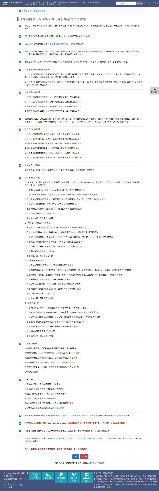
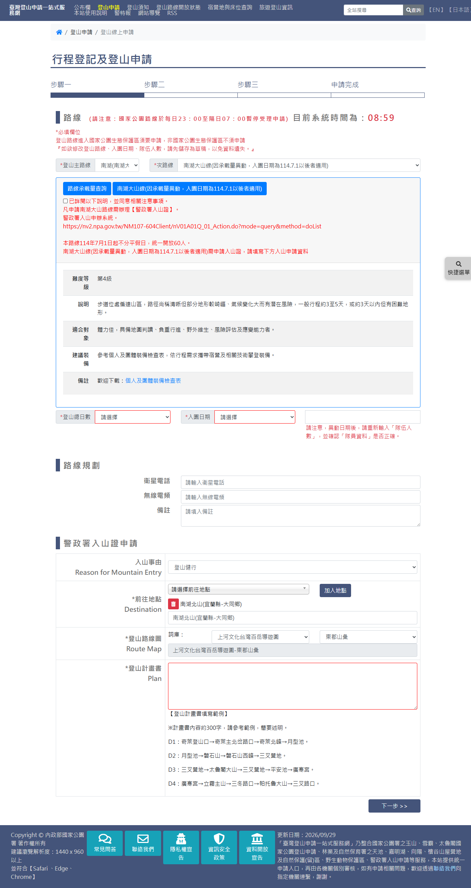
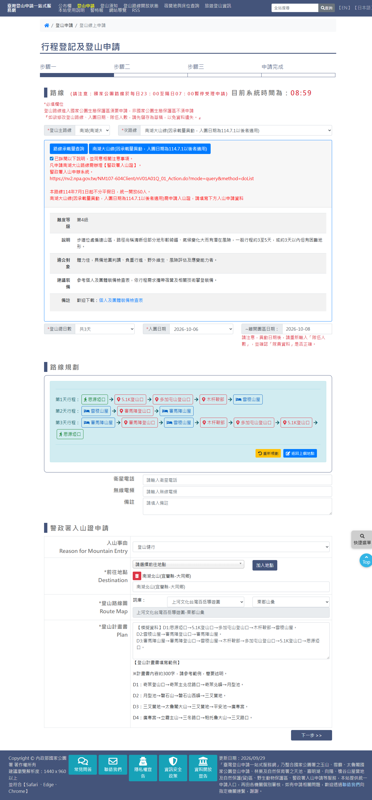
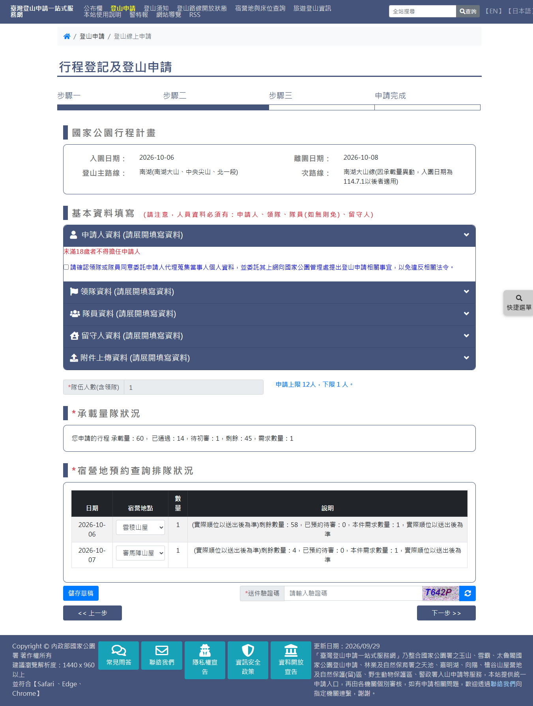
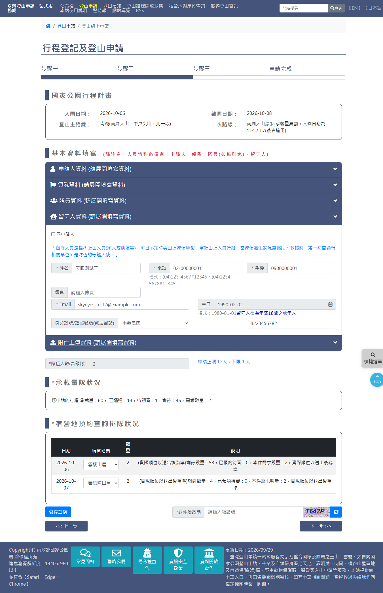

# 國家公園入園線上申請（太魯閣國家公園）

> **內容正本**：正式站 `https://hike.taiwan.gov.tw/apply_1_2.aspx`（同意書）與
> `apply_1_5.aspx`（三步驟申請表），2026-09-29 實測。
> **擷取來源／日期**：2026-09-29 由正式站實走擷取，**全程未送出**
> （確認送出鈕已由盤點環境的畫面鎖停用，見 `.scratch/outputs/正式站申請流程盤點/tools/survey_daemon.py` 的 `SUBMIT_LOCK_JS`）。
> 走的路線：`unit=105e956f-d8da-49f7-a9b7-3aefdda88a12`，
> 南湖(南湖大山、中央尖山、北一段) ／ 南湖大山線（`cid=667&fid=16`），排 3 天。
> 核對內容一律以正式站 `hike.taiwan.gov.tw` 為準，
> **不得改用測試站 `service.skyeyes.tw`**（理由見 `README.md`「溯源慣例」）。

> **本檔隸屬 `05_各項線上申請`**（該母檔尚未撰寫）。與 `05a`（玉山，`apply_1_4.aspx`）、
> `05b`（雪霸，`apply_1_3.aspx`）是平行的機關分支，本檔以「與玉山、雪霸的差異」為主軸，
> 相同處只列結論並指回 05a。**`1_N` 是機關分支，不是步驟序號**。

> **業務數值核對狀態**（2026-09-29 對正式站）
> - ✔ 已核對：同意書 18 條、預設勾選 16 條、本路線 1～30 天可選、入園日期 57 個可選
>   （10-04～11-29 連續，最早為擷取日後 5 天，與同意書第 11 條「預定入園日前 5 天下午 3 時」一致）、
>   隊伍人數上限 12 下限 1、本路線承載量 60 人
> - ✔ 太魯閣**沒有隊名欄**、**沒有行前講習**、**沒有 GPS 欄**
> - ✔ 警政署入山證區塊在步驟一**預設展開**且大半已預填（見 3.4）

---

## 一、流程總覽

與玉山、雪霸相同的四頁、六步驟；步驟 3～5 都在 `apply_1_5.aspx` 內切換，網址不變。

| 步驟 | 頁面 | 說明 |
|---|---|---|
| 1 選擇路線 | `apply_1.aspx` | 選機關與路線 |
| 2 閱讀同意書 | `apply_1_2.aspx` | 18 條 |
| 3 行程規劃 | `apply_1_5.aspx` 步驟一 | 路線、注意事項勾選、日期、路線規劃、警政署入山證 |
| 4 人員資料 | `apply_1_5.aspx` 步驟二 | 申請人／領隊／隊員／留守人／附件、承載量、宿營地 |
| 5 確認資料 | `apply_1_5.aspx` 步驟三 | 唯讀彙整 |
| 6 申請完成 | — | 未走到（不送出） |

**實作差異（使用者看不到）**：太魯閣把三步驟拆成 user control，欄位 id 前綴為
`con_step1_*`、`con_step2_*`，postback 名稱為 `ctl00$con$step1$…`；唯一例外是主路線 `climblinemain`（無前綴）。
玉山、雪霸都是 `con_*`。步驟間的「下一步」是**整頁 POST**（`bt_Next_D`），不是 UpdatePanel 局部更新。

---

## 二、步驟 2：閱讀同意書（`apply_1_2.aspx`）

（截圖為剛載入、未操作的預設狀態。）

- **18 個 checkbox**（玉山、雪霸各 21），內容由管理處後台維護。
- **預設勾選 16 條**；未勾的是：
  - 第 17 條：確認隊伍符合南投縣、臺中市、花蓮縣三個登山活動管理自治條例
  - 第 18 條：「本人已閱讀並充分瞭解上述注意事項，並會遵守國家公園、警政署各項規定。」（總括，三家都有）
- 太魯閣特有內容：
  - 第 2 條：台 8 線公路交通管制
  - 第 11 條：登山申請時間——一般路線「預定入園日前 5 天下午 3 時至前 2 個月」；
    羊頭山、畢祿山單攻為「前 3 天」；連續假期應於放假前 5 天上班日下午 3 時前完成申請
  - 第 14、15 條：錐麓古道安全宣導影片、入園公約、入園收費須知（現場購票與查核時間每日 7～10 時）
- **過時條文**：第 8 條「3G 網路將於 113 年 6 月 30 日關閉」，已過期仍掛在同意書上。
  改版時建議提醒機關清理（`[待確認]` 是否由機關自行下架）。

> **雛形資料過期**：雛形 `ConsentData.generated.js` 的太魯閣只有 13 條，
> 來自 2026-04-28 的 DB dump，**正式站現為 18 條**。需依本次擷取重建，
> 條文全文見 `extracts/prod-TAR001-S00-consent-html.json`。

---

## 三、步驟 3：行程規劃（`apply_1_5.aspx` 步驟一）

### 3.1 欄位

| 控制項 | 型別 | 必填 | 說明 | 與玉山／雪霸比較 |
|---|---|---|---|---|
| — | — | — | **沒有隊名欄** | 玉山、雪霸必填。程式碼上是 `HiddenField`，申請流程內無人寫入（`F1三家比對.md` §3-A） |
| `climblinemain` | select | ✔ | 登山主路線，13 項（屏風山線、奇萊、南湖、北一段縱走北二段、北二段⋯） | 項目不同；**無 `con_` 前綴** |
| `con_step1_climbline` | select | ✔ | 次路線，依主路線連動（南湖下有 2 條） | 同 |
| `showbed5` | button | | **「路線承載量查詢」**，開啟彈窗 | 太魯閣特有 |
| `noteCheck_CheckBox` | checkbox | ✔ | **「已詳閱以下說明，並同意相關注意事項。」**，下方為路線專屬說明（本路線：需辦警政署入山證、入山申辦系統網址、承載量統一 60 人） | 太魯閣特有；前端 `checkSetp1` 檢查 |
| `con_step1_sumday` | select | ✔ | 登山總日數，**1～30 天** | 玉山、雪霸依路線限縮（2～5、2～4） |
| `con_step1_applystart` | select | ✔ | 入園日期，選了天數才有選項 | 同 |
| — | 唯讀 | | 離開園區日期，下方紅字「異動日期後，請重新輸入『隊伍人數』，並確認『隊員資料』是否正確。」 | 同 |
| — | — | — | **無行前講習** | 玉山、雪霸有 `seminar` |
| — | — | — | **無 GPS 欄位** | 玉山有（必填），雪霸無 |
| `satellitephone`、`frequency`、`note_user` | text／textarea | | 衛星電話、無線電頻、備註 | 同 |
| 警政署入山證申請 | 區塊 | ✔ | 見 3.4 | 玉山摺疊、雪霸沒有 |

頁面上的說明文字與玉山、雪霸相同（23:00～07:00 暫停受理、系統時間、生態保護區須申請、
修改前先儲存草稿）。路線資訊表（難度等級／說明／適合對象／建議裝備／備註）版面相同，
本路線為**第 4 級**，備註欄提供「個人及團體裝備檢查表」下載。

### 3.2 入園日期

- 57 個可選，**2026-10-04 ～ 11-29 連續、沒有排除日**。
- 最早為擷取日後 **5 天**，與同意書第 11 條一致（雪霸為 6 天，與其同意書差一天，見 05b）。

### 3.3 路線規劃

- 選完入園日後出現規劃器，第一步「請選擇起點：」，選後逐點「請選擇下一個地點：」，與玉山、雪霸相同。
- 第 2 天起點**自動帶入**前一晚宿營地，與另兩家相同；但**標籤仍寫「請選擇起點」**
  （玉山、雪霸寫「請選擇下一個地點」），屬文案瑕疵，行為不受影響。
- 按鈕：`btnreset`（重新規劃）、`btnBackNode`（返回上個地點）、`btnover`（完成路線）。
  `btnover` **沒有 `name` 屬性**（玉山、雪霸有），postback 名稱為 `ctl00$con$step1$btnover`。
- 規劃結果容器 `con_step1_tbSchedule`。
- 節點圖與測試站不同（以正式站為準）。

**本次路線**：

| 天 | 節點 |
|---|---|
| 第 1 天 | 思源埡口 → 5.1K登山口 → 多加屯山登山口 → 木杆鞍部 → 雲稜山屋 |
| 第 2 天 | 雲稜山屋 → 審馬陣登山口 → 審馬陣山屋 |
| 第 3 天 | 審馬陣山屋 → 審馬陣登山口 → 雲稜山屋 → 木杆鞍部 → 多加屯山登山口 → 5.1K登山口 → 思源埡口 |

### 3.4 警政署入山證申請（預設展開）

- 區塊標題「警政署入山證申請」，**直接展開**（玉山須點開摺疊）。
- 欄位與預設值（本路線，頁面剛載入即如此）：

| 欄位 | 控制項 | 預設 |
|---|---|---|
| 入山事由 Reason for Mountain Entry | `NpaReasons`（26 項） | **已選「登山健行」** |
| 前往地點 Destination | 下拉＋「加入地點」`AddNpaPlacesInfo`＋清單（可刪除，刪除前 confirm） | **已加入「南湖北山(宜蘭縣-大同鄉)」** |
| 登山路線圖 Route Map | 詞庫兩層下拉 `NpaPaths`（8）／`NpasubPaths`（24）＋ `RouteMap_V` | **已選「上河文化台灣百岳導遊圖－東郡山彙」** |
| 登山計畫書 Plan | `NpaPlan` textarea（必填） | 規劃完成前空白；**完成路線規劃後自動產生**「D1:…。D2:…。D3:…。」 |

- 計畫書下方附「登山計畫書填寫範例」（約 300 字，以奇萊為例）。
- 五個欄位 id 與玉山相同（`F1三家比對.md` §3 已由程式碼得出，本次實走證實）。

---

## 四、步驟 4：人員資料（`apply_1_5.aspx` 步驟二）

### 4.1 版面結構

由上而下：
1. **國家公園行程計畫**（唯讀摘要）：入園日期、離園日期、登山主路線、次路線（**無隊名**）
2. **基本資料填寫**，紅字「請注意，人員資料必須有：申請人、領隊、隊員(如無則免)、留守人」
3. 五個摺疊區：申請人／領隊／隊員／留守人／**附件上傳資料**
4. 隊伍人數（含領隊）`teams_count`，唯讀，「申請上限 12 人，下限 1 人。」
5. **承載量狀況**（太魯閣特有，畫面標題原文為「承載量隊狀況」）：
   「您申請的行程 承載量：60，已通過：14，待初審：1，剩餘：45，需求數量：2」
6. **宿營地預約查詢排隊狀況**：日期／宿營地點（下拉）／數量／說明；
   說明欄顯示「剩餘數量：58，已預約待審：0，本件需求數量：2，實際順位以送出後為準」
   （雲稜山屋 58、審馬陣山屋 4）。玉山、雪霸只有排隊說明，**太魯閣多了剩餘數量**
7. **送件驗證碼 `vcode` 在步驟二**，儲存草稿（`btnbak`）、上一步（`bt_Pre_D`）、下一步（`bt_Next_D`，整頁 POST）

### 4.2 人員欄位

| 項目 | 太魯閣 | 玉山 | 雪霸 |
|---|---|---|---|
| 欄位 id | `con_step2_apply_*`、`con_step2_leader_*`、`con_step2_stay_*`、`con_step2_lisMem_member_*_N` | `con_*` | `con_*`，手機無前綴 |
| 申請人、領隊 | 姓名、電話、地址（縣市＋區＋地址）、手機、傳真、Email、證號類別＋證號、性別、生日、緊急連絡人、緊急連絡電話 | 同 | 同 |
| 隊員 | 同上但**無傳真** | 同 | 同 |
| 留守人 | 姓名、電話（格式提示 `(04)123-4567#12345`）、手機、傳真、Email、**生日**、**證號** | 無電話 | 有電話 |
| 學生身分 | **畫面上沒有** | 無 | 無 |

> **更正程式碼推論**：`F1三家比對.md` §3-B 依測試機程式碼記「太魯閣領隊與隊員有『是否為學生』」，
> 正式站步驟二空白與填妥兩份擷取皆**無「學生」字樣**。以正式站為準，改版不需此欄
> （同意書第 16 條改以文字提醒學生自行通報學校）。

欄位說明文字（紅字）：
- 申請人：「未滿18歲者不得擔任申請人」「申請人須為年滿18歲之成年人」；領隊、留守人同理
- 領隊、隊員下方：「緊急聯絡人以自己家人為主，否則無法受理，緊急聯絡人或留守人員為不隨隊伍上山之家人」
  （比玉山、雪霸多了後半句）
- 隊員、留守人：「請填個人手機號碼(勿共用)，隊員如非同住家人，e-mail、地址、緊急聯絡人請勿重複⋯」

### 4.3 四個人員區塊的操作

| 區塊 | 操作 | 與玉山／雪霸比較 |
|---|---|---|
| 申請人 | 勾「委託同意」後才出現欄位 | 同 |
| 領隊 | 「同申請人」把申請人資料複製過來 | 同 |
| 隊員 | **先勾隊員區的委託同意（`member_keytype`）**，再「新增隊員」（`addmember`，是 `<a>` 且無 `name`）；另有「展開全部隊員」「關閉全部隊員」 | 同雪霸；玉山無此勾選 |
| 留守人 | 有「同申請人」；說明「留守人員是指不上山人員⋯是隊伍的守護天使」 | 同 |

### 4.4 附件上傳與獨攀

- 附件上傳區只有一項「**路線行程規劃計劃書**」，「點選上傳文件」開啟 `apply_1_3files.aspx?type=16` 彈窗。
  依程式碼註解「20200707 開放所有路線路線行程規劃計劃書 非必填」為**選填**（畫面未標 *）。
  本次**未上傳**（上傳在盤點環境被 L4 擋下）。
- **獨攀證明說明**（`openweb4_CheckBox`）：「已下載且詳閱 太魯閣國家公園獨攀申請承諾書，並同意相關切結內容」。
  **只有 1 人時出現**；加入第 2 人後從頁面消失（空白與填妥兩份擷取對照）。

---

## 五、步驟 5：確認資料（`apply_1_5.aspx` 步驟三）

`[待擷取]` 尚未進入確認頁（需輸入步驟二的送件驗證碼），擷取後補齊。

---

## 六、與雛形的落差

| 項目 | 雛形現況 | 正式站 | 處理建議 |
|---|---|---|---|
| 同意書條文 | 太魯閣 13 條（舊 dump） | 18 條，16 條預設勾選 | 依本次擷取重建；第 8 條過時條文另提醒機關 |
| 隊名 | 三家共用、必填 | 太魯閣無 | 元件加 `showTeamName` |
| 注意事項勾選 | 無 | 太魯閣步驟一必勾，內容隨路線 | 需設計 |
| 路線承載量 | 無 | 步驟一查詢鈕＋步驟二承載量狀況 | 需設計 |
| 宿營地剩餘數量 | `[待確認]` | 太魯閣說明欄顯示剩餘數量 | 待比對雛形 apply-4 |
| 入山證區塊 | `[待確認]` | 太魯閣預設展開、大半預填 | 待比對雛形 apply-3 |
| 留守人生日、證號 | `[待確認]` | 太魯閣有 | 欄位清單依機關 |
| 獨攀承諾書 | 無 | 1 人時出現 | 需設計 |

---

## 七、證據位置

`.scratch/outputs/正式站申請流程盤點/`（不進版控）：

| 檔案 | 內容 |
|---|---|
| `extracts/prod-TAR001-S00-consent-html.json` | 同意書 18 條全文、預設勾選 |
| `extracts/prod-TAR001-S01-blank.html.json`、`-S01-fields.json` | 步驟一空白 |
| `extracts/prod-TAR001-S01-routeplanned.html.json` | 步驟一路線規劃完成 |
| `extracts/prod-TAR001-S02-blank.html.json` | 步驟二空白（1 人，含獨攀承諾書） |
| `extracts/prod-TAR001-S02-filled.html.json` | 步驟二四段填妥（腳本產生） |
| `screenshots/prod-TAR001-*.png` | 對應截圖（本檔引用的已複製到 `assets/05c-*`） |

**快速重現**：`tools/walk_prod.py`，路線代號 `taroko-nanhu-3d`（見 `tools/routes.json`）。
同意書、步驟二可自動填寫；步驟一的太魯閣支援已寫入但**尚未以腳本從頭實跑**
（本次步驟一由逐點腳本 `tar_plan.py` 完成）。換頁與驗證碼由人操作。
