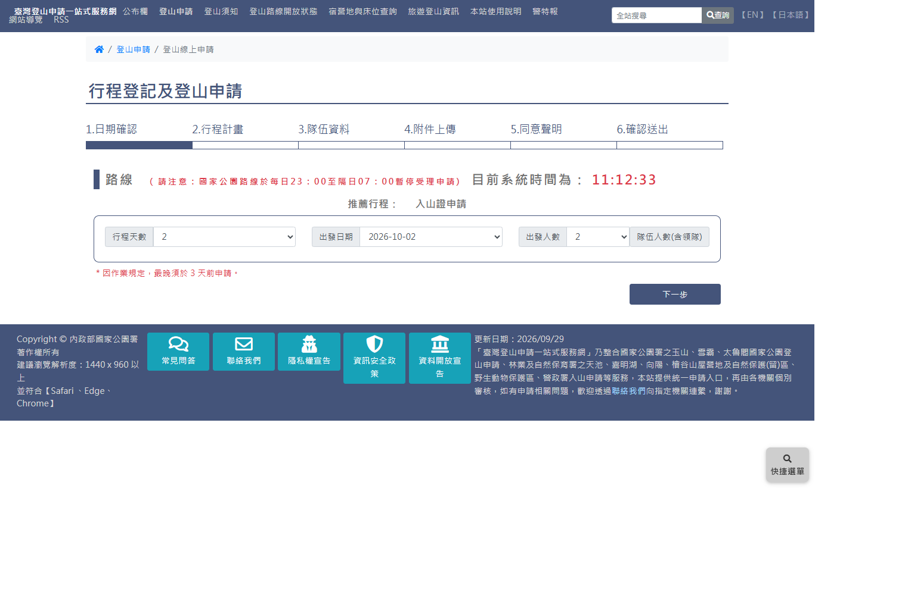
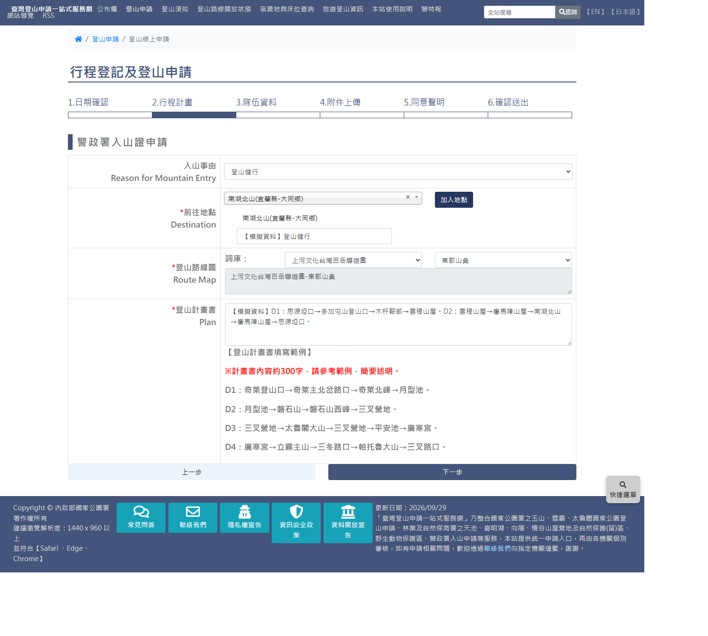
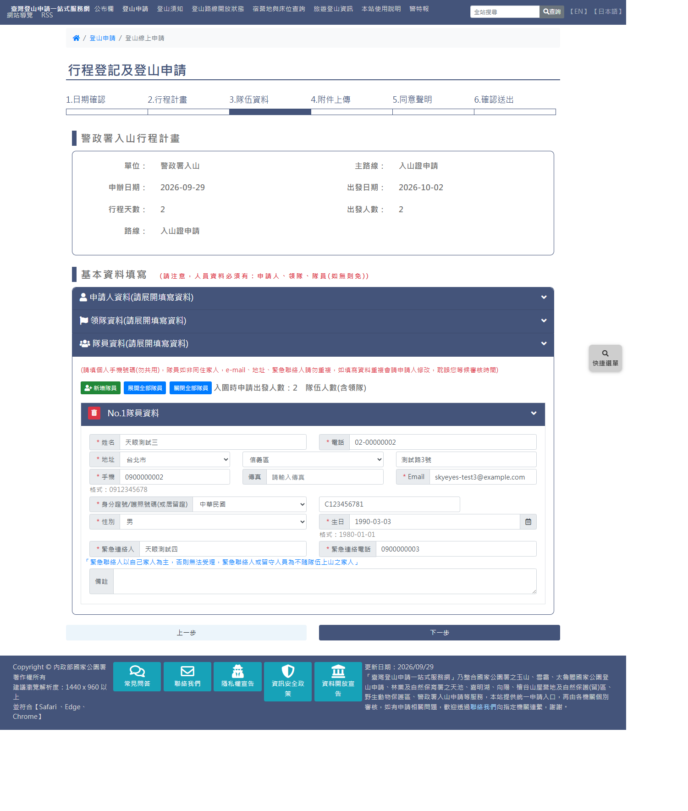
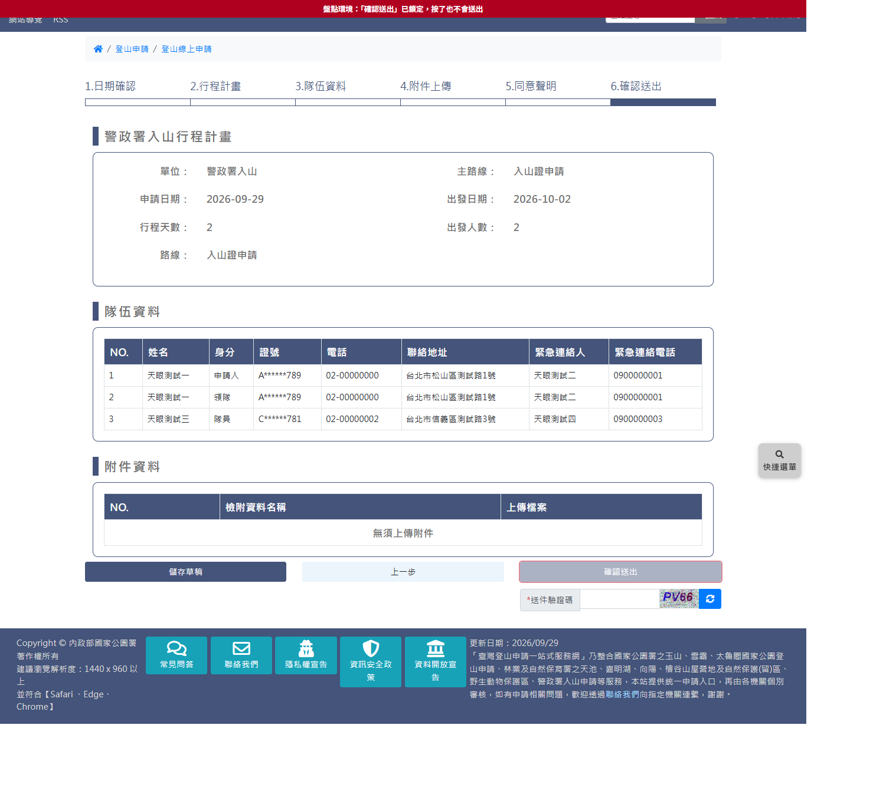

# 警政署入山證線上申請

> **內容正本**：正式站 `https://hike.taiwan.gov.tw/apply_npa_1.aspx?unit=8F7C09DC-AFEB-4708-A7BB-B20DA2A24648`
> 起的六頁（`apply_npa_1`、`apply_npa_2`、`apply_03`～`apply_06`），2026-09-29 實測。
> **擷取來源／日期**：2026-09-29 由正式站實走擷取，走到第 6 步確認頁，**全程未送出**
> （確認送出鈕 `#send` 已由盤點環境的畫面鎖停用，見 `.scratch/outputs/正式站申請流程盤點/tools/survey_daemon.py` 的 `SUBMIT_LOCK_JS`）。
> 路線：警政署入山 ／ 入山證申請（`cid=157&fid=38`，正式站路線清單第 95 筆），2 天、2 人、前往地點南湖北山。
> 核對內容一律以正式站 `hike.taiwan.gov.tw` 為準，**不得改用測試站 `service.skyeyes.tw`**。

> **本檔隸屬 `05_各項線上申請`**。與國家公園三家（05a 玉山、05b 雪霸、05c 太魯閣）是**完全不同的實作家族**：
> 國家公園是「同意書頁＋一支 .aspx 內三步驟、ViewState postback」；
> 警政署是「**六支獨立頁面、資料存 sessionStorage、背景 `Func=` AJAX**」，與林保署兩類（自然保護區域、山屋）同屬這個家族
> （測試站觀察；林保署正式站待實走）。

> **業務數值核對狀態**（2026-09-29 對正式站）
> - ✔ 行程天數 1～19、出發人數 1～19、出發日期 60 個可選（10-02～11-30，最早為 3 天後，與頁面「最晚須於3天前申請」一致）
> - ✔ 入山事由 25 項、前往地點 487 個、路線圖詞庫 8 類
> - ✔ 附件：無須上傳
> - `[待確認]` 路線資料 `sumdaymax=1`、`sumdaymin=1`，但畫面天數可選到 19，兩者不一致（見 2.1）

---

## 一、流程總覽

步驟列固定顯示「1.日期確認 2.行程計畫 3.隊伍資料 4.附件上傳 5.同意聲明 6.確認送出」。

| 步驟 | 頁面 | 說明 |
|---|---|---|
| 1 日期確認 | `apply_npa_1.aspx` | 天數、出發日期、人數 |
| 2 行程計畫 | `apply_npa_2.aspx` | 入山事由、前往地點、路線圖、計畫書 |
| 3 隊伍資料 | `apply_03.aspx` | 申請人／領隊／隊員（**無留守人**） |
| 4 附件上傳 | `apply_04.aspx` | 本路線「無須上傳附件」 |
| 5 同意聲明 | `apply_05.aspx` | 單一勾選 |
| 6 確認送出 | `apply_06.aspx` | 唯讀彙整、送件驗證碼、確認送出 |

**與國家公園三家的結構差異**：
- **沒有獨立的同意書頁**；同意聲明放在第 5 步、確認頁之前
- **送件驗證碼在確認頁**，與「確認送出」綁在一起（國家公園在人員資料頁）
- 每一步是獨立頁面，「上一步／下一步」是 `<a id="back">`／`<a id="next">`，jQuery handler 驗證後直接換頁，不是 postback
- 各步驟資料寫進 **sessionStorage**（`TravelDays`、`TravelStartDate`、`TravelPeoples`、`TravelStep02Npa`、`TravelStep03`…），
  關掉分頁即消失；第 6 步若缺 `UnitsGuid`／`SecondaryGuid`／`TravelStep03` 會提示後導回路線列表

---

## 二、步驟 1：日期確認（`apply_npa_1.aspx`）

### 2.1 欄位

| 控制項 | 型別 | 說明 |
|---|---|---|
| — | 唯讀 | 「推薦行程：入山證申請」 |
| `#TravelDays` | select | 行程天數，1～19 |
| `#TravelStartDate` | select | 出發日期，選了天數才有選項；本次 60 個（10-02～11-30） |
| `#TravelPeoples` | select | 出發人數（隊伍人數含領隊），1～19 |
| `#next` | 連結 | 下一步 |

- 紅字：「＊因作業規定，最晚須於3天前申請。」
- 頁首同國家公園：「國家公園路線於每日23：00至隔日07：00暫停受理申請」＋目前系統時間
  （**每秒**以 `Func=FormGetSysTime` 向伺服器取時間）。
- `[待確認]` 路線資料（`FormUnitsMainSecondaryRoute` 回傳）`sumdaymax=1`、`sumdaymin=1`，畫面卻可選 1～19 天。
  是否以畫面為準、天數上限的業務規則為何，待機關確認。

---

## 三、步驟 2：行程計畫（`apply_npa_2.aspx`）

區塊標題「警政署入山證申請」，欄位與國家公園步驟一內嵌的入山證區塊**同一組**，但這裡是獨立一頁、**全部空白起手**
（太魯閣會依路線預填）：

| 欄位 | 控制項（name） | 必填 | 說明 |
|---|---|---|---|
| 入山事由 Reason for Mountain Entry | `NpaReasons` | ✔ | 25 項：登山健行、救濟、文化、醫療⋯傳教（太魯閣 26 項） |
| 前往地點 Destination | `NpaPlacesInfo` | ✔ | **Chosen 搜尋下拉，487 個地點**，選後按「加入地點」（`span#btn-search`）加入清單，可加多筆 |
| 前往地點描述 | `NpaPlacesNotes`（清單每筆一個） | ✔ | **必填**；空白按下一步會跳「必填欄位未填寫」 |
| 登山路線圖 Route Map | `NpaPaths`（8）→ `NpasubPaths` → `RouteMap` | ✔ | 選詞庫後帶出圖幅，合成「上河文化台灣百岳導遊圖-東郡山彙」 |
| 登山計畫書 Plan | `NpaPlan` | ✔ | 附「登山計畫書填寫範例」（約 300 字，以奇萊為例） |

> 測試站 2026-09-17 在此步卡住（「必填欄位未填寫」），當時推測是前往地點描述未填；
> **本次正式站證實**：填了描述即可通過。

---

## 四、步驟 3：隊伍資料（`apply_03.aspx`）

### 4.1 版面

1. **行程計畫**摘要：單位、主路線、申辦日期、出發日期、行程天數、出發人數、路線
   （由 `Func=FormUnitsMainSecondaryRoute` 回傳後才填入；**正式站此查詢常超過 40 秒**，期間摘要空白）
2. 紅字「(請注意，人員資料必須有：申請人、領隊、隊員(如無則免))」
3. 紅字「**請注意：本案件申請人與領隊須為同一人**」
4. 三個摺疊區：申請人／領隊／隊員。**沒有留守人**

### 4.2 欄位

三個區塊欄位相同（name 前綴：申請人 `Step03_01_`、領隊 `Step03_02_`、隊員 `Step03_<序號>_`）：

| 欄位 | 必填 | 說明 |
|---|---|---|
| 姓名、電話 | ✔ | |
| 地址 | ✔ | 縣市（`GetCity`，寫「台北市」）＋鄉鎮區（`GetTown`）＋地址 |
| 手機 | ✔ | 格式：0912345678 |
| 傳真 | | |
| Email | ✔ | |
| 身分證號/護照號碼(或居留證) | ✔ | 類別「中華民國／國外」＋號碼 |
| 性別 | ✔ | 由證號第二碼自動帶入（本次實測） |
| 生日 | ✔ | 格式：1980-01-01 |
| 緊急連絡人、緊急連絡電話 | ✔ | |
| 備註 | | |

- 申請人區：「未成年者不得擔任申請人」＋委託同意勾選（`#con_applycheck`，同國家公園文案）
- 領隊區：「同申請人」勾選（`Step03_02_Chk`），勾了即複製申請人資料
- 隊員區：「(請填個人手機號碼(勿共用)⋯)」＋「新增隊員／展開全部隊員／關閉全部隊員」＋
  「入園時申請出發人數：N　隊伍人數(含領隊)」；**不論人數只預先產生 No.1 一列**，其餘按「新增隊員」（`#add_member`）
  （2026-09-29 以 2 人、3 人各實走一次確認）
- 隊員緊急連絡人下方紅字同國家公園：「緊急聯絡人以自己家人為主，否則無法受理⋯」

---

## 五、步驟 4、5

- **第 4 步附件上傳**：「行程附件上傳　檔案限制：5MB」，表格 NO.／檢附資料名稱／上傳檔案；本路線「**無須上傳附件**」。
- **第 5 步同意聲明**：標題「警政署」，含「隱私權保護政策」「作業使用說明」兩個連結頁籤，以及兩段文字：
  - 各直轄市、縣(市)政府陸續公告實施登山活動管理自治條例，請詳加閱覽並注意緊急管制入山規定
  - 登山申請隊員若具有學生身分或參加學校社團活動，請務必自行通報學校相關單位
  - 「我同意並了解以上隱私權保護政策、使用說明、國家公園入園證規定及各市、（縣）市登山管理自治條例。」
  - 單一勾選「同意上述聲明」（必勾，「請確認已勾選同意聲明」）

---

## 六、步驟 6：確認送出（`apply_06.aspx`）

- **警政署入山行程計畫**：單位（警政署入山）、主路線（入山證申請）、申請日期、出發日期、行程天數、出發人數、路線
- **隊伍資料**表：NO.／姓名／**身分**（申請人／領隊／隊員）／證號／電話／聯絡地址／緊急連絡人／緊急連絡電話
  - **申請人與領隊各列一行**，即使是同一人（國家公園以「領隊」欄打 V）
  - **證號遮罩**顯示：`A******789`（國家公園確認頁顯示完整證號）
- **附件資料**：無須上傳附件
- **送件驗證碼**（`checkedCode`）
- 按鈕：儲存草稿（`#save`）、上一步（`#back`）、確認送出（`#send`，按下呼叫 `GetCodes()`）
- **沒有**同意書勾選清單、入山事由與前往地點的明細（只在「路線」欄顯示地點名稱）

---

## 七、與雛形的落差

| 項目 | 雛形現況 | 正式站 | 處理建議 |
|---|---|---|---|
| 流程形態 | **無對應頁**（2026-09-29 grep `05_Prototype`：只有國家公園步驟一內嵌的入山證區塊，`apply-3.html`） | 6 步驟獨立流程，同意聲明在確認頁前 | 需新增，或與林保署兩類共用六步驟骨架 |
| 留守人 | — | 無 | 人員元件需可關閉留守人 |
| 申請人＝領隊 | — | 強制同一人 | 領隊區預設「同申請人」且不可改 `[待確認]` 是否鎖定 |
| 確認頁證號 | — | 遮罩 | 建議三家一致採遮罩 |
| 驗證碼位置 | 國家公園在人員資料頁 | 確認頁 | 待決定是否統一 |

---

## 八、證據位置

`.scratch/outputs/正式站申請流程盤點/`（不進版控）：

| 檔案 | 內容 |
|---|---|
| `extracts/prod-NPA001-S01-blank.html.json` | 第 1 步 |
| `extracts/prod-NPA001-S02-blank.html.json`、`-S02-filled.html.json` | 第 2 步空白／填妥 |
| `extracts/prod-NPA001-S03-blank.html.json`、`-S03-filled.html.json` | 第 3 步 |
| `extracts/prod-NPA001-S04-blank.html.json`、`-S05-blank.html.json` | 第 4、5 步 |
| `extracts/prod-NPA001-S06-confirm.html.json` | 確認頁（含當下 sessionStorage 全文） |
| `screenshots/prod-NPA001-*.png` | 對應截圖（本檔引用的已複製到 `assets/05d-*`） |

**快速重現**：`walk_npa.py [--days 2] [--people 1|2|3] [--place 南湖北山]`，一條指令跑到確認頁、不需輸入驗證碼
（2026-09-29 以 3 人從頭實跑通過，約 4 分鐘，其中確認頁等路線摘要 API 約 1～2 分鐘）。
腳本位於 `.scratch/outputs/正式站申請流程盤點/tools/`（2026-09-29 使用者同意後放入）。
