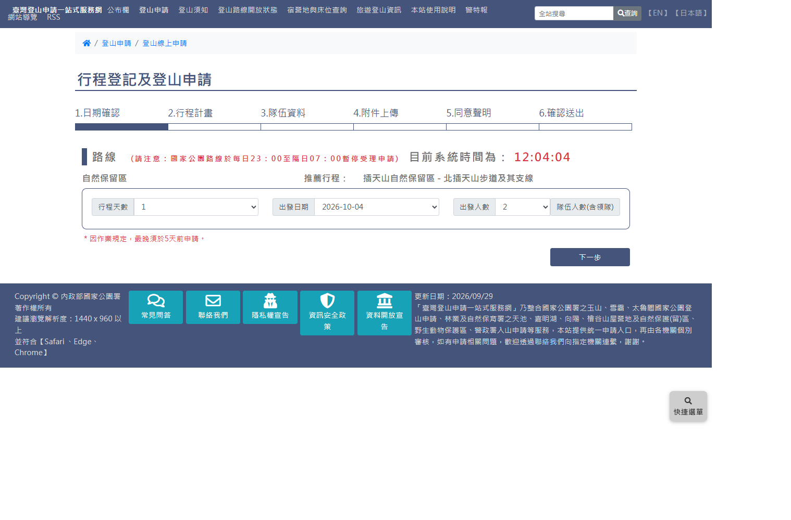
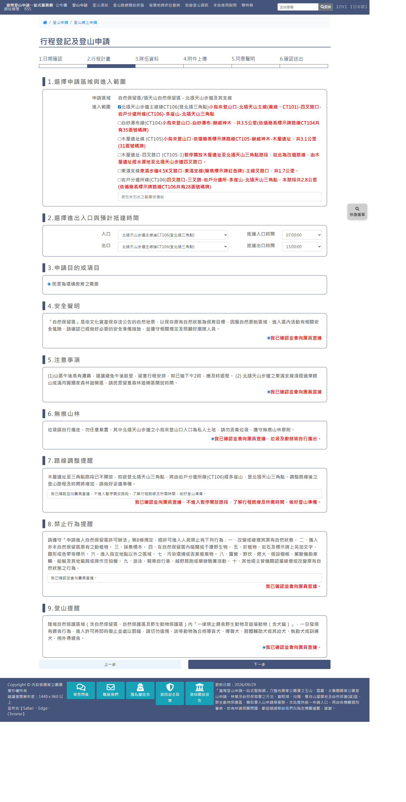
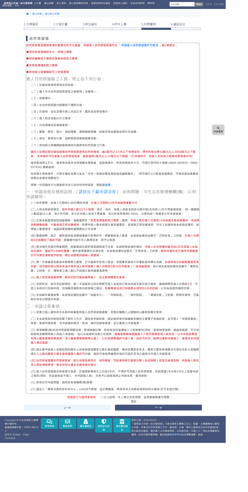
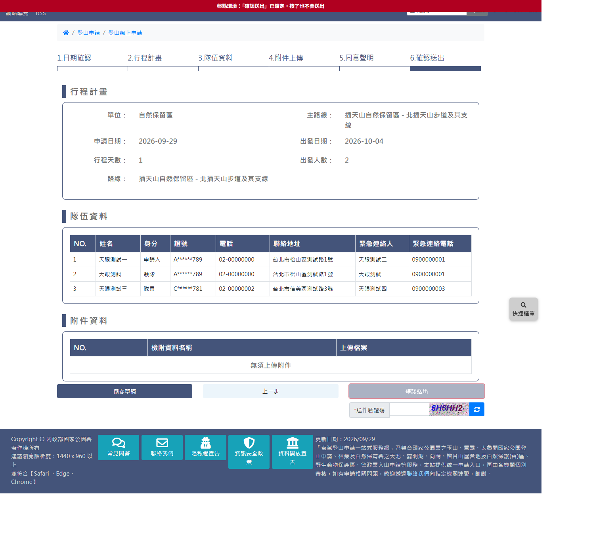
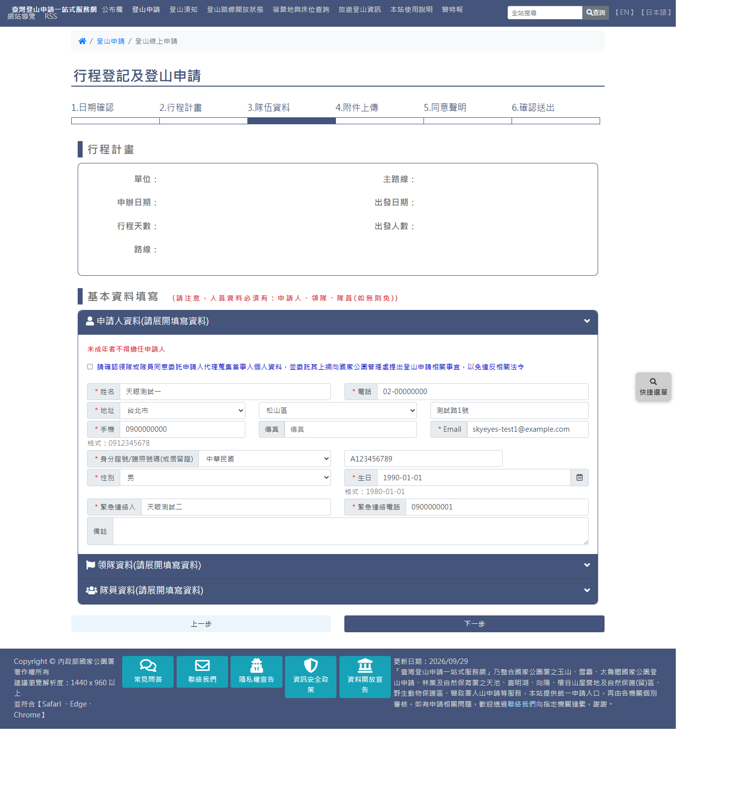
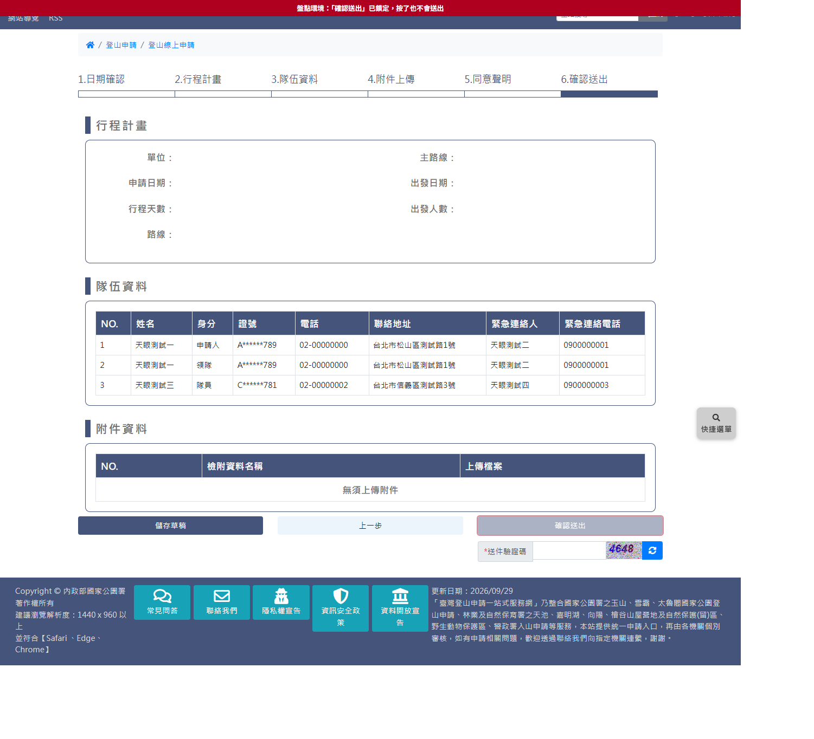

# 林業及自然保育署自然保護區域線上申請

> **內容正本**：正式站 `https://hike.taiwan.gov.tw/apply_forest_area_1.aspx?unit=7d0ed03d-e3ff-4482-8254-96f6434f5a85&tmpc_id=630&tmpf_id=511`
> 起的六頁（`apply_forest_area_1`、`apply_forest_area_2`、`apply_03`～`apply_06`），2026-09-29 實測。
> **擷取來源／日期**：2026-09-29 由正式站實走擷取兩輪，走到第 6 步確認頁，**全程未送出**（`#send` 由盤點環境畫面鎖停用）。
> 路線：自然保留區 ／ 插天山自然保留區 - 北插天山步道及其支線（`cid=630&fid=511`，正式站路線清單第 82 筆），1 天、2 人。
> 核對內容一律以正式站 `hike.taiwan.gov.tw` 為準，**不得改用測試站 `service.skyeyes.tw`**。

> **本檔隸屬 `05_各項線上申請`**。與 05d 警政署入山證**同一個六步驟家族**（第 3～6 步共用 `apply_03`～`apply_06`），
> 本檔以「與警政署的差異」為主軸，共用部分指回 05d。

> **業務數值核對狀態**（2026-09-29 對正式站）
> - ✔ 本區行程天數只有 1 天、出發人數 1～15、出發日期 57 個（10-04～11-29，最早 5 天後）
> - ✔ 收件期間「進入日期前 5～60 日」、每件 15 人為限、進入日期前 14 日抽籤（第 5 步規定原文）
> - ✔ 本區申請目的只有「民眾為環境教育之需要」，**不須附件**
> - `[待確認]` 其他區域的申請目的與附件要求：測試站鴛鴦湖三種目的都「須附行程計畫書」，
>   正式站只走了北插天山，**哪些區域強制附件未普查**

---

## 一、流程總覽

步驟列同 05d：「1.日期確認 2.行程計畫 3.隊伍資料 4.附件上傳 5.同意聲明 6.確認送出」。

| 步驟 | 頁面 | 與警政署的差異 |
|---|---|---|
| 1 日期確認 | `apply_forest_area_1.aspx` | 多「區域類型」標題（自然保留區）；天數依區域（本區只有 1）；最晚 **5** 天前（警政署 3 天）；人數上限 15（警政署 19） |
| 2 行程計畫 | `apply_forest_area_2.aspx` | **完全不同**：區域範圍、進出口與時間、目的、各項宣達確認（見三） |
| 3 隊伍資料 | `apply_03.aspx` | 共用；**無「申請人須為領隊」限制** |
| 4 附件上傳 | `apply_04.aspx` | 共用；本區「無須上傳附件」 |
| 5 同意聲明 | `apply_05.aspx` | 共用頁面、**內容依區域類型**（自然保留區完整規定，見五） |
| 6 確認送出 | `apply_06.aspx` | 共用 |

**沒有獨立的同意書頁**（與警政署同）。背景查詢：第 1 步選天數後 `Func=FormForestAreaList` 取可申請日期與名額。

---

## 二、步驟 1：日期確認

- 標題列：區域類型「自然保留區」＋「推薦行程：插天山自然保留區 - 北插天山步道及其支線」
- `#TravelDays`（本區只有 1）、`#TravelStartDate`、`#TravelPeoples`（1～15）
- 紅字「＊因作業規定，最晚須於5天前申請。」
- 頁面載入後才以 `Func=FormActionKey` 取 key；**太快選天數，日期查詢會帶空 key 而回「Not valid!」**
  （一般使用者手動操作不太會碰到，自動化要等）

---

## 三、步驟 2：行程計畫（`apply_forest_area_2.aspx`）

九個編號區塊（本區）：

| # | 區塊 | 控制項（name） | 說明 |
|---|---|---|---|
| 1 | 選擇申請區域與進入範圍 | `SubBlockArea`（checkbox，每段一個，id `SubBlockArea_A42-076` 等）＋`Notes` | 申請區域唯讀；進入範圍本區 6 段（北插主線接 CT106、白紗瀑布線 CT104、木屋遺址線 CT105、木屋遺址-四叉路口、東滿支線、岩戶分遣所線 CT106），每段附路線說明 |
| 2 | 選擇進出入口與預計抵達時間 | `SubBlockArea_entr`／`SubBlockArea_exit`＋兩個 `GateTime` | **勾了範圍後入口／出口選項即時過濾成該段**（純前端）；時間 05:00～18:00 每半小時 |
| 3 | 申請目的或項目 | `rdo-use-reason`（radio） | 本區只有「民眾為環境教育之需要」 |
| 4 | 安全聲明 | `rdo-use-safe` | 「我已確認並會向團員宣達」 |
| 5 | 注意事項 | `OtherName5` | 午後濃霧、東滿支線須經森林遊樂區 |
| 6 | 無痕山林 | `OtherName6` | 小烏來登山口為私人土地 |
| 7 | 路線調整提醒 | `OtherName7`（唯讀文字） | 木屋遺址至三角點不開放，改由 CT106 經多崖山 |
| 8 | 禁止行為提醒 | `OtherName8`（唯讀文字） | 「申請進入自然保留區許可辦法」第 8 條 |
| 9 | 登山提醒 | `OtherName9` | 一律禁止餵食野生動物及遊蕩動物 |

- 5～9 的區塊**內容與數量依區域而定**（測試站鴛鴦湖為 7 個區塊、目的 3 種且都須附件），
  改版時應視為「區域設定的宣達清單」，不是固定欄位。
- 測試站結論「F2 永遠走不完第 2 步（必須上傳）」**只對部分區域成立**；北插天山不須附件，可完整走完。

---

## 四、步驟 3、4

共用 05d 的 `apply_03`／`apply_04`，差異：
- 第 3 步**沒有**「本案件申請人與領隊須為同一人」紅字，領隊可與申請人不同
- 隊員列同 05d：只預先產生 No.1，其餘按 `#add_member`；有刪除鈕 `#delete_<N>`（確認框 Cancel／OK）
- 第 4 步本區「無須上傳附件」

---

## 五、步驟 5：同意聲明（自然保留區）

標題「自然保留區」，全文為規定說明，要點：
- 可申請目的（許可辦法第 2 條）：原住民族傳統文化祭儀、研究機構學術研究、**民眾環境教育**、其他特殊需要
- 禁止行為十項、罰則（6 個月～5 年有期徒刑、未申請進入罰 3～15 萬）
- **申請流程及規則**：收件自進入日期前 5～60 日；**進入日期前 14 日先抽籤再審查**（抽籤僅限「民眾為環境教育之需要」）；
  每件 15 人為限、每日每件每區姓名與身分證字號不得重複；補件 2 日內一次；進入日期前 4 日起下載許可證；
  6 日前註銷以利遞補；1 年內 3 次以上惡意申請列入禁止名單
- 單一勾選「以上說明，本人業已完全明瞭，並同意確實遵守相關規定。」

---

## 六、步驟 6：確認送出

版面同 05d（行程計畫摘要、隊伍資料表含身分欄與遮罩證號、附件資料、送件驗證碼、儲存草稿／上一步／確認送出）。
摘要「單位」顯示區域類型（自然保留區），「主路線」「路線」為區域名稱。

---

## 七、正式站缺陷：同分頁連續申請時 sessionStorage 不清除

**重現**（2026-09-29 實測）：同一分頁先走完警政署入山證到確認頁（未送出），再從林保署區域重新開始申請。

- 第 3 步**直接帶入上一張的申請人、領隊與 2 位隊員**（本張只申請 2 人，多出 1 位）
- 第 5 步除了自然保留區規定，**多出警政署的同意聲明區塊**（`apply_05` 只要 sessionStorage 有 `TravelStep02Npa` 就顯示）
- 確認頁**行程摘要整塊空白**：`UnitsGuid` 仍是警政署的 `8F7C09DC…`，路線摘要比對不到

原因：第 1 步只覆寫 `MainGuid`／`SecondaryGuid`，不清 `UnitsGuid`、`TravelStep02Npa`、`TravelStep03`。
清空 sessionStorage 後重跑，上述三項都正常。
**風險**：若使用者在此狀態送出，林保署申請可能夾帶警政署的機關代碼與入山資料 `[待確認]`（未送出，無法驗證後端行為）。
**改版建議**：每張申請開始時重設暫存狀態，或暫存以申請為單位隔離。

---

## 八、與雛形的落差

2026-09-29 grep `05_Prototype`：**沒有自然保護區域的申請頁**（林保署只有山屋 `forest-camp-1/2.html`）。

| 項目 | 雛形現況 | 正式站 | 處理建議 |
|---|---|---|---|
| 整個流程 | 無對應頁 | 六步驟，第 2 步為區域範圍／進出口時間／目的／宣達清單 | 需新增；第 3～6 步與警政署、山屋共用 |
| 第 2 步宣達區塊 | — | 數量與內容依區域設定（北插 9 區、測試站鴛鴦湖 7 區） | 設計為資料驅動清單，不寫死欄位 |
| 附件要求 | — | 依區域與目的（北插不須、鴛鴦湖須附行程計畫書） | 由目的設定決定是否顯示上傳 |
| 暫存狀態 | — | 同分頁連續申請會殘留（第七節） | 每張申請開始時重設 |

---

## 九、證據位置

`.scratch/outputs/正式站申請流程盤點/`（不進版控）：

| 檔案 | 內容 |
|---|---|
| `extracts/prod-FA001-S01-blank.html.json`、`screenshots/prod-FA001-S01-filled.png` | 第 1 步 |
| `extracts/prod-FA001-S02-blank.html.json`、`-S02-filled.html.json` | 第 2 步 |
| `extracts/prod-FA001-S03-blank.html.json`、`screenshots/prod-FA001-S03-carryover.png` | 第 3 步（帶入上一張資料） |
| `extracts/prod-FA001-S05-blank.html.json`、`-S06-confirm.html.json` | 受污染的第 5、6 步（含當下 sessionStorage） |
| `extracts/prod-FA002-S05-clean.html.json` | 乾淨流程的第 5 步 |
| `extracts/quick-fa-0929-1214-S06-confirm.html.json` | 乾淨流程的確認頁（含 sessionStorage） |

**快速重現**：`walk_fa.py [--cid 630 --fid 511] [--people 1|2|3] [--keep-session]`，預設先清空 sessionStorage，
一條指令跑到確認頁（約 160 秒），不需輸入驗證碼；`--keep-session` 可重現第七節缺陷。
`[待確認]` 腳本目前放在 session 暫存區，尚未放進 `tools/`。
