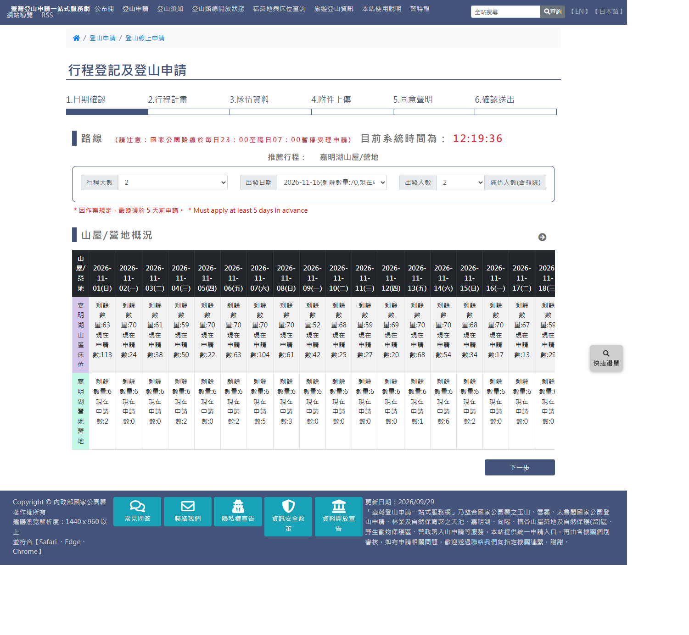
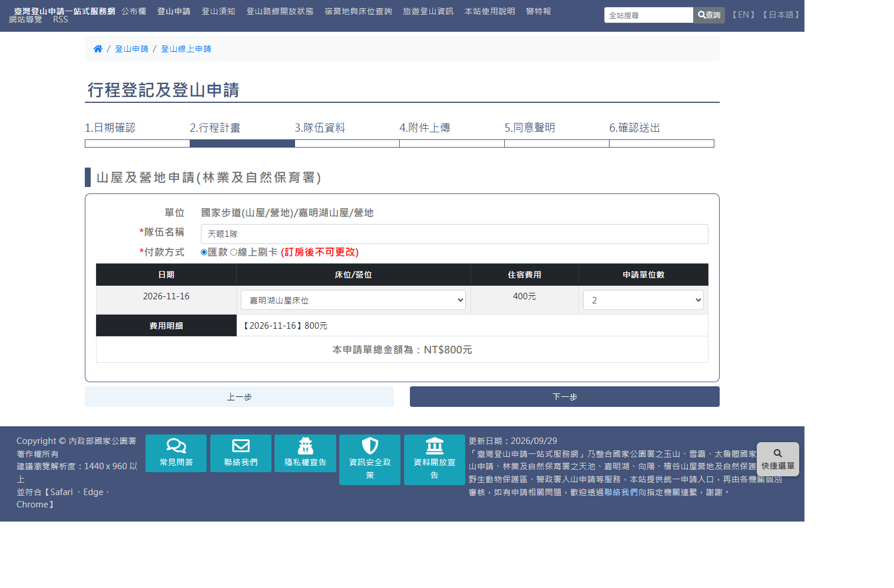
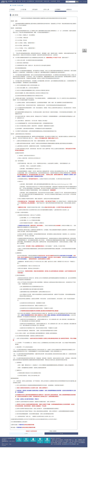
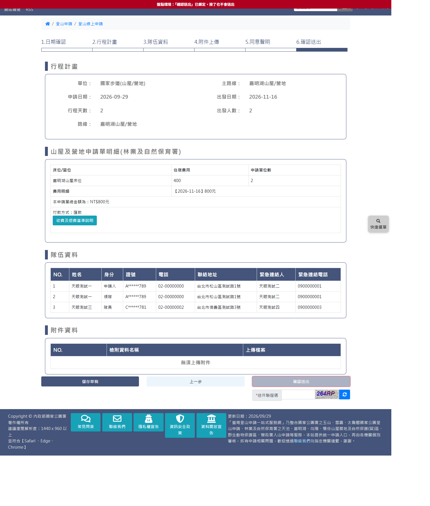

# 林業及自然保育署自然步道山屋線上申請

> **內容正本**：正式站 `https://hike.taiwan.gov.tw/apply_forest_camp_1.aspx?unit=60D5A789-676C-47D6-8F6D-2B991A5D730D`
> 起的六頁（`apply_forest_camp_1`、`apply_forest_camp_2`、`apply_03`～`apply_06`），2026-09-29 實測。
> **擷取來源／日期**：2026-09-29 由正式站實走兩輪（手動逐步一輪、快速腳本一輪），走到第 6 步確認頁，**全程未送出**。
> 路線：國家步道(山屋/營地) ／ 嘉明湖山屋/營地（`cid=159&fid=40`，正式站路線清單第 92 筆），2 天、2 人、嘉明湖山屋床位 2 位。
> 核對內容一律以正式站 `hike.taiwan.gov.tw` 為準，**不得改用測試站 `service.skyeyes.tw`**。

> **本檔隸屬 `05_各項線上申請`**。與 05d 警政署、05e 自然保護區域**同一個六步驟家族**，第 3～6 步共用頁面，
> 本檔以差異為主，共用部分指回 05d。本路線 4 條山屋（向陽、嘉明湖、檜谷、天池）只走了嘉明湖。

> **業務數值核對狀態**（2026-09-29 對正式站）
> - ✔ 行程天數 2～19、出發人數 1～12；出發日期 50 個（10-04～11-29，剩餘 0 的日期不列出）
> - ✔ 嘉明湖山屋床位 400 元／床；本次 2 床總金額 800 元
> - ✔ 第 5 步規定：嘉明湖兩山屋各 70 床、營地 6 座營位，每日可住 176 人；一般申請住宿日前 60～5 日，外籍人士前 120～61 日
> - `[待確認]` 測試站 2026-09-17 天池山莊「查不到任何可選日期」，正式站天池未走，是否為抽籤期間限制待查

---

## 一、流程與家族差異

| 步驟 | 頁面 | 與 05d／05e 的差異 |
|---|---|---|
| 1 日期確認 | `apply_forest_camp_1.aspx` | 天數 **2 起跳**；日期選項顯示剩餘數量；**須先按「查詢住宿」才出現下一步** |
| 2 行程計畫 | `apply_forest_camp_2.aspx` | **訂位頁**：隊伍名稱、付款方式、每晚床位／營位與數量、費用明細 |
| 3 隊伍資料 | `apply_03.aspx` | 共用；**「本案件申請人與領隊須為同一人」**（同警政署，自然保護區域沒有） |
| 4 附件上傳 | `apply_04.aspx` | 本路線「無須上傳附件」 |
| 5 同意聲明 | `apply_05.aspx` | 內容為「山屋/營地」：嘉明湖國家步道經營管理與住宿申請注意事項全文 |
| 6 確認送出 | `apply_06.aspx` | 多一區「山屋及營地申請單明細」與付款方式 |

背景查詢（唯讀，已入白名單）：`CampIndex00List`（第 1 步日期與剩餘數量）、`FormCampIndexList`（第 2 步營位清單）、
`FormCampGetCost`（第 2 步依日期算費用）。

---

## 二、步驟 1：日期確認

- `#TravelDays` 2～19（至少住一晚）
- `#TravelStartDate` 選項文字直接帶數量，例：「2026-11-16(剩餘數量:70,現在申請數:17)」；
  **剩餘數量為 0 的日期不列出**（本次 10-06、10-09、10-10 等缺號）。熱門日期「現在申請數」遠超剩餘（10-25：剩 3、申請 767）
- `#TravelPeoples` 1～12
- 紅字「＊因作業規定，最晚須於 5 天前申請。 ＊Must apply at least 5 days in advance」（附英文對照，05d／05e 同位置的提示沒有）
- **「查詢住宿」**（`a[name=SearchStay]`）：選完三個欄位後要按它，「下一步」才會顯示
- 自動化注意：頁面載入後要等 `RouteInfo` 寫回 `SecondaryGuid` 才能選天數，太快會「Not valid!」

---

## 三、步驟 2：訂位（`apply_forest_camp_2.aspx`）

標題「山屋及營地申請(林業及自然保育署)」：

| 欄位 | 控制項（name） | 說明 |
|---|---|---|
| 單位 | 唯讀 | 國家步道(山屋/營地)/嘉明湖山屋/營地 |
| *隊伍名稱 | `TeamName` | 必填（國家公園三家只有玉山、雪霸有隊名） |
| *付款方式 | `PayKind` | 1＝匯款、2＝線上刷卡；紅字「(訂房後不可更改)」 |
| 每晚一列：日期／床位/營位／住宿費用／申請單位數 | `CampRoom`、`CampOrderNums` | 床位種類本次 3 項：嘉明湖山屋床位、嘉明湖營地營地、向陽山屋床位；數量 0～12；選後帶出單價（400 元） |
| 費用明細 | 唯讀 | 「【2026-11-16】800元」「本申請單總金額為：NT$800元」 |

- 2 天行程只有 1 列（1 晚）；多天應為每晚一列 `[待確認]`（未實測 3 天以上）
- 床位選單把嘉明湖與向陽兩個山屋並列，**同一晚可選不同山屋** `[待確認]` 規則面是否限制

---

## 四、步驟 3～5

- 第 3 步共用 05d：「本案件申請人與領隊須為同一人」；隊員只預先產生 No.1
- 第 4 步：無須上傳附件
- 第 5 步標題「山屋/營地」，全文為「林業及自然保育署臺東分署嘉明湖國家步道暨附屬山屋及其營地經營管理與住宿申請注意事項」，要點：
  - 步道據點里程（向陽山屋 4.3K、嘉明湖山屋 8.4K、嘉明湖 13K）、向陽服務站 7～17 時查驗
  - 宿營地：向陽、嘉明湖山屋各 70 床，嘉明湖營地 6 座營位，每日可住 176 人
  - 同日同一自然人只能申請一個床位或營位；同天不得同時申請山屋與營地
  - 一般申請住宿日前 60～5 日；外籍人士前 120～61 日
  - 每隊 1～12 人，申請人由系統帶入為領隊且須為入住人員；領隊異動每單 1 次、每年 2 次；隊員不得更換只能刪除
  - 連續住宿須各日都抽中才核准
  - 單一勾選同意

---

## 五、步驟 6：確認送出

- 行程計畫摘要：單位（國家步道(山屋/營地)）、主路線、申請日期、出發日期、行程天數、出發人數、路線
- **山屋及營地申請單明細(林業及自然保育署)**：床位/營位、住宿費用、申請單位數、費用明細、總金額、**付款方式**、「收費及退費基準說明」連結
- 隊伍資料表、附件資料、送件驗證碼、儲存草稿／上一步／確認送出（同 05d）

---

## 六、與雛形的落差

雛形有 `forest-camp-1.html`（日期確認）與 `forest-camp-2.html`（行程計畫），第 3～6 步未做。
以下依 2026-09-29 grep 比對，畫面細節未逐項核對 `[待比對]`：

| 項目 | 雛形現況 | 正式站 | 處理建議 |
|---|---|---|---|
| 日期選項顯示剩餘數量 | 無「剩餘」字樣 | 「剩餘數量:N,現在申請數:M」，剩餘 0 不列 | 補上 |
| 「查詢住宿」步驟 | 無 | 第 1 步須先按才出現下一步 | 待決定保留或改為選完即可下一步 |
| 隊伍名稱 | 有（2–40 字） | 有 | 同 |
| 付款方式 | 有（卡片式選項） | 匯款／線上刷卡，「訂房後不可更改」 | 核對選項與提示文字 |
| 每晚床位／營位 | 有（每晚一區、各設施至少 1 單位） | 每晚一列：種類下拉＋數量 0～12，即時算總金額 | 核對「至少 1 單位」規則來源 `[待確認]` |
| 第 3～6 步 | 無 | 共用 `apply_03`～`apply_06`，申請人須為領隊 | 需新增 |

---

## 七、證據位置

`.scratch/outputs/正式站申請流程盤點/`（不進版控）：

| 檔案 | 內容 |
|---|---|
| `extracts/prod-FC001-S01-blank.html.json`、`-S01-stay.html.json` | 第 1 步空白／查詢住宿後 |
| `extracts/prod-FC001-S02-blank.html.json`、`-S02-filled.html.json` | 第 2 步訂位 |
| `extracts/prod-FC001-S05.html.json` | 第 5 步注意事項全文 |
| `extracts/prod-FC001-S06-confirm.html.json` | 確認頁（含 sessionStorage） |
| `extracts/quick-fc-0929-1226-S06-confirm.html.json` | 快速腳本那一輪的確認頁 |

**快速重現**：`walk_fc.py [--unit <山屋 source_guid>] [--people 1|2|3] [--after YYYY-MM-DD]`，
預設嘉明湖、先清空 sessionStorage，一條指令跑到確認頁（實測 84 秒），不需輸入驗證碼。
腳本位於 `.scratch/outputs/正式站申請流程盤點/tools/`（2026-09-29 使用者同意後放入）。
