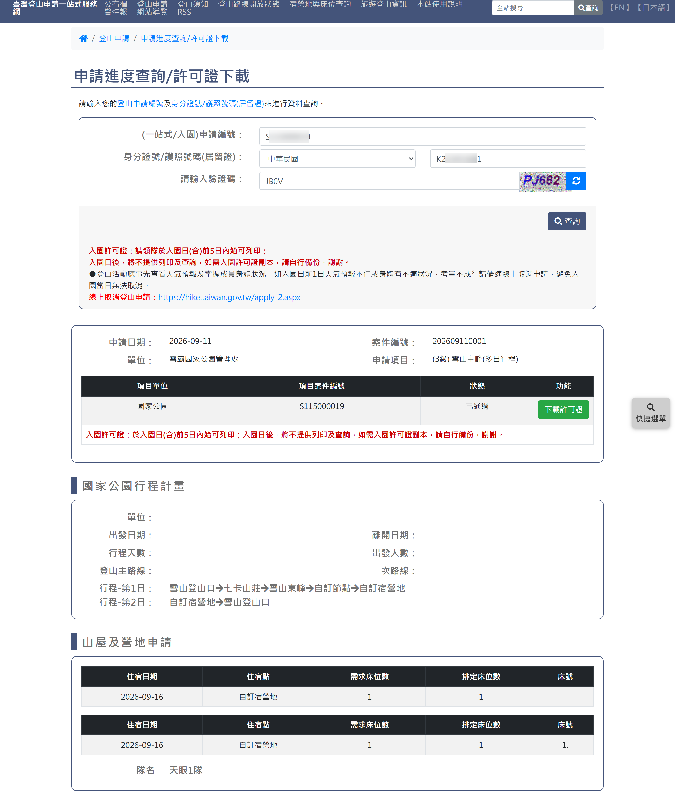
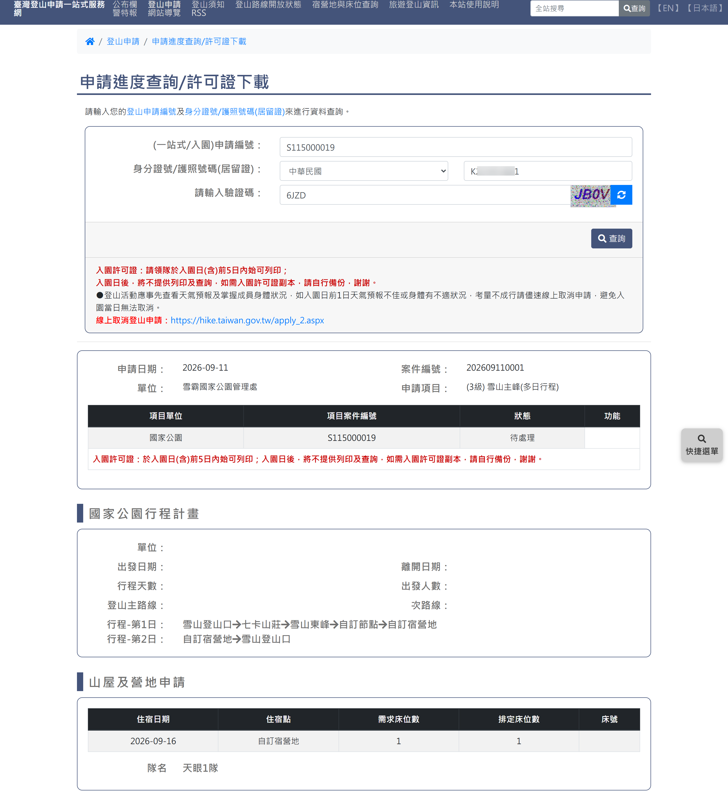
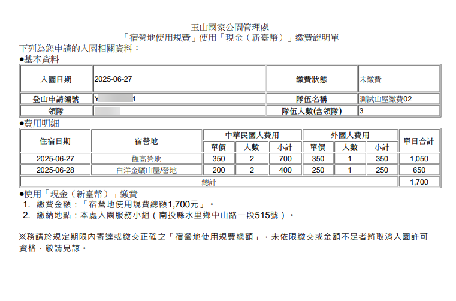
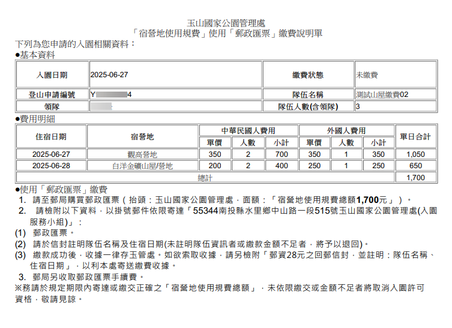
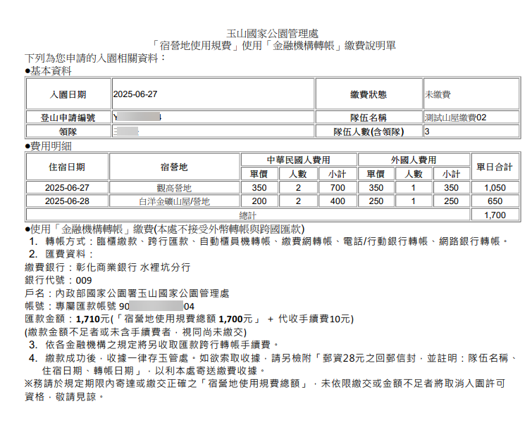

# 申請進度查詢與許可證下載

> **內容正本**：正式站 `https://hike.taiwan.gov.tw/applySearch.aspx`（2026-09-16 實測 HTTP 200）。
> **擷取來源／日期**：`[待確認]` —— 撰寫時未記錄；2026-09-16 補溯源欄位時已無法回溯。
> 核對內容一律以正式站 `hike.taiwan.gov.tw` 為準，**不得改用測試站 `service.skyeyes.tw`**（兩站內容會不一致，理由見 `README.md`「溯源慣例」）。

> **業務數值核對狀態**（2026-09-16 對正式站 `hike.taiwan.gov.tw`）
> - `[待確認]` 查帳「**3–5 個工作天**」：`notice_a1`（玉山登山須知）**查不到**這個期限，
>   該頁寫的是繳費期限「中籤日／通知遞補日後 3 日內完成繳納」。
>   本值與 `16_玉山宿營地查詢.md` 同源，確認時要一起改。

## 一、查詢頁與進度檢視

> 功能路徑：首頁 > 登山申請 > 申請進度查詢/繳費/異動/取消  
> 頁面網址：applySearch.aspx

- 進度查詢條件
  - 申請編號：文字輸入框。
  - 申請人國籍：下拉選單（請選擇、中華民國、國外）。
  - 身分證號/護照號碼(或居留證)：文字輸入框。
  - 驗證碼：文字輸入框，附圖形驗證碼及重新整理按鈕。
  - 查詢：按鈕，檢核格式通過後送出查詢。
- 查詢結果展示
  - 申請進度明細表格：
    - 欄位：申請編號、申請機關、隊名、登山路線、入園日期、離園日期、申請狀態。
  - 狀態情境與後續操作：
    - 核准入園（已通過）：
      - 操作按鈕：下載入園許可證（匯出 PDF）、線上資料異動（導向 `apply_2.aspx`）、出園回報（導向 `apply_6.aspx`）。
    - 審查中／待處理：
      - 狀態標示：待審查、初審通過或待補件。
      - 操作按鈕：補件（上傳補充文件）、取消申請（撤回申請案）。
    - 待繳費（排雲山莊／觀高山屋）：
      - 狀態標示：核准繳費。
      - 操作按鈕：繳費說明（彈出或導向繳費方式說明單）。

---

## 二、玉山宿營地繳費說明單

> 當申請玉山國家公園需繳費宿營地（排雲山莊、觀高山屋）獲得核准時，依選擇或提供之繳費管道出具對應說明單。

### 1. 現金繳費說明單

- 適用管道：親至玉山國家公園管理處以新臺幣現金繳納。
- 說明單內容：
  - 申請資訊：申請編號、隊名、領隊姓名、預定住宿日期、核准宿營地、核准人數。
  - 繳費金額：應繳金額總計（新臺幣元整）。
  - 繳費期限：標示最後繳款截止日期與時間（逾期名額自動作廢）。
  - 繳款地點與時段：南投縣水里鄉中山路一段 515 號（玉管處財務單位），上班日 08:30–17:00。
  - 注意事項：繳費後由出納開立正式收據，入園查核時備查。

### 2. 郵政匯票繳費說明單

- 適用管道：至中華郵政各營業據點購買郵政匯票郵寄繳納。
- 說明單內容：
  - 申請資訊：申請編號、隊名、領隊姓名、預定住宿日期、核准宿營地、應繳金額。
  - 匯票抬頭：指名受款人「國家公園署玉山國家公園管理處」。
  - 郵寄方式：限掛號郵寄至指定地址，信封註明「申請編號」與「宿營地規費」。
  - 查帳時間：以郵戳為憑，查帳約需 3–5 個工作天 `[待確認]`。

### 3. 金融機構轉帳繳費說明單

- 適用管道：ATM 自動櫃員機、網路銀行或實體臨櫃匯款轉帳。
- 說明單內容：
  - 帳戶資訊：解款行代碼、解款行名稱、虛擬專用帳號、應繳金額。
  - 繳費期限：每筆申請案專屬虛擬帳號具備繳費效期，逾期帳號自動失效。
  - 銷帳機制：轉帳完成後系統自動對帳（或於進度查詢頁回填帳號末五碼）。

---

## 內部註記

- 舊系統技術架構：ASP.NET WebForms（`.aspx`）。
- 控制項識別碼：
  - 申請編號輸入框：`ctl00$con$serial`（`#con_serial`）。
  - 國籍下拉選單：`ctl00$con$nation`（`#con_nation`）。
  - 身分證號輸入框：`ctl00$con$sid`（`#con_sid`）。
  - 查詢按鈕：`ctl00$con$btnQuery`。
  - 下載許可證按鈕：`#con_btnDownload`。
- 業務規則：
  - 僅「核准入園」狀態可下載許可證與進行出園回報。
  - 補件期限依審核通知信件規定期限辦理，逾期自動退件。
  - 繳費案件須於期限內完成繳款，查帳通過後狀態轉為「已核准」。
