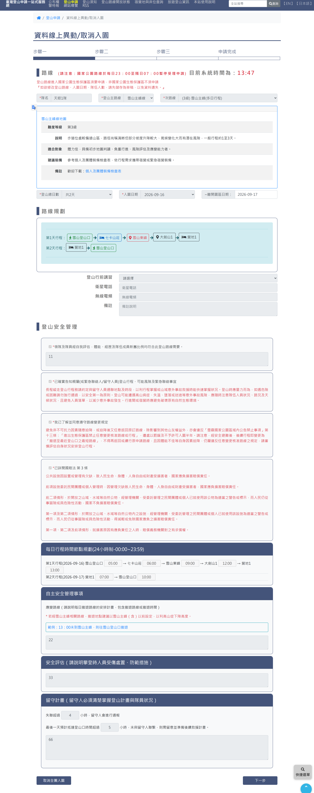

# 申請資料異動及取消

> **內容正本**：正式站 `https://hike.taiwan.gov.tw/apply_2.aspx`（2026-09-16 實測 HTTP 200）。
> **擷取來源／日期**：`[待確認]` —— 撰寫時未記錄；2026-09-16 補溯源欄位時已無法回溯。
> 核對內容一律以正式站 `hike.taiwan.gov.tw` 為準，**不得改用測試站 `service.skyeyes.tw`**（兩站內容會不一致，理由見 `README.md`「溯源慣例」）。

## 一、線上資料異動頁

> 功能路徑：首頁 > 登山申請 > 申請進度查詢/繳費/異動/取消 > 線上資料異動  
> 頁面網址：apply_2.aspx

- 申請行程資料
  - 欄位：申請編號、申請機關、入園日期、離園日期、隊名、登山主路線、次路線。唯讀顯示。
- 領隊與隊員異動
  - 互換功能：按鈕「隊員與領隊互換」，點擊後觸發互換並跳出提示視窗。
  - 領隊資料：
    - 未成年者不得擔任領隊。
    - 欄位：姓名、電話、手機、傳真、Email、證號、性別、生日、緊急連絡人及電話。
  - 隊員資料：
    - 隊員列表：各隊員資料卡片，支援修改資料或替換人員。
    - 取消隊員：核取方塊或按鈕，勾選標記取消該員入園資格。
- 留守人資料異動
  - 附「同申請人」核取方塊；欄位含姓名、電話、手機、Email、證號、生日。
- 異動確認與送出
  - 送件驗證碼：文字輸入框，附圖形驗證碼及重新整理按鈕。
  - 確認修改：按鈕，點擊後檢核異動規則並儲存送出。
  - 整隊取消入園：按鈕，點擊後跳出確認視窗，確認後取消全隊申請案。

---

## 內部註記

- 舊系統技術架構：ASP.NET WebForms（`.aspx`）。
- 控制項識別碼：
  - 隊員與領隊互換按鈕：`#con_btnSwap`。
  - 確認修改按鈕：`#con_btnModify`。
  - 整隊取消按鈕：`#con_btnCancelAll`。
  - 驗證碼輸入框：`#con_vcode`。
- 業務規則：
  - 隊員異動人數與期限依各國家公園管理處自治條例規範。
  - 經核准入園後，主路線與入園日期不得變更；僅得辦理人員資料異動或取消。
