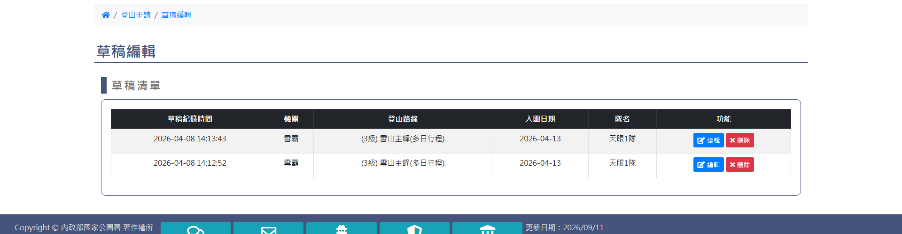
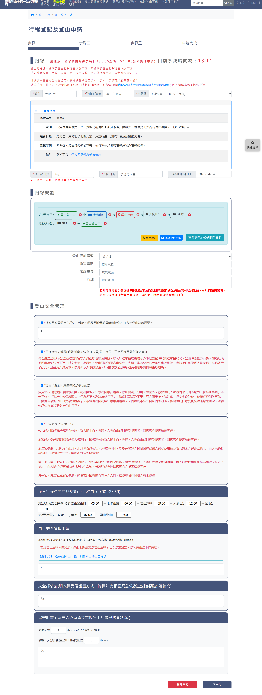
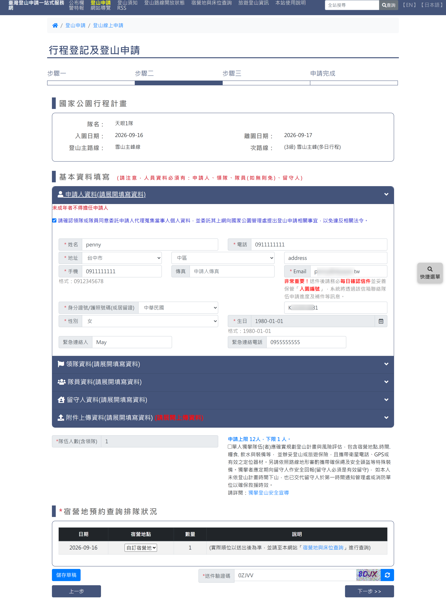
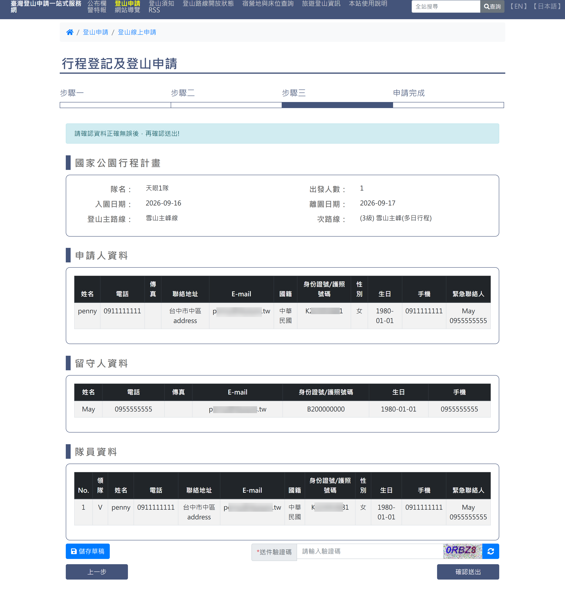
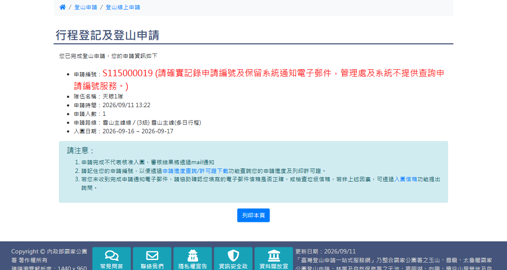

# 草稿編輯

## 一、查詢頁

> 功能路徑：首頁 > 登山申請 > 草稿編輯  
> 頁面網址：apply_2_1.aspx

- 草稿資料查詢
  - 申請人國籍：下拉選單，選項為請選擇、中華民國、國外，預設為請選擇。
  - 身分證號/護照號碼(或居留證)：文字輸入框；國籍為中華民國時檢核身分證字號或居留證號規則，國外時不檢核。
  - 申請人Email：文字輸入框，檢核 Email 格式。
  - 請輸入驗證碼：文字輸入框，附圖形驗證碼及重新整理按鈕。
  - 填寫提醒：紅字標註「＊如欲修改登山路線、入園日期、隊伍人數，請先儲存為草稿，以免資料遺失。」
  - 查詢：按鈕，點擊後清除前後空白並檢核必填欄位、證號規則、Email 格式與驗證碼。
- 開放時間提示：查詢成功後跳出提示視窗，內容為「雪霸、玉山、太魯閣申請開放申請時間為07:00-23:00，請您於07:00手動重新整理頁面，輸入驗證碼後執行"確認送出"鈕即可將申請案送出。草稿資訊僅保留30日，30日內未異動資料或送出申請，草稿將被移除。」

---

## 二、草稿清單頁

> 功能路徑：首頁 > 登山申請 > 草稿編輯 > 草稿清單  
> 頁面網址：apply_2_1.aspx（查詢通過後渲染）

- 草稿清單表格：
  - 欄位：草稿紀錄時間、機關、登山路線、入園日期、隊名、功能。
  - 功能按鈕：
    - 編輯：按鈕，點擊後載入該草稿資料並導向步驟一。
    - 刪除：按鈕，點擊後刪除該筆草稿紀錄。

---

## 三、步驟一：行程登記及登山申請

> 功能路徑：首頁 > 登山申請 > 各項線上申請 / 草稿編輯 > 步驟一  
> 頁面網址：apply_1_1.aspx

- 路線基本資訊
  - 隊名：文字輸入框，必填。
  - 登山主路線／次路線：連動下拉選單，選取後載入路線地圖與難度等級卡片。
  - 登山總日數／入園日期／離開園區日期：日期與天數選取，連動計算離園日期。
- 路線規劃
  - 每日行程節點：顯示每日地點標籤與刪除圖示。
  - 操作按鈕：重新規劃、返回上個地點、查看宿營地部份關閉日期。
- 登山安全管理
  - 4 項檢核核取方塊：領隊及隊員體能評估、確實告知親屬行程、遵守路線變更規定、詳閱國賠法第 3 條，皆須勾選。
  - 每日行程時間節點規劃：各站點預計抵達時間輸入框（24 小時制）。
  - 自主安全管理事項：應變路線輸入框。
  - 安全評估：受傷處置及緊急救護經驗文字框。
  - 留守計畫：失聯通報小時數（預設 4）、最後一天預計抵達登山口時間（小時，預設 5）、留守人掌握現況說明文字框。
- 步驟按鈕
  - 刪除草稿：按鈕，點擊後刪除該草稿。
  - 下一步：按鈕，點擊後檢核步驟一欄位並進入步驟二。

---

## 四、步驟二：基本資料填寫

> 功能路徑：首頁 > 登山申請 > 各項線上申請 / 草稿編輯 > 步驟二  
> 頁面網址：apply_1_2.aspx

- 行程摘要：唯讀顯示隊名、入園日期、離園日期、登山主路線、次路線。
- 人員資料填寫手風琴區塊：
  - 申請人資料：未成年者不得擔任申請人；欄位含姓名、電話、地址（縣市/行政區/地址）、手機、傳真、Email（紅字警語：每日確認信件並妥善保管入園編號）、證號、性別、生日、緊急連絡人及電話。
  - 領隊資料：未成年者不得擔任領隊；附「同申請人」核取方塊，勾選後自動代入；緊急連絡人須以家人為主。
  - 隊員資料：
    - 提醒說明：個人手機號碼勿共用；非同住家人其 Email、地址、緊急聯絡人勿重複。
    - 操作按鈕：新增隊員、展開全部隊員、關閉全部隊員。
    - 隊員卡片：可獨立刪除；欄位同申請人。
  - 留守人資料：附「同申請人」核取方塊；留守人為不上山人員。
  - 附件上傳資料：點擊開啟上傳彈窗；上傳檔案限制單檔 5MB；支援新增、編輯與刪除附件清單。
- 宿營地預約查詢排隊狀況：顯示日期、宿營地點、數量、說明。
- 儲存與送件控制
  - 儲存草稿：按鈕，點擊或按 Enter 儲存並跳出提示 `草稿儲存完成`。
  - 送件驗證碼：文字輸入框，附圖形驗證碼與重新整理按鈕。
  - 上一步／下一步 >>：按鈕。

---

## 五、步驟三：確認資料頁

> 功能路徑：首頁 > 登山申請 > 各項線上申請 / 草稿編輯 > 步驟三  
> 頁面網址：apply_1_3.aspx

- 提示文字：純文字，「請確認資料正確無誤後，再確認送出！」。
- 確認總表：行程計畫表格、申請人資料表格、留守人資料表格、隊員資料表格。
- 操作控制：
  - 儲存草稿：按鈕。
  - 送件驗證碼：文字輸入框，附圖形驗證碼及重新整理按鈕。
  - 上一步：按鈕，返回步驟二。
  - 確認送出：按鈕，檢核驗證碼通過後送出申請案。

---

## 六、步驟四：申請完成頁

> 功能路徑：首頁 > 登山申請 > 各項線上申請 / 草稿編輯 > 申請完成  
> 頁面網址：apply_1_4.aspx

- 申請結果資訊
  - 申請編號：紅字強調「請確實記錄申請編號及保留系統通知電子郵件，管理處及系統不提供查詢申請編號服務。」
  - 明細欄位：隊伍名稱、申請時間、申請人數、申請路線、入園日期。
- 注意事項
  - 申請完成不代表核准入園，審核結果透過 mail 通知。
  - 記住申請編號，以利用「申請進度查詢/許可證下載」查詢進度與列印許可證。
  - 未收到通知信請檢查垃圾信箱，或使用入園信箱反映。
- 列印本頁：按鈕，點擊後觸發列印或匯出 PDF。

---

## 內部註記

- 舊系統技術架構：ASP.NET WebForms（`.aspx`）。
- 控制項識別碼：
  - 查詢頁：
    - 申請人國籍：`ctl00$con$apply_nation`（`#con_apply_nation`）。
    - 身分證號/護照號碼(或居留證)：`ctl00$con$apply_sid`（`#con_apply_sid`）。
    - 申請人Email：`ctl00$con$apply_email`（`#con_apply_email`）。
    - 驗證碼輸入框：`ctl00$con$vcode`（`#con_vcode`）。
    - 驗證碼圖形：`#con_imgcode`（`CheckImageCode.aspx`）。
    - 查詢按鈕：`ctl00$con$btnappok`（`#con_btnappok`，觸發 `WebForm_DoPostBackWithOptions`，驗證群組 `validateapp`）。
  - 步驟二控制項：
    - 儲存草稿按鈕：`#con_btnDraft`。
    - 鍵盤事件：監聽 Enter 觸發草稿儲存與彈窗 `alert('草稿儲存完成')`。
    - 附件上傳彈窗：FancyBox 外掛彈窗（`#fancybox-content`）。
- 前端檢核演算法：
  - 送出前呼叫 `trimdata()` 清除身分證號及 Email 前後空白。
  - `Check_sid()` 函式：包含 `UserNO()` 驗證本國身分證格式，以及 `UserNO2()` 驗證居留證格式。
  - 驗證碼更新函式：`changevcode()`，累加計數重新請求 `CheckImageCode.aspx`。
