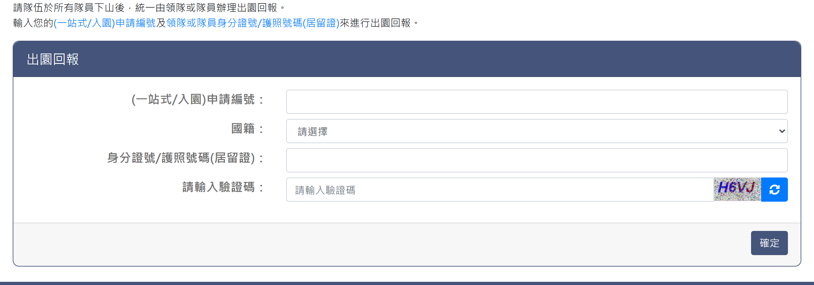
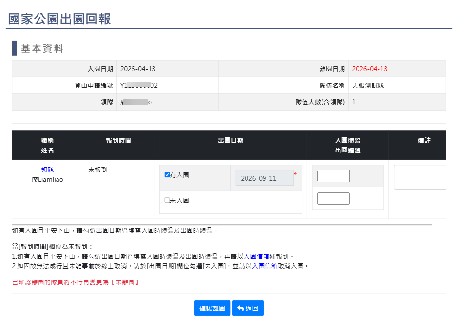

# 國家公園出園回報

> **內容正本**：正式站 `https://hike.taiwan.gov.tw/apply_6.aspx`（2026-09-16 實測 HTTP 200）。
> **擷取來源／日期**：`[待確認]` —— 撰寫時未記錄；2026-09-16 補溯源欄位時已無法回溯。
> 核對內容一律以正式站 `hike.taiwan.gov.tw` 為準，**不得改用測試站 `service.skyeyes.tw`**（兩站內容會不一致，理由見 `README.md`「溯源慣例」）。

## 一、回報頁

> 功能路徑：首頁 > 登山申請 > 國家公園出園回報  
> 頁面網址：apply_6.aspx

- 回報說明：純文字，說明隊伍於所有隊員下山後，統一由領隊或隊員輸入申請編號及身分證號/護照號碼(居留證)辦理出園回報。
- 出園回報
  - (一站式/入園)申請編號：文字輸入框。
  - 國籍：下拉選單，選項為請選擇、中華民國、國外，預設為請選擇。
  - 身分證號/護照號碼(居留證)：文字輸入框；國籍為中華民國時檢核身分證字號或居留證號規則，國外時不檢核。
  - 請輸入驗證碼：文字輸入框，附圖形驗證碼及重新整理按鈕。
  - 確定：按鈕，點擊後檢核必填欄位、證號規則與驗證碼；檢核通過後送出出園回報。

---

## 二、回報資料填寫頁

> 功能路徑：首頁 > 登山申請 > 國家公園出園回報 > 回報資料填寫  
> 頁面網址：apply_6.aspx（查詢送出後載入）

- 基本資料
  - 欄位：入園日期、離園日期、登山申請編號、隊伍名稱、領隊姓名、隊伍人數(含領隊)。唯讀顯示。
- 出園回報明細
  - 列表欄位：職稱/姓名、報到時間、出園日期、入園體溫/出園體溫、備註。
  - 報到時間：純文字。
  - 出園日期：
    - 有入園：核取方塊，勾選後日期選取框必填（預設當日）。
    - 未入園：核取方塊。與有入園互斥。
  - 入園體溫／出園體溫：文字輸入框，選填。
  - 備註：文字輸入框，選填。
- 報到狀態說明
  - 報到時間為「未報到」且有入園 → 勾選出園日期並填寫體溫，以入園信箱補報到。
  - 報到時間為「未報到」且未成行 → 勾選未入園，以入園信箱取消入園。
  - 限制：已確認離園之隊員不可再變更為未離園。
- 操作按鈕
  - 確認離園：按鈕，點擊跳出確認視窗 `請確認是否送出出園回報?!`。確認後送出並跳出提示 `出園回報完成!!`。
  - 返回：按鈕，點擊返回查詢頁。

---

## 內部註記

- 舊系統技術架構：ASP.NET WebForms（`.aspx`）。
- 控制項識別碼：
  - 查詢頁：
    - 申請編號：`ctl00$con$serial`（`#con_serial`）。
    - 國籍下拉選單：`ctl00$con$nation`（`#con_nation`）。
    - 身分證號/居留證：`ctl00$con$sid`（`#con_sid`）。
    - 驗證碼輸入框：`ctl00$con$vcode`（`#con_vcode`）。
    - 驗證碼圖形：`#con_imgcode`（`CheckImageCode.aspx`）。
    - 確定按鈕：`ctl00$con$btnok`（`#con_btnok`，觸發 `WebForm_DoPostBackWithOptions`）。
  - 回報頁：
    - 確認離園按鈕：`#con_btnSave`（觸發 JavaScript `confirm('請確認是否送出出園回報?!')`）。
    - 返回按鈕：`#con_btnBack`。
- 前端檢核演算法：
  - 送出前執行 `trimdata()` 清除前後空白。
  - `Check_sid()` 函式：包含 `UserNO()` 驗證本國身分證格式（首碼英文、次碼 1 或 2，加權檢查碼模 10），以及 `UserNO2()` 驗證居留證格式。
  - 送出成功提示：`alert('出園回報完成!!')`。
