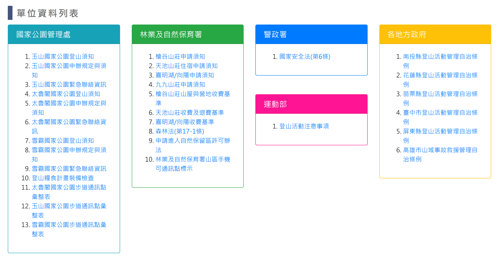
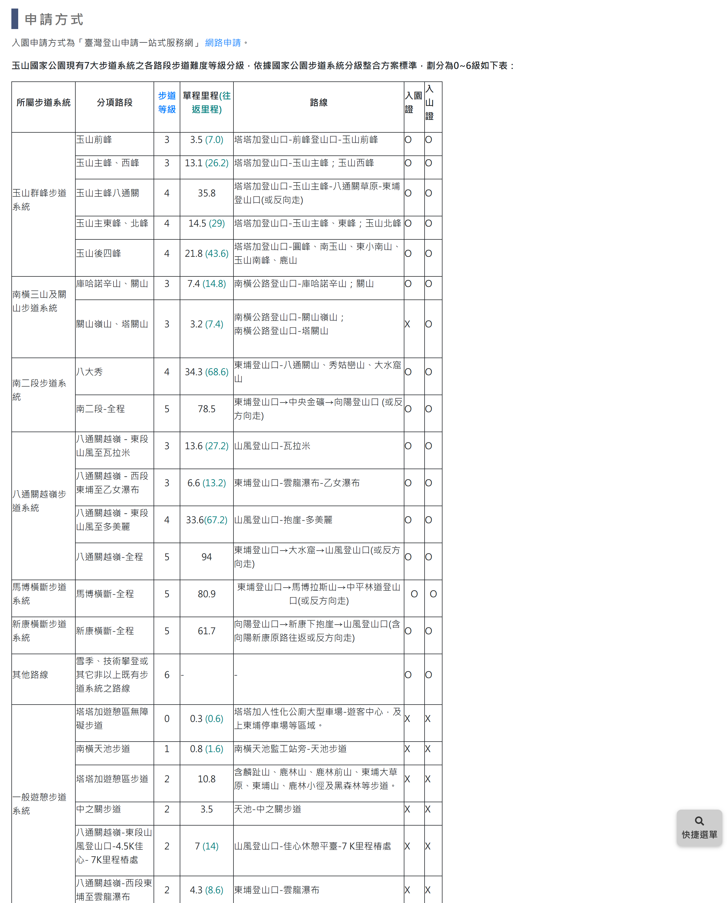

# 登山須知

> **內容正本**：正式站 `https://hike.taiwan.gov.tw/notice.aspx`（2026-09-16 實測 HTTP 200）。
> **擷取來源／日期**：`[待確認]` —— 撰寫時未記錄；2026-09-16 補溯源欄位時已無法回溯。
> **已核對**：2026-09-16 以正式站核對 「國家安全法(第6條)」、「運動部」、「觀看登山安全影片」、「單位資料列表」與 31 條清單項目，本份與正式站一致。
> 核對內容一律以正式站 `hike.taiwan.gov.tw` 為準，**不得改用測試站 `service.skyeyes.tw`**（兩站內容會不一致，理由見 `README.md`「溯源慣例」）。

## 一、列表頁

> 功能路徑：首頁 > 登山須知  
> 頁面網址：notice.aspx

- 觀看登山安全影片：按鈕，點擊後另開分頁開啟 [YouTube 登山安全影片播放清單](https://www.youtube.com/watch?v=HgnaQaKFjNo&list=PL8CdSPNjegIZKIN75OXLB9uk_4eQmgsAm&index=3)。
- 單位資料列表
  - 國家公園管理處
    - 玉山國家公園登山須知、玉山國家公園申辦規定與須知、玉山國家公園緊急聯絡資訊、太魯閣國家公園登山須知、太魯閣國家公園申辦規定與須知、太魯閣國家公園緊急聯絡資訊、雪霸國家公園登山須知、雪霸國家公園申辦規定與須知、雪霸國家公園緊急聯絡資訊、登山糧食計畫裝備檢查：連結，點擊後導向檢視頁。
    - 太魯閣國家公園步道通訊點彙整表、雪霸國家公園步道通訊點彙整表：連結，另開分頁開啟 PDF。
    - 玉山國家公園步道通訊點彙整表：連結，點擊後另開分頁開啟 [玉山國家公園步道通訊點彙整表](https://www.ysnp.gov.tw/StaticPage/CommunicationReferencePoint)。
  - 林業及自然保育署
    - 檜谷山莊申請須知、天池山莊住宿申請須知、嘉明湖/向陽申請須知、九九山莊申請須知、檜谷山莊山屋與營地收費基準、天池山莊收費及退費基準、嘉明湖/向陽收費基準：連結，點擊後導向檢視頁。
    - 外部法規與通訊點：超連結，點擊後另開分頁開啟 [森林法(第17-1條)](https://law.moj.gov.tw/LawClass/LawAll.aspx?pcode=M0040001)、[申請進入自然保留區許可辦法](https://law.moj.gov.tw/LawClass/LawAll.aspx?pcode=M0040036)、[林業及自然保育署山區手機可通訊點標示](https://www.forest.gov.tw/0004548/0073591)。
  - 警政署
    - 國家安全法(第6條)：超連結，點擊後另開分頁開啟 [國家安全法(第6條)](https://law.moj.gov.tw/LawClass/LawAll.aspx?PCode=A0030028)。
  - 運動部
    - 登山活動注意事項：超連結，點擊後另開分頁開啟 [登山活動注意事項](https://law.sports.gov.tw/NewsContent.aspx?id=83&KW=%E7%99%BB%E5%B1%B1%E6%B4%BB%E5%8B%95)。
  - 各地方政府
    - 自治條例：超連結，點擊後另開分頁開啟 [南投縣登山活動管理自治條例](https://www.ntfd.gov.tw/index.php?act=article&code=detail&ids=2498)、[花蓮縣登山活動管理自治條例](http://glrs.hl.gov.tw/glrsout/NewsContent.aspx?id=1390)、[苗栗縣登山活動管理自治條例](http://law.miaoli.gov.tw/glrsnewsout/NewsContent.aspx?id=326)、[臺中市登山活動管理自治條例](http://lawsearch.taichung.gov.tw/GLRSout/NewsContent.aspx?id=16176)、[屏東縣登山活動管理自治條例](http://ptlaw.pthg.gov.tw/NewsContent.aspx?id=987)、[高雄市山域事故救援管理自治條例](https://outlaw.kcg.gov.tw/LawContent.aspx?id=GL001547&KeyWord=%e9%ab%98%e9%9b%84%e5%b8%82%e5%b1%b1%e5%9f%9f%e4%ba%8b%e6%95%85%e6%95%91%e6%8f%b4%e7%ae%a1%e7%90%86%e8%87%aa%e6%b2%bb%e6%a2%9d%e4%be%8b)。

---

## 二、檢視頁

> 功能路徑：首頁 > 登山須知 > 須知內容  
> 頁面網址：notice_{代碼}.aspx

- 頁面內容
  - 須知標題：純文字。
  - 須知內容：富文字 HTML。
- 回列表頁：按鈕，點擊後返回列表頁。

---

## 內部註記

- 舊系統技術架構：ASP.NET WebForms（`.aspx`）。
- 檢視頁代碼對照：
  - 國家公園管理處：玉山須知 `notice_a1.aspx`、申辦規定 `notice_a2.aspx`、緊急聯絡 `notice_a3.aspx`；太魯閣須知 `notice_a4.aspx`、申辦規定 `notice_a5.aspx`、緊急聯絡 `notice_a6.aspx`；雪霸須知 `notice_a7.aspx`、申辦規定 `notice_a8.aspx`、緊急聯絡 `notice_a9.aspx`；裝備檢查 `notice_a10.aspx`。
  - 林業及自然保育署：檜谷須知 `notice_b1.aspx`、天池須知 `notice_b2.aspx`、嘉明湖須知 `notice_b3.aspx`、九九須知 `notice_b7.aspx`；檜谷收費基準 `notice_b4.aspx`、天池收費基準 `notice_b5.aspx`、嘉明湖收費基準 `notice_b6.aspx`。
- 外部連結皆以另開新分頁（`target="_blank"`）處理。
