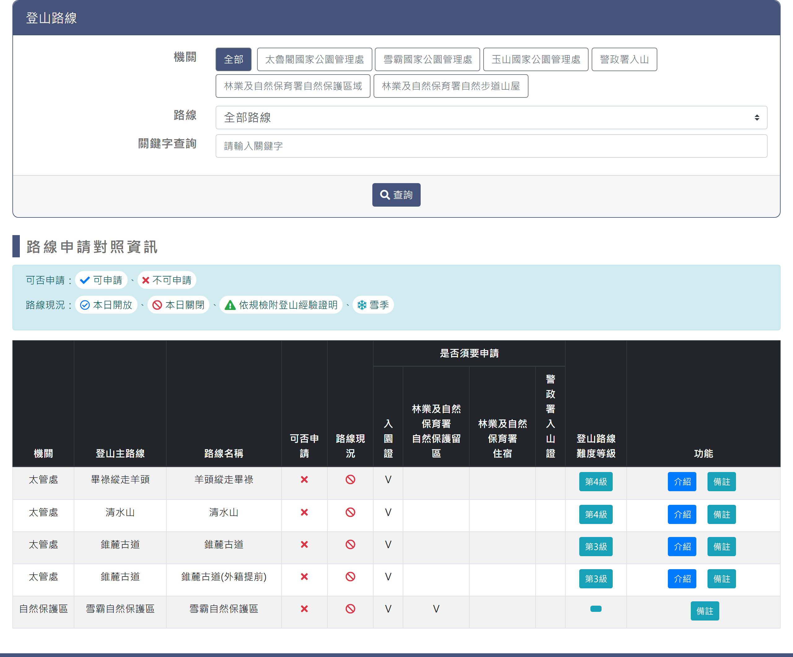
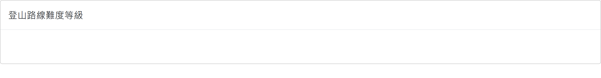
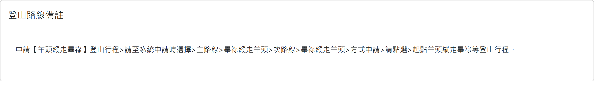

# 登山路線開放狀態

> **內容正本**：正式站 `https://hike.taiwan.gov.tw/open.aspx`（2026-09-16 實測 HTTP 200）。
> **擷取來源／日期**：`[待確認]` —— 撰寫時未記錄；2026-09-16 補溯源欄位時已無法回溯。
> 核對內容一律以正式站 `hike.taiwan.gov.tw` 為準，**不得改用測試站 `service.skyeyes.tw`**（兩站內容會不一致，理由見 `README.md`「溯源慣例」）。

## 一、列表頁

> 功能路徑：首頁 > 登山路線開放狀態  
> 頁面網址：open.aspx

- 查詢條件
  - 機關：按鈕群，選項為全部、太魯閣國家公園管理處、雪霸國家公園管理處、玉山國家公園管理處、警政署入山、林業及自然保育署自然保護區域、林業及自然保育署自然步道山屋，預設為全部；點擊後動態載入對應路線選項。
  - 路線：下拉選單（支援關鍵字輸入過濾），預設為全部路線。
  - 查詢：按鈕，點擊後依設定條件篩選並重新載入列表。
- 圖例說明
  - 可否申請：可申請（綠色勾號圖示）、不可申請（紅色叉號圖示）。
  - 路線現況：本日開放（綠色圓形圖示）、本日關閉（紅色禁止圖示）、依規檢附登山經驗證明（黃色三角警示圖示）、雪季（藍色雪花圖示）。
- 路線申請對照資訊
  - 列表：
    - 欄位：機關、登山主路線、路線名稱、可否申請、路線現況、是否須要申請（入園證、林業及自然保育署自然保護留區、林業及自然保育署住宿、警政署入山證）、登山路線難度等級、功能（介紹、備註）。
    - 可否申請：以圖示呈現可申請或不可申請狀態。
    - 路線現況：以圖示呈現本日開放、本日關閉、依規檢附登山經驗證明或雪季狀態。
    - 是否須要申請：包含入園證、林業及自然保育署自然保護留區、林業及自然保育署住宿、警政署入山證四項，須申請者標記「V」，不須則空白。
    - 登山路線難度等級：按鈕（標示如「第4級」），點擊後以彈窗開啟難度等級頁。
    - 介紹：按鈕，點擊後導向登山路線介紹檢視頁。
    - 備註：按鈕，點擊後以彈窗開啟備註頁。

---

## 二、難度等級-彈窗頁

> 功能路徑：首頁 > 登山路線開放狀態 > 登山路線難度等級  
> 頁面網址：linelevel.aspx?f_id={路線ID}&c_id={子路線ID}

- 頁面內容
  - 彈窗標題：登山路線難度等級。
  - 難度等級說明：純文字或 HTML，顯示該路線之步道分級難度等級與評估說明。

---

## 三、備註-彈窗頁

> 功能路徑：首頁 > 登山路線開放狀態 > 登山路線備註  
> 頁面網址：linenote.aspx?f_id={路線ID}&c_id={子路線ID}

- 頁面內容
  - 彈窗標題：登山路線備註。
  - 備註內容：純文字，說明該路線申請路徑選取方式、開放管制時間或證件免辦提醒。

---

## 內部註記

- 舊系統技術架構：ASP.NET WebForms（`.aspx`）。
- 控制項識別碼：
  - 機關按鈕群：`#org`、`#org{GUID}`（隱藏欄位 `#hidorgid`）。
  - 路線下拉選單：`ctl00$con$line`（`#con_line`，套用 Bootstrap Multiselect 支援輸入過濾）。
  - 查詢按鈕：`ctl00$con$btnselect`（`#con_btnselect`，觸發 `__doPostBack`）。
  - 難度等級彈窗：`#levelid`（Fancybox iframe，彈窗關閉時觸發 `parent.location.reload(true)`）。
  - 介紹按鈕：導向 `information_1.aspx?c_id={ID}`。
  - 備註彈窗：`#noteid`（Fancybox iframe）。
- 圖例圖示採用 Font Awesome（`fa-check`、`fa-times`、`fa-circle`、`fa-ban`、`fa-exclamation-triangle`、`fa-snowflake`）。
