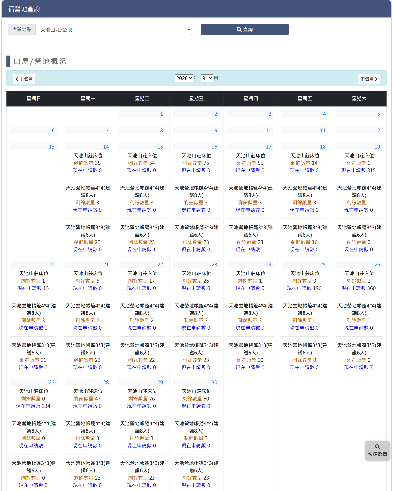

# 林業及自然保育署宿營地查詢

> **內容正本**：正式站 `https://hike.taiwan.gov.tw/bed_0.aspx`（2026-09-16 實測 HTTP 200）。
> **擷取來源／日期**：`[待確認]` —— 撰寫時未記錄；2026-09-16 補溯源欄位時已無法回溯。
> 核對內容一律以正式站 `hike.taiwan.gov.tw` 為準，**不得改用測試站 `service.skyeyes.tw`**（兩站內容會不一致，理由見 `README.md`「溯源慣例」）。

## 一、查詢與月曆概況頁

> 功能路徑：首頁 > 宿營地與床位查詢 > 林業及自然保育署宿營地查詢  
> 頁面網址：bed_0.aspx

- 宿營地查詢
  - 宿營地點：下拉選單，選項為請選擇、天池山莊/營地、向陽山屋、嘉明湖山屋/營地、檜谷山莊/營地，預設為請選擇。
  - 查詢：按鈕，點擊後依選取宿營地點載入該月份山屋及營地概況月曆。
- 山屋/營地概況
  - 月份導航：
    - 上個月：按鈕（`<上個月`），點擊切換至前一個月份。
    - 年份：下拉選單，選取查詢年份。
    - 月份：下拉選單，選取查詢月份（1 至 12 月）。
    - 下個月：按鈕（`下個月>`），點擊切換至下一個月份。
  - 月曆表格：
    - 欄位：星期日、星期一、星期二、星期三、星期四、星期五、星期六。
    - 日期格：
      - 日期：顯示當日日期。
      - 設施現況：依選取宿營地點列出各設施項目之剩餘數量與申請人數。
        - 設施名稱：依宿營地點顯示對應設施項目（天池山莊/營地：天池山莊床位、天池營地帳篷4*4(建議8人)、天池營地帳篷3*3(建議6人)；向陽山屋：向陽山屋床位；嘉明湖山屋/營地：嘉明湖山屋床位、嘉明湖營地營地；檜谷山莊/營地：檜谷山莊、檜谷山莊周邊營地四人帳篷）。
        - 剩餘數量：標示各設施當日剩餘額度。
        - 現在申請數：標示目前累計申請總人數。

---

## 內部註記

- 舊系統技術架構：ASP.NET WebForms（`.aspx`）。
- 控制項識別碼：
  - 宿營地點下拉選單：`ctl00$con$rooms`（`#con_rooms`）。
  - 查詢按鈕：`ctl00$con$btnsearch`（`#con_btnsearch`，觸發 `__doPostBack`）。
  - 上個月按鈕：`ctl00$con$btnPreMonth`（`#con_btnPreMonth`）。
  - 年份下拉選單：`ctl00$con$ddlYear`（`#con_ddlYear`）。
  - 月份下拉選單：`ctl00$con$ddlMonth`（`#con_ddlMonth`）。
  - 下個月按鈕：`ctl00$con$btnNextMonth`（`#con_btnNextMonth`）。
  - 月曆控制項：ASP.NET Calendar（`ctl00$con$Calendar1`）。
- 後端資料來源：介接林業及自然保育署 API（讀取 `web.config` 之 `WSUrls` MasterAPI）。
