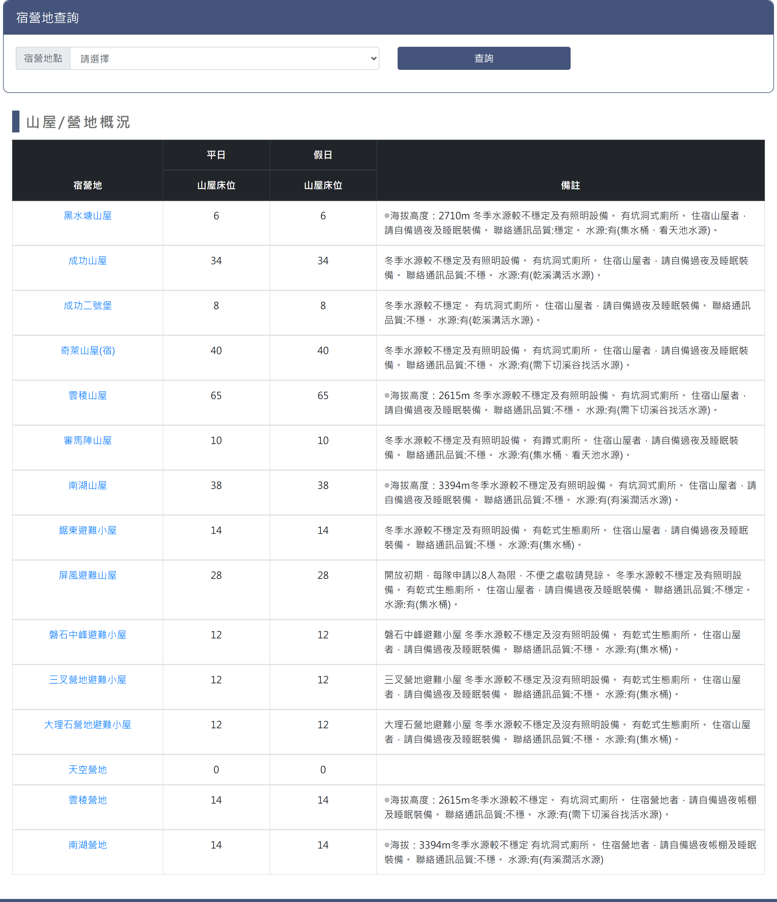
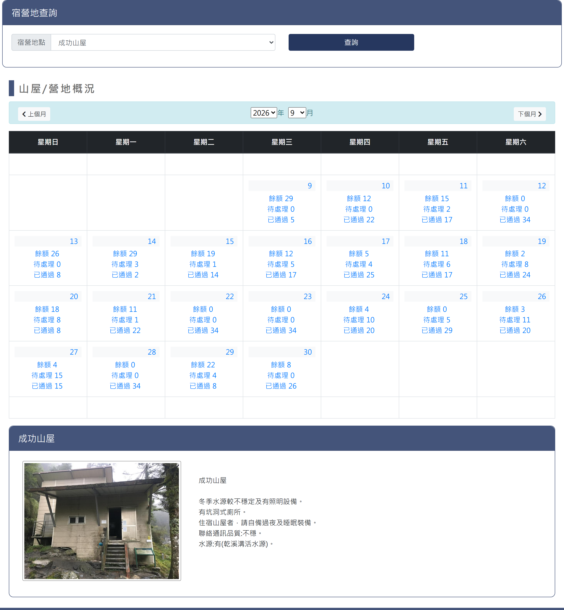
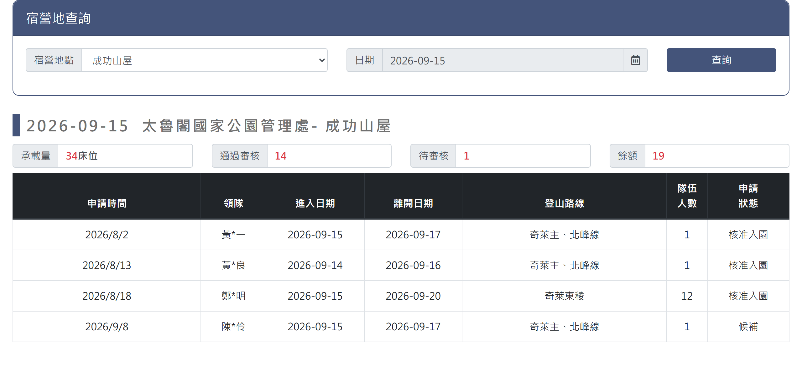

# 太魯閣山屋查詢

> **內容正本**：正式站 `https://hike.taiwan.gov.tw/bed_4.aspx`（2026-09-16 實測 HTTP 200）。
> **擷取來源／日期**：`[待確認]` —— 撰寫時未記錄；2026-09-16 補溯源欄位時已無法回溯。
> 核對內容一律以正式站 `hike.taiwan.gov.tw` 為準，**不得改用測試站 `service.skyeyes.tw`**（兩站內容會不一致，理由見 `README.md`「溯源慣例」）。

## 一、查詢與承載量月曆頁

> 功能路徑：首頁 > 宿營地與床位查詢 > 太魯閣山屋查詢  
> 頁面網址：bed_4.aspx

- 宿營地查詢
  - 宿營地點：下拉選單，選項為請選擇、黑水塘山屋、成功山屋、成功二號堡、奇萊山屋(宿)、雲稜山屋、審馬陣山屋、南湖山屋、鋸東避難小屋、屏風避難山屋、雲稜營地、南湖營地、磐石中峰避難小屋、三叉營地避難小屋、大理石營地避難小屋，預設為請選擇。
  - 查詢：按鈕，未選取宿營地點時顯示承載量總表；選取宿營地點後載入該宿營地點之月曆檢視。
- 宿營地承載量總表（未選取宿營地點時呈現）

  

  - 列表：
    - 欄位：宿營地、平日山屋床位、假日山屋床位、備註。
    - 宿營地：超連結，點擊後載入該宿營地點之月曆檢視。
    - 備註：說明各宿營地點之海拔高度、水源、廁所型式、通訊品質與住宿自備裝備提醒。
- 月曆概況（選取宿營地點後呈現）

  

  - 月份導航：
    - 上個月：按鈕，點擊切換至前一個月份。
    - 年份：下拉選單，選取查詢年份。
    - 月份：下拉選單，選取查詢月份（1 至 12 月）。
    - 下個月：按鈕，點擊切換至下一個月份。
  - 月曆表格：
    - 欄位：星期日、星期一、星期二、星期三、星期四、星期五、星期六。
    - 日期格：
      - 日期：顯示當日日期。
      - 每日申請概況：超連結，顯示該日名額統計，點擊後另開當日申請名單明細頁。
        - 餘額：標示當日剩餘額度。
        - 待處理：標示待審查件數或人數。
        - 已通過：標示已核准入園人數。
  - 山屋介紹卡片：
    - 卡片標題：顯示該宿營地點名稱。
    - 山屋照片：點擊可開啟原圖彈窗展示。
    - 介紹內容：純文字，說明海拔高度、水源穩定度、照明設備、廁所型式、住宿自備裝備提醒、通訊品質與水源位置。
    - 水況資訊：標示該山屋即時或常態水源狀況。
    - 訊號資訊：標示各電信業者通訊訊號品質。

---

## 二、當日申請名單-明細頁

> 功能路徑：首頁 > 宿營地與床位查詢 > 太魯閣山屋查詢 > 當日申請名單  
> 頁面網址：bed_4main.aspx?orgid={機關ID}&node_id={宿營地ID}&sdate={日期}

- 宿營地查詢
  - 宿營地點：下拉選單，選項為請選擇及各宿營地點，預設帶入前頁所選宿營地點。
  - 日期：日期選取框，預設帶入前頁所選日期。
  - 查詢：按鈕，點擊後依選定之宿營地點與日期重新載入當日申請名單。
- 當日申請名單
  - 名單標題：顯示格式為「{查詢日期} {受理機關} - {宿營地點}」，例：「2026-09-15 太魯閣國家公園管理處 - 成功山屋」。
  - 承載量概況：承載量、通過審核、待審核、餘額。
  - 列表：
    - 欄位：申請時間、領隊、進入日期、離開日期、登山路線、隊伍人數、申請狀態。
    - 領隊：第二字元以「*」遮罩。

---

## 內部註記

- 舊系統技術架構：ASP.NET WebForms（`.aspx`）。
- 控制項識別碼：
  - 宿營地點下拉選單：`ctl00$con$rooms`（`#con_rooms`）。
  - 查詢按鈕：`ctl00$con$btnsearch`（`#con_btnsearch`，觸發 `__doPostBack`）。
  - 承載量總表：`#con_gvData`（`.table_bed`，宿營地名稱帶 hidden 欄位 `HiddenField1` 存宿營地 ID）。
  - 月曆導航：上個月按鈕 `ctl00$con$lbUpMonth`（`#con_lbUpMonth`）、下個月按鈕 `ctl00$con$lbDownMonth`（`#con_lbDownMonth`）、年份選單 `#con_ddlYear`、月份選單 `#con_ddlMonth`。
  - 月曆日格：日期標籤 `#con_cb_{index}`、明細超連結 `#con_cc_{index}`。
  - 明細頁跳轉：網址為 `bed_4main.aspx?orgid={機關ID}&node_id={宿營地ID}&sdate={日期}`。
  - 明細頁查詢區：宿營地點 `#con_rooms`、日期文字框 `ctl00$con$ucDatePicker1$txtDate`（`#con_ucDatePicker1_txtDate`）、查詢按鈕 `#con_btnsearch`。
  - 明細頁標題：主標題 `.con_title`、名單標題日期 `#con_sdate`、機關 `#con_org`、宿營地 `#con_room`。
  - 明細頁承載量統計：`#con_lblsumrooms`（承載量）、`#con_lblsubrooms`（通過審核）、`#con_lblchkrooms`（待審核）、`#con_lbloverrooms`（餘額）。
  - 山屋介紹卡片：照片彈窗函式 `fancypic('{node_id}')`、水況標籤 `#con_waters`、訊號標籤 `#con_signals`。
- 機關代碼（`orgid`）：太魯閣國家公園管理處固定為 `105e956f-d8da-49f7-a9b7-3aefdda88a12`。
