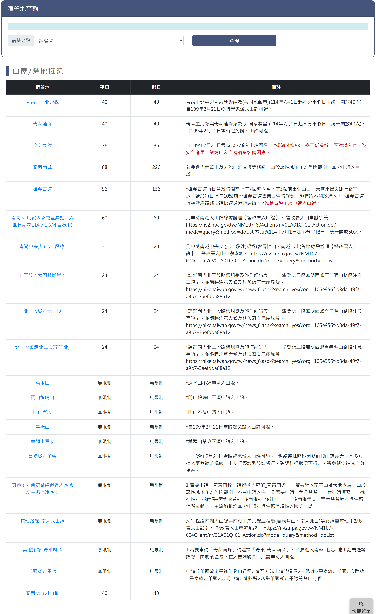
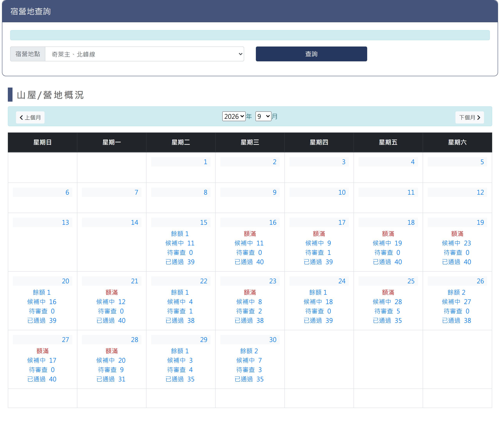
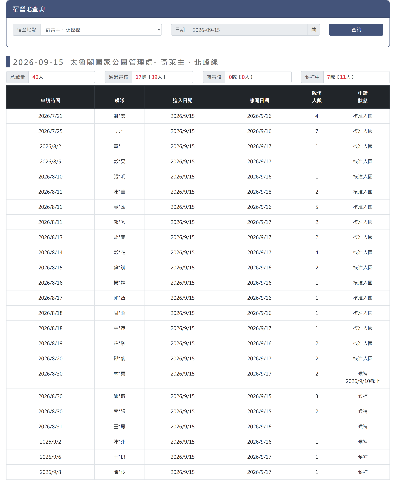

# 太魯閣路線查詢

## 一、查詢與承載量月曆頁

> 功能路徑：首頁 > 宿營地與床位查詢 > 太魯閣路線查詢  
> 頁面網址：bed_5.aspx

- 路線查詢
  - 路線：下拉選單，選項為請選擇、奇萊主、北峰線、奇萊連峰、奇萊東稜、奇萊南峰、錐麓古道、南湖大山線(因承載量異動，入園日期為114.7.1以後者適用)、南湖中央尖 (北一段線)、北二段（鬼門關斷崖）、北一段縱走北二段、北一段縱走北二段(南往北)、清水山、閂山鈴鳴山、閂山單攻、畢祿山、羊頭山單攻、畢祿縱走羊頭、其他（非傳統路線但進入區域屬生態保護區）、其他路線\_南湖大山線、其他路線\_奇萊群峰、羊頭縱走畢祿、奇萊北屏風山線，預設為請選擇。
  - 查詢：按鈕，未選取路線時顯示承載量總表；選取路線後載入該路線之月曆檢視。
- 路線承載量總表（未選取路線時呈現）

  

  - 列表：
    - 欄位：路線、平日、假日、備註。
    - 路線：超連結，點擊後載入該路線之月曆檢視。
    - 備註：說明各路線每日承載量管制名額。
- 月曆概況（選取路線後呈現）

  

  - 月份導航：
    - 上個月：按鈕，點擊切換至前一個月份。
    - 年份：下拉選單，選取查詢年份。
    - 月份：下拉選單，選取查詢月份（1 至 12 月）。
    - 下個月：按鈕，點擊切換至下一個月份。
  - 月曆表格：
    - 欄位：星期日、星期一、星期二、星期三、星期四、星期五、星期六。
    - 日期格：
      - 日期：顯示當日日期。
      - 每日申請概況：超連結，顯示該日名額統計，點擊後另開當日申請名單明細頁。
        - 餘額：標示當日剩餘額度。
        - 待處理：標示待審查件數或人數。
        - 已通過：標示已核准入園人數。

---

## 二、當日申請名單-明細頁

> 功能路徑：首頁 > 宿營地與床位查詢 > 太魯閣路線查詢 > 當日申請名單  
> 頁面網址：bed_5main.aspx?orgid={機關ID}&c_id={路線ID}&sdate={日期}

- 路線查詢
  - 路線：下拉選單，選項為請選擇及各路線名稱，預設帶入前頁所選路線。
  - 日期：日期選取框，預設帶入前頁所選日期。
  - 查詢：按鈕，點擊後依選定之路線與日期重新載入當日申請名單。
- 當日申請名單
  - 名單標題：顯示格式為「{查詢日期} {受理機關} - {路線名稱}」，例：「2026-09-15 太魯閣國家公園管理處 - 奇萊主、北峰線」。
  - 承載量概況：承載量、通過審核、待審核、候補中。
  - 列表：
    - 欄位：申請時間、領隊、進入日期、離開日期、隊伍人數、申請狀態。
    - 領隊：第二字元以「*」遮罩。

---

## 內部註記

- 舊系統技術架構：ASP.NET WebForms（`.aspx`）。
- 控制項識別碼：
  - 路線下拉選單：`ctl00$con$rooms`（`#con_rooms`）。
  - 查詢按鈕：`ctl00$con$btnsearch`（`#con_btnsearch`，觸發 `__doPostBack`）。
  - 承載量總表：`#con_gvData`（`.table_bed`，路線名稱帶 hidden 欄位儲存路線 ID）。
  - 月曆導航：上個月按鈕 `ctl00$con$lbUpMonth`（`#con_lbUpMonth`）、下個月按鈕 `ctl00$con$lbDownMonth`（`#con_lbDownMonth`）、年份選單 `#con_ddlYear`、月份選單 `#con_ddlMonth`。
  - 月曆日格：日期標籤 `#con_cb_{index}`、明細超連結 `#con_cc_{index}`。
  - 明細頁跳轉：網址為 `bed_5main.aspx?orgid={機關ID}&c_id={路線ID}&sdate={日期}`。
  - 明細頁查詢區：路線選單 `#con_rooms`、日期文字框 `ctl00$con$ucDatePicker1$txtDate`（`#con_ucDatePicker1_txtDate`）、查詢按鈕 `#con_btnsearch`。
  - 明細頁標題：主標題 `.con_title`、名單標題日期 `#con_sdate`、機關 `#con_org`、路線 `#con_room`。
  - 明細頁承載量統計：`#con_lblsumrooms`（承載量）、`#con_lblsubrooms`（通過審核）、`#con_lblchkrooms`（待審核）、`#con_lbloverrooms`（餘額）。
- 機關代碼（`orgid`）：太魯閣國家公園管理處固定為 `105e956f-d8da-49f7-a9b7-3aefdda88a12`。
