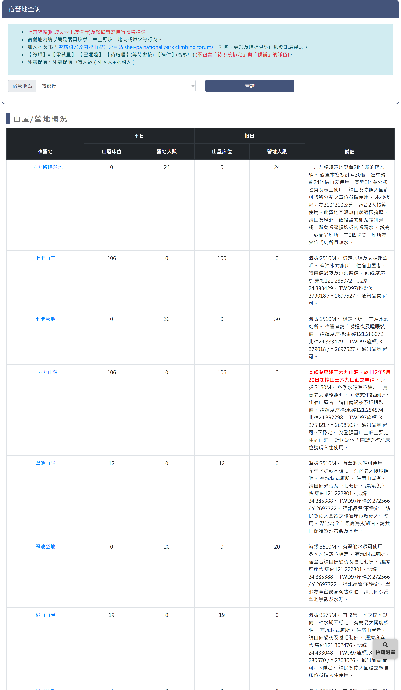
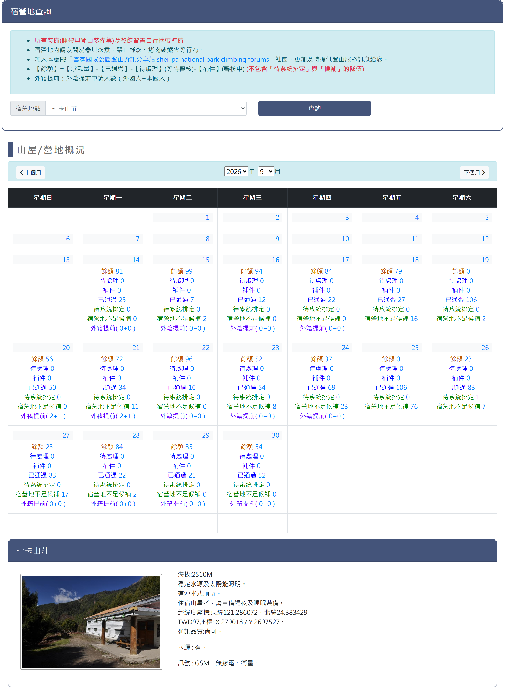
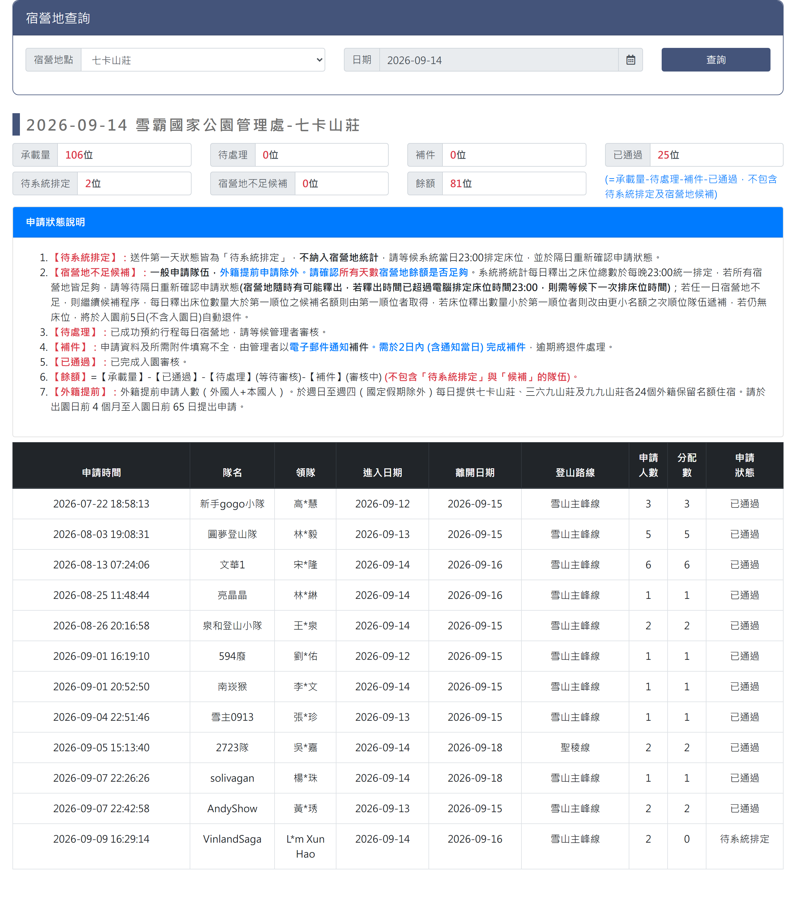

# 雪霸宿營地查詢

> **內容正本**：正式站 `https://hike.taiwan.gov.tw/bed_1.aspx`（2026-09-16 實測 HTTP 200）。
> **擷取來源／日期**：`[待確認]` —— 撰寫時未記錄；2026-09-16 補溯源欄位時已無法回溯。
> 核對內容一律以正式站 `hike.taiwan.gov.tw` 為準，**不得改用測試站 `service.skyeyes.tw`**（兩站內容會不一致，理由見 `README.md`「溯源慣例」）。

## 一、查詢與承載量月曆頁

> 功能路徑：首頁 > 宿營地與床位查詢 > 雪霸宿營地查詢  
> 頁面網址：bed_1.aspx

- 註記說明：
  - 所有裝備(睡袋與登山裝備等)及餐飲皆需自行攜帶準備。
  - 宿營地內請以簡易器具炊煮，禁止野炊、烤肉或燃火等行為。
  - 加入本處FB「[雪霸國家公園登山資訊分享站 shei-pa national park climbing forums](https://www.facebook.com/groups/1834803213441409/)」社團，更加及時提供登山服務訊息給您。
  - 【餘額】=【承載量】-【已通過】-【待處理】(等待審核)-【補件】(審核中) (不包含「待系統排定」與「候補」的隊伍)。
  - 外籍提前：外籍提前申請人數（外國人+本國人）。
- 宿營地查詢
  - 宿營地點：下拉選單，選項為請選擇、三六九臨時營地、七卡山莊、七卡營地、三六九山莊、翠池山屋、翠池營地、桃山山屋、桃山營地、新達山屋、新達營地、馬達拉溪登山口宿營地、九九山莊、中霸山屋、賽良久營地、瓢簞山屋、瓢簞營地、雪山山莊舊址營地、油婆蘭山屋、油婆蘭營地、完美谷營地、17K營地、26K營地、28K營地、匹匹達山東鞍營地、奇峻山營地、弓水營地、大南山西鞍營地、火石山下營地、雪北山屋、素密達山屋、霸南山屋、馬洋山前營地、馬洋池營地、雪山圈谷營地，預設為請選擇。
  - 查詢：按鈕，未選取宿營地點時顯示承載量總表；選取宿營地點後載入該宿營地點之月曆檢視與宿營地介紹卡片。
- 宿營地承載量總表（未選取宿營地點時呈現）

  

  - 列表：
    - 欄位：宿營地、平日山屋床位、平日營地人數、假日山屋床位、假日營地人數、備註。
    - 宿營地：超連結，點擊後載入該宿營地點之月曆檢視與介紹卡片。
    - 備註：富文本（HTML），說明各宿營地點之開放現況、營地型態、注意事項與自備裝備提醒；支援重要警示紅字標記（例：停止申請公告）、粗體與超連結。
- 月曆概況（選取宿營地點後呈現）

  

  - 月份導航：
    - 上個月：按鈕，點擊切換至前一個月份。
    - 年份：下拉選單，選取查詢年份。
    - 月份：下拉選單，選取查詢月份（1 至 12 月）。
    - 下個月：按鈕，點擊切換至下一個月份。
  - 月曆表格：
    - 欄位：星期日、星期一、星期二、星期三、星期四、星期五、星期六。
    - 日期格：
      - 日期：顯示當日日期。
      - 每日申請概況：超連結，顯示該日名額統計，點擊後另開當日申請名單明細頁。
        - 餘額：標示當日剩餘額度。
        - 待處理：標示待審查件數或人數。
        - 已通過：標示已核准入園人數。
  - 宿營地介紹卡片：
    - 卡片標題：顯示該宿營地點名稱。
    - 宿營地照片：點擊可開啟原圖彈窗展示。
    - 介紹內容：純文字，說明海拔高度、經緯度座標、水況穩定度、公廁設備、通訊品質與住宿注意事項。
    - 訊號資訊：標示各電信業者通訊訊號品質。

---

## 二、當日申請名單-明細頁

> 功能路徑：首頁 > 宿營地與床位查詢 > 雪霸宿營地查詢 > 當日申請名單  
> 頁面網址：bed_1main.aspx?orgid={機關ID}&node_id={宿營地ID}&sdate={日期}

- 宿營地查詢
  - 宿營地點：下拉選單，選項為請選擇及各宿營地點，預設帶入前頁所選宿營地點。
  - 日期：日期選取框，預設帶入前頁所選日期。
  - 查詢：按鈕，點擊後依選定之宿營地點與日期重新載入當日申請名單。
- 當日申請名單
  - 名單標題：顯示格式為「{查詢日期} {受理機關} - {宿營地點}」，例：「2026-09-14 雪霸國家公園管理處 - 七卡山莊」。
  - 承載量概況：承載量、待處理、補件、已通過、待系統排定、宿營地不足候補、餘額。
  - 申請狀態說明：
    - 待系統排定：送件首日狀態，不計入統計，等候每日 23:00 統一排定後隔日確認。
    - 宿營地不足候補：一般申請隊伍（外籍提前除外），每日 23:00 依序遞補釋出床位；入園前 5 日仍無床位自動退件。
    - 待處理：已成功預約行程每日宿營地，等候管理者審核。
    - 補件：填寫不全由電郵通知，需於 2 日內（含通知當日）完成補件，逾期退件。
    - 已通過：已完成入園審核。
    - 餘額：`餘額 = 承載量 - 已通過 - 待處理 - 補件`（不含待系統排定與候補隊伍）。
    - 外籍提前：週日至週四（國定假日除外）提供七卡、三六九、九九山莊各 24 個保留名額，於出園前 4 個月至入園前 65 日提出申請。
  - 列表：
    - 欄位：申請時間、隊名、領隊、進入日期、離開日期、登山路線、申請人數、分配數、申請狀態。
    - 領隊：第二字元以「*」遮罩。

---

## 內部註記

- 舊系統技術架構：ASP.NET WebForms（`.aspx`）。
- 控制項識別碼：
  - 宿營地點下拉選單：`ctl00$con$rooms`（`#con_rooms`）。
  - 查詢按鈕：`ctl00$con$btnsearch`（`#con_btnsearch`，觸發 `__doPostBack`）。
  - 承載量總表：`#con_gvData`（`.table_bed`，宿營地名稱帶 hidden 欄位儲存宿營地 ID）。
  - 月曆導航：上個月按鈕 `ctl00$con$lbUpMonth`（`#con_lbUpMonth`）、下個月按鈕 `ctl00$con$lbDownMonth`（`#con_lbDownMonth`）、年份選單 `#con_ddlYear`、月份選單 `#con_ddlMonth`。
  - 月曆日格：日期標籤 `#con_cb_{index}`、明細超連結 `#con_cc_{index}`。
  - 宿營地介紹卡片：照片彈窗函式 `fancypic('{node_id}')`、訊號標籤 `#con_signals`。
  - 明細頁跳轉：網址為 `bed_1main.aspx?orgid={機關ID}&node_id={宿營地ID}&sdate={日期}`。
  - 明細頁查詢區：宿營地點 `#con_rooms`、日期文字框 `ctl00$con$ucDatePicker1$txtDate`（`#con_ucDatePicker1_txtDate`）、查詢按鈕 `#con_btnsearch`。
  - 明細頁標題：主標題 `.con_title`、名單標題日期 `#con_sdate`、機關 `#con_org`、宿營地 `#con_room`。
  - 明細頁承載量統計：`#con_lblsumrooms`（承載量）、`#con_lblsubrooms`（通過審核）、`#con_lblchkrooms`（待審核）、`#con_lbloverrooms`（餘額）。
- 機關代碼（`orgid`）：雪霸國家公園管理處固定為 `e6dd4652-2d37-4346-8f5d-6e538353e0c2`。
