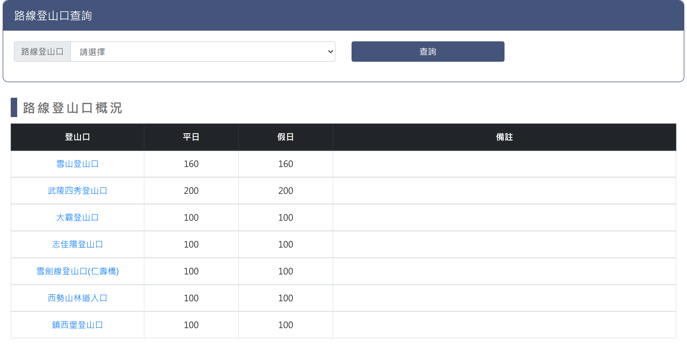
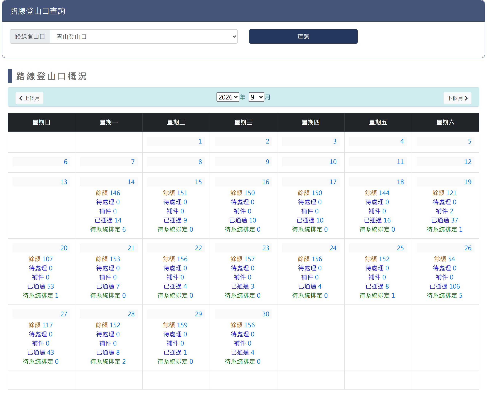
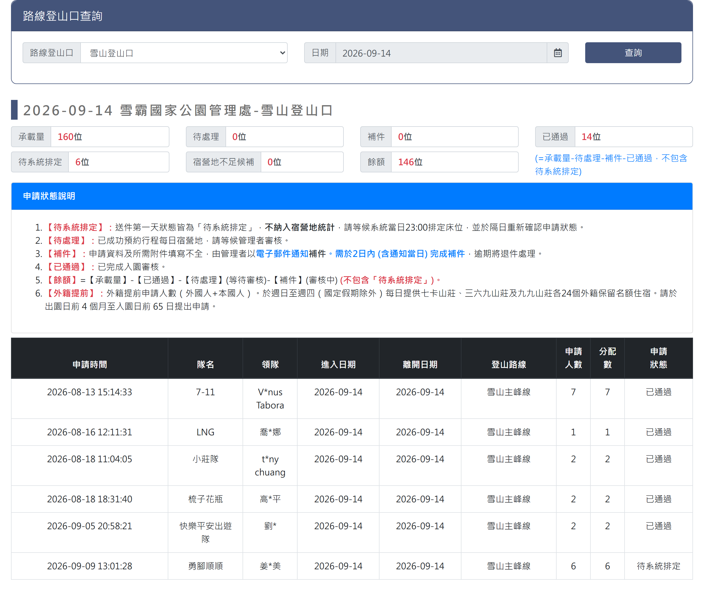

# 雪霸路線查詢

> **內容正本**：正式站 `https://hike.taiwan.gov.tw/bed_10.aspx`（2026-09-16 實測 HTTP 200）。
> **擷取來源／日期**：`[待確認]` —— 撰寫時未記錄；2026-09-16 補溯源欄位時已無法回溯。
> 核對內容一律以正式站 `hike.taiwan.gov.tw` 為準，**不得改用測試站 `service.skyeyes.tw`**（兩站內容會不一致，理由見 `README.md`「溯源慣例」）。

> **業務數值核對狀態**（2026-09-16 對正式站 `hike.taiwan.gov.tw`）
> - `[待確認]` 外籍提前「各 **24** 個保留名額，出園前 **4 個月**至入園前 **65 日**」：
>   與 `14_雪霸宿營地查詢.md` 同一段文字、同樣查不到來源（`bed_1`／`notice_a7`／
>   `notice_a8` 皆無）。**兩份規格共用同一個未經核對的數值**，確認時要一起改。
> - ✔ **已核對**：「每日 **23:00** 統一排定」—— `notice_a7` 有
>   「系統將統計每日釋出之床位總數於每晚23:00統一排定」。
> - `[待確認]` 「補件須於 **2 日內**（含通知當日）完成」：`notice_a7`／`notice_a8` 皆無
>   補件規定。與 `14_雪霸宿營地查詢.md` 同文，要一起改。

## 一、查詢與承載量月曆頁

> 功能路徑：首頁 > 宿營地與床位查詢 > 雪霸路線查詢  
> 頁面網址：bed_10.aspx

- 路線（登山口）查詢
  - 登山口：下拉選單，選項為請選擇、雪山登山口、武陵四秀登山口、大霸登山口、志佳陽登山口、雪劍線登山口(仁壽橋)、西勢山林道入口、鎮西堡登山口，預設為請選擇。
  - 查詢：按鈕，未選取登山口時顯示承載量總表；選取登山口後載入該登山口之月曆檢視。
- 登山口承載量總表（未選取登山口時呈現）

  

  - 列表：
    - 欄位：登山口、平日、假日、備註。
    - 登山口：超連結，點擊後載入該登山口之月曆檢視。
    - 備註：說明各登山口每日管制承載量與開放範圍。
- 月曆概況（選取登山口後呈現）

  

  - 月份導航：
    - 上個月：按鈕，點擊切換至前一個月份。
    - 年份：下拉選單，選取查詢年份。
    - 月份：下拉選單，選取查詢月份（1 至 12 月）。
    - 下個月：按鈕，點擊切換至下一個月份。
  - 月曆表格：
    - 欄位：星期日、星期一、星期二、星期三、星期四、星期五、星期六。
    - 日期格：
      - 日期：顯示當日日期。
      - 每日申請概況：超連結，顯示該日名額統計，點擊後另開當日申請名單明細頁。
        - 餘額：標示當日剩餘額度。
        - 待處理：標示待審查件數或人數。
        - 已通過：標示已核准入園人數。

---

## 二、當日申請名單-明細頁

> 功能路徑：首頁 > 宿營地與床位查詢 > 雪霸路線查詢 > 當日申請名單  
> 頁面網址：bed_10main.aspx?orgid={機關ID}&node_id={登山口ID}&sdate={日期}

- 路線（登山口）查詢
  - 登山口：下拉選單，選項為請選擇及各登山口名稱，預設帶入前頁所選登山口。
  - 日期：日期選取框，預設帶入前頁所選日期。
  - 查詢：按鈕，點擊後依選定之登山口與日期重新載入當日申請名單。
- 當日申請名單
  - 名單標題：顯示格式為「{查詢日期} {受理機關} - {登山口名稱}」，例：「2026-09-14 雪霸國家公園管理處 - 雪山登山口」。
  - 承載量概況：承載量、待處理、補件、已通過、待系統排定、宿營地不足候補、餘額。
  - 申請狀態說明：
    - 待系統排定：送件首日狀態，不計入統計，等候每日 23:00 統一排定後隔日確認。
    - 待處理：已成功預約每日宿營名額，等候管理者審核。
    - 補件：填寫不全由電郵通知，需於 2 日內（含通知當日）完成補件，逾期退件。`[待確認]`
    - 已通過：已完成入園審核。
    - 餘額：`餘額 = 承載量 - 已通過 - 待處理 - 補件`（不含待系統排定隊伍）。
    - 外籍提前：週日至週四（國定假日除外）提供七卡、三六九、九九山莊各 24 個保留名額，於出園前 4 個月至入園前 65 日提出申請。`[待確認]`
  - 列表：
    - 欄位：申請時間、隊名、領隊、進入日期、離開日期、登山路線、申請人數、分配數、申請狀態。
    - 領隊：第二字元以「*」遮罩。

---

## 內部註記

- 舊系統技術架構：ASP.NET WebForms（`.aspx`）。
- 控制項識別碼：
  - 登山口下拉選單：`ctl00$con$rooms`（`#con_rooms`）。
  - 查詢按鈕：`ctl00$con$btnsearch`（`#con_btnsearch`，觸發 `__doPostBack`）。
  - 承載量總表：`#con_gvData`（`.table_bed`，登山口名稱帶 hidden 欄位儲存登山口 ID）。
  - 月曆導航：上個月按鈕 `ctl00$con$lbUpMonth`（`#con_lbUpMonth`）、下個月按鈕 `ctl00$con$lbDownMonth`（`#con_lbDownMonth`）、年份選單 `#con_ddlYear`、月份選單 `#con_ddlMonth`。
  - 月曆日格：日期標籤 `#con_cb_{index}`、明細超連結 `#con_cc_{index}`。
  - 明細頁跳轉：網址為 `bed_10main.aspx?orgid={機關ID}&node_id={登山口ID}&sdate={日期}`。
  - 明細頁查詢區：登山口選單 `#con_rooms`、日期文字框 `ctl00$con$ucDatePicker1$txtDate`（`#con_ucDatePicker1_txtDate`）、查詢按鈕 `#con_btnsearch`。
  - 明細頁標題：主標題 `.con_title`、名單標題日期 `#con_sdate`、機關 `#con_org`、登山口 `#con_room`。
  - 明細頁承載量統計：`#con_lblsumrooms`（承載量）、`#con_lblsubrooms`（通過審核）、`#con_lblchkrooms`（待審核）、`#con_lbloverrooms`（餘額）。
- 機關代碼（`orgid`）：雪霸國家公園管理處固定為 `e6dd4652-2d37-4346-8f5d-6e538353e0c2`。
