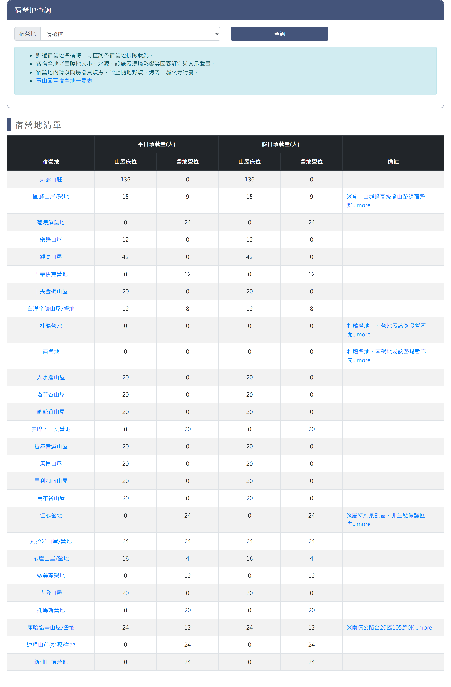
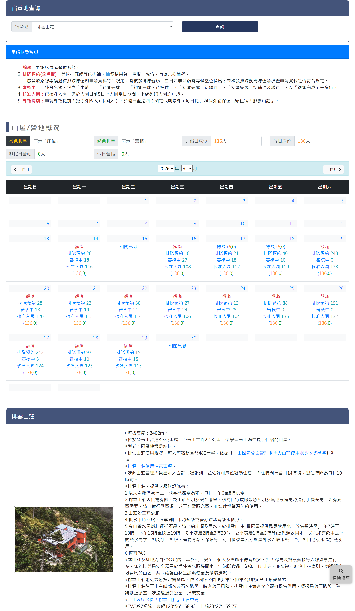
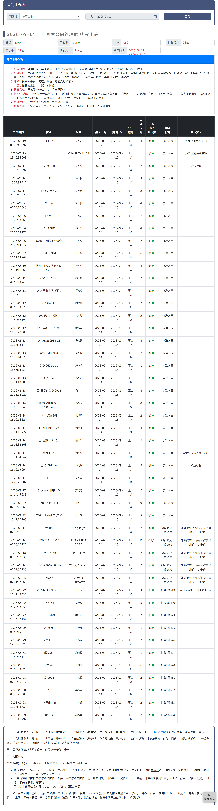

# 玉山宿營地查詢

> **內容正本**：正式站 `https://hike.taiwan.gov.tw/bed_6.aspx`（2026-09-16 實測 HTTP 200）。
> **擷取來源／日期**：`[待確認]` —— 撰寫時未記錄；2026-09-16 補溯源欄位時已無法回溯。
> 核對內容一律以正式站 `hike.taiwan.gov.tw` 為準，**不得改用測試站 `service.skyeyes.tw`**（兩站內容會不一致，理由見 `README.md`「溯源慣例」）。

## 一、查詢與承載量月曆頁

> 功能路徑：首頁 > 宿營地與床位查詢 > 玉山宿營地查詢  
> 頁面網址：bed_6.aspx

- 宿營地查詢
  - 宿營地點：下拉選單，選項為請選擇、排雲山莊、圓峰山屋/營地、荖濃溪營地、樂樂山屋、觀高山屋、巴奈伊克營地、中央金礦山屋、白洋金礦山屋/營地、杜鵑營地、南營地、大水窟山屋/營地、塔芬谷山屋/營地、轆轆谷山屋/營地、拉庫音溪山屋/營地、庫哈諾辛山屋/營地、瓦拉米山屋/營地、大分山屋/營地、抱崖山屋/營地、梅蘭鞍部營地、賽良久營地(南段)、南面營地、尖山下營地、連理西鞍營地、連理西鞍前營地、連理東鞍營地、東郡大山北鞍營地、東郡大山下營地，預設為請選擇。
  - 查詢：按鈕，未選取宿營地點時顯示承載量總表；選取宿營地點後載入該宿營地點之月曆檢視。
- 宿營地承載量總表（未選取宿營地點時呈現）

  

  - 列表：
    - 欄位：宿營地、平日山屋床位、平日營地營位、假日山屋床位、假日營地營位、備註。
    - 宿營地：超連結，點擊後載入該宿營地點之月曆檢視。
    - 備註：說明各宿營地點之開放現況、設施型態與注意事項。
- 月曆概況（選取宿營地點後呈現）

  

  - 申請狀態說明：
    - 餘額：剩餘床位或營位名額。
    - 排隊預約(含備取)：等候抽籤或等候遞補；抽籤備取隊伍具優先遞補權；符合規定者核發排隊號碼，無餘額需候位釋出。
    - 審核中：已核發名額，含中籤、初審完成、待補件、待繳費、複審完成等狀態。
    - 核准入園：入園日前 5 日至當日可上網列印許可證。
    - 外籍提前：申請外籍提前人數（本外籍合計）；週日至週四（國定假日除外）提供排雲山莊每日 24 個外籍保留名額。
  - 山屋/營地概況：
    - 名額數值：顯示非假日床位、假日床位、非假日營帳、假日營帳名額。
    - 顏色標記：橘色表示床位，綠色表示營帳。
  - 月份導航：
    - 上個月：按鈕，點擊切換至前一個月份。
    - 年份：下拉選單，選取查詢年份。
    - 月份：下拉選單，選取查詢月份（1 至 12 月）。
    - 下個月：按鈕，點擊切換至下一個月份。
  - 月曆表格：
    - 欄位：星期日、星期一、星期二、星期三、星期四、星期五、星期六。
    - 日期格：
      - 日期：顯示當日日期。
      - 每日申請概況：超連結，顯示該日名額統計，點擊後另開當日申請名單明細頁。
        - 狀態/餘額：標示額滿或剩餘額度數值。
        - 排隊預約：標示排隊預約件數或人數。
        - 審核中：標示審核中人數。
        - 核准入園：標示核准入園人數。
        - 承載量額度：標記「(床位數,營位數)」，例：「(136,0)」。
  - 宿營地介紹卡片：
    - 卡片標題：顯示該宿營地點名稱（例：排雲山莊）。
    - 宿營地照片：展示外觀縮圖。
    - 基本資訊：說明海拔高度（3402m）、步道里程位置、建物型式（兩層樓鋼骨結構）、TWD97 經緯度座標與 TWD97TM2 座標。
    - 收費標準：標示每人每宿新臺幣 480 元整。
    - 入住規範：入住時間為當日 14:00 後，退住時間為每日 10:00 前；報到需出示入園許可證並依床位號入住。
    - 服務設施：說明供電時段（18:00–20:00，禁拔公電充電）、公廁、供水（戶外煮水區取水加熱）、PAC 設備。
    - 炊煮與露營規範：山莊周圍 30 公尺內禁止燃火大肆炊事與野營，限戶外煮水區使用簡易安全器具；附近無指定露營區，依法禁止搭設營帳。
    - 安全提醒：備有安全頭盔供易落石路段借用。
    - 水源與訊號：標示水源狀況（有/無）與支援通訊種類（GSM、無線電、衛星）。

---

## 二、當日申請名單-明細頁

> 功能路徑：首頁 > 宿營地與床位查詢 > 玉山宿營地查詢 > 當日申請名單  
> 頁面網址：bed_6main.aspx?orgid={機關ID}&node_id={宿營地ID}&sdate={日期}

- 宿營地查詢
  - 宿營地點：下拉選單，選項為請選擇及各宿營地點名稱，預設帶入前頁所選宿營地點。
  - 日期：日期選取框，預設帶入前頁所選日期。
  - 查詢：按鈕，點擊後依選定之宿營地點與日期重新載入當日申請名單。
- 當日申請名單
  - 名單標題：顯示格式為「{查詢日期} {受理機關} - {宿營地點}」，例：「2026-09-14 內政部國家公園署玉山國家公園管理處 - 排雲山莊」。
  - 承載量概況：餘額、承載量、申請、排隊預約、審核中、核准入園、抽籤時間。
  - 申請狀態說明：
    - 排隊預約：等候抽籤或等候遞補；外籍提前申請隊伍依申請時間保留名額。
    - 排隊遞補：排雲山莊、圓峰山屋/營地、瓦拉米山屋/營地於抽籤公告後申請者核發號碼候位；逾 60 人建請另擇期申請。
    - 備取：抽籤結果為備取隊伍，具優先遞補權。
    - 中籤：抽籤結果中籤隊伍。
    - 初審完成：已核發床位或營位，初審通過。
    - 待補件/繳費：已核發名額，需補件或繳費（排雲山莊/觀高山屋規費查帳需 3–5 個工作天）。
    - 複審完成：已完成補件或繳費，等待核准入園。
    - 核准入園：入園日前 5 日至當日可上網列印許可證。
  - 列表：
    - 欄位：申請時間、隊名、領隊、進入日期、離開日期、登山路線、申請人數、分配床/營位數、申請狀態、隊伍說明。
    - 領隊：第二字元以「*」遮罩。

---

## 內部註記

- 舊系統技術架構：ASP.NET WebForms（`.aspx`）。
- 控制項識別碼：
  - 宿營地點下拉選單：`ctl00$con$rooms`（`#con_rooms`）。
  - 查詢按鈕：`ctl00$con$btnsearch`（`#con_btnsearch`，觸發 `__doPostBack`）。
  - 承載量總表：`#con_gvData`（`.table_bed`，宿營地名稱帶 hidden 欄位儲存宿營地 ID）。
  - 月曆導航：上個月按鈕 `ctl00$con$lbUpMonth`（`#con_lbUpMonth`）、下個月按鈕 `ctl00$con$lbDownMonth`（`#con_lbDownMonth`）、年份選單 `#con_ddlYear`、月份選單 `#con_ddlMonth`。
  - 月曆日格：日期標籤 `#con_cb_{index}`、明細超連結 `#con_cc_{index}`。
  - 明細頁跳轉：網址為 `bed_6main.aspx?orgid={機關ID}&node_id={宿營地ID}&sdate={日期}`。
  - 明細頁查詢區：宿營地點 `#con_rooms`、日期文字框 `ctl00$con$ucDatePicker1$txtDate`（`#con_ucDatePicker1_txtDate`）、查詢按鈕 `#con_btnsearch`。
  - 明細頁標題：主標題 `.con_title`、名單標題日期 `#con_sdate`、機關 `#con_org`、宿營地 `#con_room`。
  - 明細頁承載量統計：`#con_lblsumrooms`（承載量）、`#con_lblsubrooms`（通過審核）、`#con_lblchkrooms`（待審核）、`#con_lbloverrooms`（餘額）。
- 機關代碼（`orgid`）：玉山國家公園管理處固定為 `C951CDCD-B75A-46B9-8002-8EF952EC95FD`。
