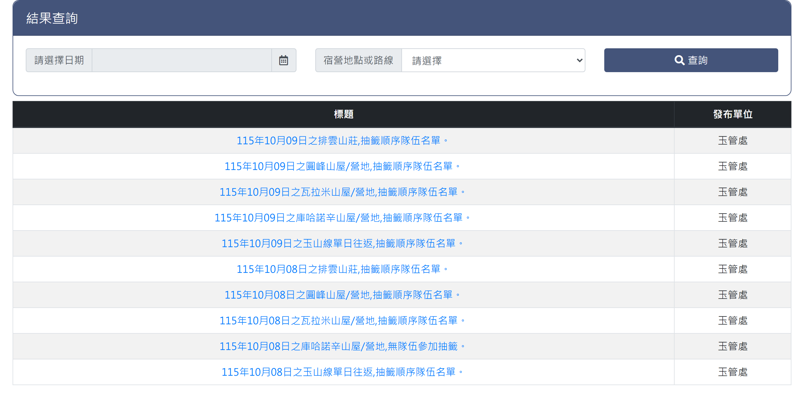
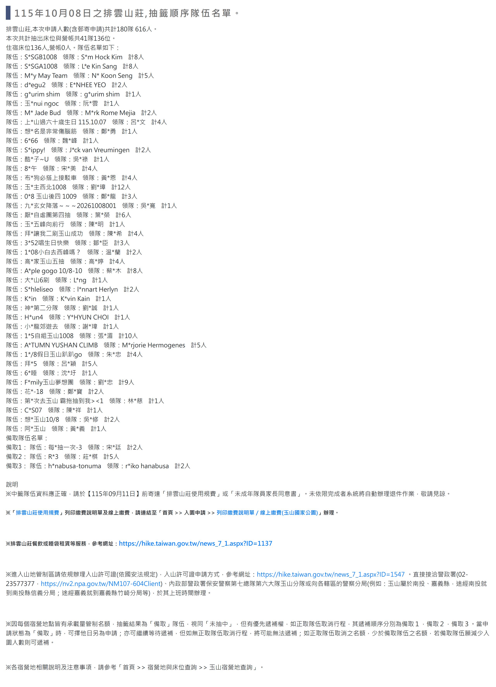

# 玉山抽籤結果查詢

> **內容正本**：正式站 `https://hike.taiwan.gov.tw/bed_3.aspx`（2026-09-16 實測 HTTP 200）。
> **擷取來源／日期**：`[待確認]` —— 撰寫時未記錄；2026-09-16 補溯源欄位時已無法回溯。
> **已核對**：2026-09-16 以正式站核對 「玉山線單日往返路線」路線名，本份與正式站一致。
> 核對內容一律以正式站 `hike.taiwan.gov.tw` 為準，**不得改用測試站 `service.skyeyes.tw`**（兩站內容會不一致，理由見 `README.md`「溯源慣例」）。

## 一、列表頁

> 功能路徑：首頁 > 宿營地與床位查詢 > 玉山抽籤結果查詢  
> 頁面網址：bed_3.aspx

- 查詢區
  - 日期：日期選取框，預設為空白。
  - 宿營地/路線：下拉選單，選項為請選擇、排雲山莊、圓峰山屋/營地、瓦拉米山屋/營地、庫哈諾辛山屋/營地、玉山線單日往返，預設為請選擇。
  - 查詢：按鈕，點擊後依輸入之日期與宿營地/路線篩選抽籤公告清單。
- 抽籤結果列表
  - 欄位：標題、發布單位。
  - 標題：超連結，點擊跳轉至該筆抽籤結果檢視頁；標題格式為「{民國年}年{月}月{日}日之{宿營地/路線名稱},抽籤順序隊伍名單。」。
  - 發布單位：純文字，固定顯示受理機關名稱。

---

## 二、檢視頁

> 功能路徑：首頁 > 宿營地與床位查詢 > 玉山抽籤結果查詢 > 檢視結果  
> 頁面網址：bed_3_1.aspx?id={公告ID}&id2=0

- 抽籤公告內容
  - 公告標題：文字標示該次抽籤主題，格式為「{民國年}年{月}月{日}日之{宿營地/路線名稱},抽籤順序隊伍名單。」。
  - 申請統計：純文字標示本次申請總隊數與總人數（含郵寄申請）。
  - 抽出統計：純文字標示本次抽出隊數、總人數，並分別標明住宿床位人數與營帳人數。
- 抽籤順序隊伍名單
  - 條列呈現：逐筆列出中籤隊伍資訊。
  - 隊伍資訊：包含隊伍名稱、領隊姓名、隊伍人數。
  - 領隊：第二字元以「*」遮罩。
  - 隊伍名稱：部分字元遮罩。

---

## 內部註記

- 舊系統技術架構：ASP.NET WebForms（`.aspx`）。
- 控制項識別碼：
  - 查詢日期文字框：`ctl00$con$sdate$txtDate`（`#con_sdate_txtDate`）。
  - 宿營地/路線下拉選單：`ctl00$con$ddlNode`（`#con_ddlNode`）。
  - 查詢按鈕：`ctl00$con$btnQry`（`#con_btnQry`，觸發 `__doPostBack`）。
  - 結果列表：`.rwd-table`（表格包含標題超連結，帶參數 `bed_3_1.aspx?id={公告ID}&id2=0`）。
  - 檢視頁內容容器：`.content .container-fluid`（內含抽籤統計與抽籤順序隊伍清單）。
- 機關代碼（`orgid`）：玉山國家公園管理處固定為 `C951CDCD-B75A-46B9-8002-8EF952EC95FD`。
