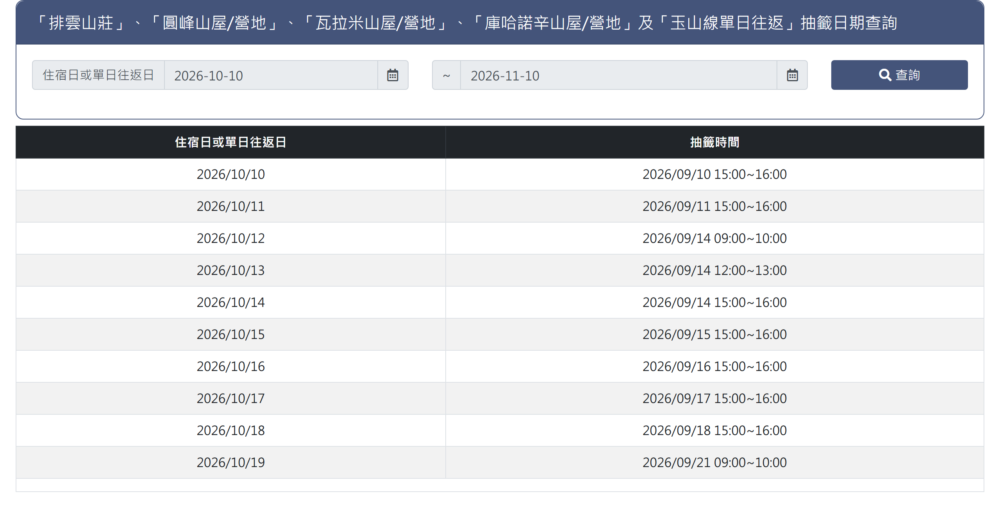

# 玉山抽籤日期

> **內容正本**：正式站 `https://hike.taiwan.gov.tw/bed_8.aspx`（2026-09-16 實測 HTTP 200）。
> **擷取來源／日期**：`[待確認]` —— 撰寫時未記錄；2026-09-16 補溯源欄位時已無法回溯。
> 核對內容一律以正式站 `hike.taiwan.gov.tw` 為準，**不得改用測試站 `service.skyeyes.tw`**（兩站內容會不一致，理由見 `README.md`「溯源慣例」）。

> **業務數值核對狀態**（2026-09-16 對正式站 `hike.taiwan.gov.tw`）
> - `[待確認]` 日期欄「預設帶入當日起算 **1 個月**後／**2 個月**後」：
>   `bed_8.aspx` 的預設值由 server 端或 JS 帶入，**靜態 HTML 看不出來**，
>   需實際操作該頁或查 code。與 `20_玉山可申請退費日期查詢.md` 的預設值同一類問題。

## 一、列表頁

> 功能路徑：首頁 > 宿營地與床位查詢 > 玉山抽籤日期  
> 頁面網址：bed_8.aspx

- 查詢區
  - 開始日期：日期選取框，預設帶入當日起算 1 個月後之日期。`[待確認]`
  - 結束日期：日期選取框，預設帶入當日起算 2 個月後之日期。`[待確認]`
  - 查詢：按鈕，點擊後依輸入之起訖日期區間篩選抽籤期程清單。
- 抽籤日期列表
  - 欄位：住宿日或單日往返日、抽籤時間。
  - 住宿日或單日往返日：純文字，格式為 YYYY/MM/DD。
  - 抽籤時間：純文字，格式為 YYYY/MM/DD HH:mm~HH:mm。
- 分頁控制項
  - 頁碼按鈕：點擊切換指定頁次。
  - 下一頁按鈕：點擊跳轉至下一頁。

---

## 內部註記

- 舊系統技術架構：ASP.NET WebForms（`.aspx`）。
- 控制項識別碼：
  - 開始日期文字框：`ctl00$con$sdate$txtDate`（`#con_sdate_txtDate`）。
  - 結束日期文字框：`ctl00$con$edate$txtDate`（`#con_edate_txtDate`）。
  - 查詢按鈕：`ctl00$con$btnQry`（`#con_btnQry`，觸發 `__doPostBack`）。
  - 資料表格：`.rwd-table`（包含抽籤期程清單）。
  - 分頁器：`.pagination`。
- 機關代碼（`orgid`）：玉山國家公園管理處固定為 `C951CDCD-B75A-46B9-8002-8EF952EC95FD`。
