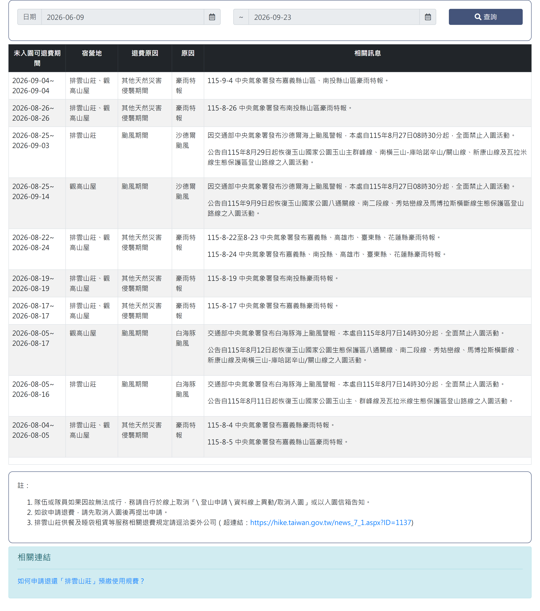

# 玉山可申請退費日期查詢

## 一、列表頁

> 功能路徑：首頁 > 宿營地與床位查詢 > 玉山可申請退費日期查詢  
> 頁面網址：bed_9.aspx

- 查詢區
  - 開始日期：日期選取框，預設帶入前 3 個月之日期。
  - 結束日期：日期選取框，預設帶入當前日期。
  - 查詢：按鈕，點擊後依輸入之起訖日期區間篩選可退費公告清單。
- 退費日期列表
  - 欄位：未入園可退費期間、宿營地、退費原因、原因、相關訊息。
  - 未入園可退費期間：日期區間，格式為「YYYY-MM-DD~YYYY-MM-DD」。
  - 宿營地：標示受影響之宿營地點名稱（例：排雲山莊、觀高山屋）。
  - 退費原因：標示退費類別（例：其他天然災害侵襲期間、颱風期間）。
  - 原因：標示具體天候事由（例：豪雨特報、特定颱風名稱）。
  - 相關訊息：純文字，記載氣象署發布特報資訊或管理處禁止／恢復入園公告全文。
- 分頁控制項
  - 頁碼按鈕：點擊切換指定頁次。
  - 下一頁按鈕：點擊跳轉至下一頁。

---

## 內部註記

- 舊系統技術架構：ASP.NET WebForms（`.aspx`）。
- 控制項識別碼：
  - 開始日期文字框：`ctl00$con$sdate$txtDate`（`#con_sdate_txtDate`）。
  - 結束日期文字框：`ctl00$con$edate$txtDate`（`#con_edate_txtDate`）。
  - 查詢按鈕：`ctl00$con$btnQry`（`#con_btnQry`，觸發 `__doPostBack`）。
  - 資料表格：`.rwd-table`（包含可退費公告清單）。
  - 分頁器：`.pagination`。
- 機關代碼（`orgid`）：玉山國家公園管理處固定為 `C951CDCD-B75A-46B9-8002-8EF952EC95FD`。
