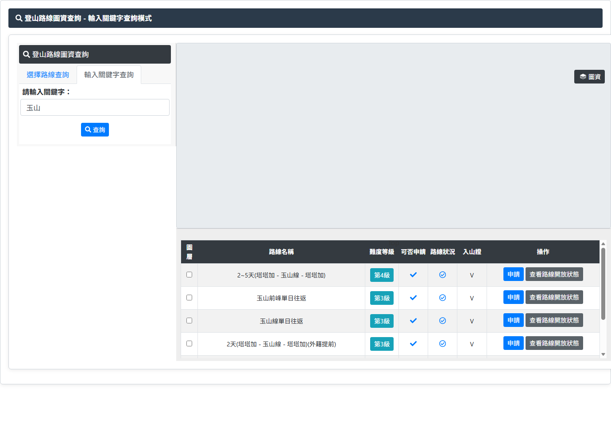

# 登山路線圖資查詢

## 一、圖資與查詢頁

> 功能路徑：首頁 > 旅遊登山資訊 > 登山路線圖資查詢  
> 頁面網址：web_map2.aspx

- 查詢條件（支援雙模式切換）
  - 選擇路線查詢（模式一，預設）
    - 管理單位：下拉選單，選項為請選擇、太魯閣國家公園管理處、玉山國家公園管理處、雪霸國家公園管理處、國家步道(山屋/營地)、警政署入山、自然保留區、自然保護區、野生動物保護區，預設為請選擇。選定後觸發 PostBack 動態載入主路線。
    - 主路線：連動下拉選單，選定後觸發 PostBack 動態載入次路線。
    - 次路線：連動下拉選單，預設為請選擇。
    - 查詢：按鈕，點擊後依選定條件送出 PostBack，更新圖台軌跡與下方查詢結果清單。
  - 輸入關鍵字查詢（模式二）
    - 關鍵字：文字輸入框，輸入路線名稱關鍵字。
    - 查詢：按鈕，點擊後送出 PostBack 模糊比對，更新圖台與查詢結果清單。
- 圖資圖台與圖層開關
  - 圖台顯示：Easymap 地圖畫布，支援縮放、平移與全螢幕操作。
  - 圖資控制面板：浮動抽屜，點擊「圖資」按鈕展開，點擊關閉按鈕收合。
  - 圖層清單（核取方塊，共 22 個項目）：
    - 底圖（單選切換）：GoogleMap、開放地圖、臺灣通用電子地圖(含等高線)。
    - 遊客中心（點位）：太管處遊客中心、玉管處遊客中心、雪管處遊客中心。
    - 救難停機坪（點位）：太管處救難停機坪、玉管處救難停機坪、雪管處救難停機坪。
    - 可通訊據點（點位）：太管處可通訊據點、玉管處可通訊據點、雪管處可通訊據點。
    - 國家公園分區圖（面圖）：太管處國家公園分區圖、玉管處國家公園分區圖、雪管處國家公園分區圖。
    - 國家公園範圍（面圖）：太管處國家公園範圍、玉管處國家公園範圍、雪管處國家公園範圍。
    - 國家生態保護區（面圖）：太管處國家生態保護區、玉管處國家生態保護區、雪管處國家生態保護區。
    - 應申請入山證範圍（面圖）：應申請入山證範圍。
- 查詢結果列表
  - 表格位於地圖下方，依查詢條件呈現相符路線清單。
  - 欄位定義：
    - 圖層：核取方塊（`layercheck`），勾選 → 圖台載入並標繪該路線軌跡；取消勾選 → 移除軌跡。
    - 路線名稱：純文字，顯示路線全名（例：`2~5天(塔塔加 - 玉山線 - 塔塔加)`）。
    - 難度等級：藍色標籤按鈕（例：`第4級`、`第3級`），點擊後以 Fancybox iframe 彈窗開啟「登山路線難度等級」（`linelevel.aspx?f_id={主路線ID}&c_id={次路線ID}`）。
    - 可否申請：圖示，可申請（綠色勾號 `fa-check`）、不可申請（紅色叉號 `fa-times`）。
    - 路線狀況：狀態圖示，開放通行（綠色圓形 `fa-check-circle`）、管制封閉（紅色禁止圖示）。
    - 入山證：文字標註，須向警政署申辦入山證者標示 `V`，免申辦者留空。
    - 操作按鈕群：
      - 申請：藍色按鈕，點擊另開分頁導向線上申請條款頁並帶入路線參數（`apply_1.aspx?search={路線ID}`）。
      - 查看路線開放狀態：灰色按鈕，點擊另開分頁導向路線開放狀態頁並帶入路線參數（`open.aspx?search={路線ID}`）。

---

## 內部註記

- 舊系統技術架構：ASP.NET WebForms（`.aspx`）＋ UpdatePanel。
- 地圖套件：Easymap（`./GIS/Easymap/easymap.js`）。
- 控制項識別碼：
  - 機關下拉選單：`ctl00$con$ddlOrg`（`#con_ddlOrg`）。
  - 主路線下拉選單：`ctl00$con$ddlMain`（`#con_ddlMain`）。
  - 次路線下拉選單：`ctl00$con$ddlSecond`（`#con_ddlSecond`）。
  - 關鍵字輸入框：`ctl00$con$tbKeyword`（`#con_tbKeyword`）。
  - 路線查詢按鈕：`#con_btnQry`（超連結按鈕，觸發 `__doPostBack('ctl00$con$btnQry', '')`）。
  - 關鍵字查詢按鈕：`#con_btnQry2`（超連結按鈕，觸發 `__doPostBack('ctl00$con$btnQry2', '')`）。
  - 地圖畫布容器：`#map`（`.map_box`）。
  - 圖層開關控制：開啟按鈕 `.layer_o`、關閉按鈕 `.layer_c`、圖層容器 `.map_layer`。
  - 底圖核取方塊：GoogleMap（`#google`）、開放地圖（`#osm`）、臺灣通用電子地圖（`#EMAP5`）。
  - 點位圖層核取方塊：遊客中心（`#VisitorCenter_Taroko`、`#VisitorCenter_Yushan`、`#VisitorCenter_SheiPa`）；救難停機坪（`#EmergencyHelipad_Taroko`、`#EmergencyHelipad_Yushan`、`#EmergencyHelipad_SheiPa`）；可通訊據點（`#CommunicationOutpost_Taroko`、`#CommunicationOutpost_Yushan`、`#CommunicationOutpost_SheiPa`）。
  - 面圖圖層核取方塊：國家公園分區圖（`#NationalParkZoningMap_Taroko`、`#NationalParkZoningMap_Yushan`、`#NationalParkZoningMap_SheiPa`）；國家公園範圍（`#NationalParkArea_Taroko`、`#NationalParkArea_Yushan`、`#NationalParkArea_SheiPa`）；生態保護區（`#EcologicalProtectionArea_Taroko`、`#EcologicalProtectionArea_Yushan`、`#EcologicalProtectionArea_SheiPa`）；應申請入山證範圍（`#NAPControlledArea_Nap`）。
  - 難度等級彈窗：`#levelid`（Fancybox 2.1.5 iframe，寬 980、高 600）。
- 前端動態連動腳本：
  - UpdatePanel 非同步回傳後重新綁定事件：`Sys.WebForms.PageRequestManager.getInstance().add_endRequest` 重新執行 `InitFancybox()` 與 `LayersCheck()`。
  - 圖層開合控制：點擊 `.layer_o` 觸發 `$(".map_layer").show()`；點擊 `.layer_c` 觸發 `$(".map_layer").hide()`。
