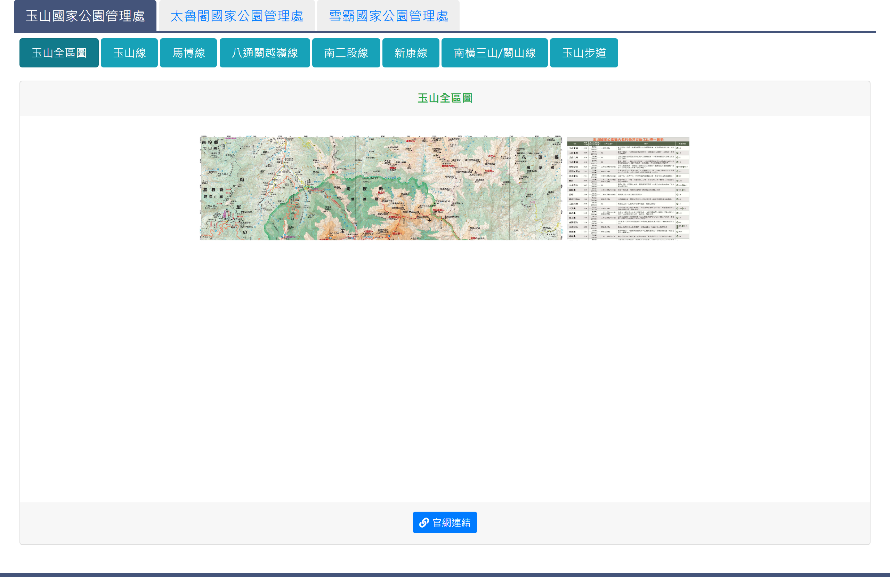

# 登山路線介紹

## 一、介紹頁

> 功能路徑：首頁 > 旅遊登山資訊 > 登山路線介紹  
> 頁面網址：information_1.aspx

- 機關頁籤：頁籤切換，選項為玉山國家公園管理處、太魯閣國家公園管理處、雪霸國家公園管理處，預設為玉山國家公園管理處。
- 各機關路線標籤與內容結構
  - 玉山國家公園管理處（共 8 個標籤，各標籤底端皆附「官網連結」按鈕導向玉山官網）
    - 登山路線（玉山線、馬博線、八通關越嶺線、南二段線、新康線、南橫三山/關山線）：
      - 路線圖：圖片顯示（1 至 2 張）。
      - 路線介紹：富文字 HTML。
      - 建議行程：依行程天數標註行進節點與里程，部分路線提供多組建議行程。
      - 對外交通：純文字，說明各登山口自行開車與接駁指引。
      - 官網連結：按鈕，點擊後另開分頁開啟玉山官網對應路線說明。
    - 步道圖資（玉山全區圖、玉山步道）：
      - 步道圖：圖片顯示。
      - 官網連結：按鈕，點擊後另開分頁開啟玉山官網圖資或步道頁面。
  - 太魯閣國家公園管理處（共 16 個標籤，全處皆無「官網連結」按鈕）
    - 完整結構路線（奇萊主北峰、奇萊東稜、南湖中央尖線(北一段)、南湖大山線、北二段、畢祿縱走羊頭、清水山、錐麓古道、奇萊連峰）：
      - 路線圖：圖片顯示。
      - 路線介紹：富文字 HTML。
      - 建議行程：列點標註行進節點。
      - 對外交通：純文字說明。
      - 特殊附件/外連：奇萊東稜附「奇萊東稜路標規劃及施作紀錄表」Word 檔下載連結；錐麓古道附停車資訊圖與台灣好行外部連結。
    - 單攻路線（畢祿山單攻、羊頭山單攻）：
      - 路線圖、建議行程、對外交通（無路線介紹）。
    - 行程路線（北一縱走北二、閂山鈴鳴山、閂山單攻、奇萊南峰）：
      - 路線圖、建議行程（無路線介紹、無對外交通）。
    - 步道圖資（太魯閣步道）：
      - 步道圖：圖片顯示（無文字說明、無官網連結按鈕）。
  - 雪霸國家公園管理處（共 9 個標籤，各標籤底端皆附「官網連結」按鈕導向雪霸官網）
    - 登山路線（雪山西稜線、雪東線、聖稜線、武陵四秀、大霸線、志佳陽線、雪劍線(大小劍線)、大霸北稜線）：
      - 路線圖：圖片顯示（1 張）。
      - 路線介紹：富文字 HTML。
      - 建議行程：列點標註行程行進節點。
      - 對外交通：純文字說明。
      - 官網連結：按鈕，點擊後另開分頁開啟雪霸官網對應路線頁面。
    - 步道圖資（雪霸步道）：
      - 步道圖：圖片顯示。
      - 官網連結：按鈕，點擊後另開分頁開啟雪霸官網步道開放狀態頁面。

---

## 內部註記

- 舊系統技術架構：ASP.NET WebForms（`.aspx`）。
- 控制項識別碼：
  - 機關頁籤容器：`.tabs_blue`（玉山 `#tab_a1`、太魯閣 `#tab_a2`、雪霸 `#tab_a3`）。
  - 玉山路線標籤：`#tab_b1` 至 `#tab_b8`（`#tab_b1` 玉山全區圖、`#tab_b8` 玉山步道）。
  - 太魯閣路線標籤：`#tab_c1` 至 `#tab_c16`（`#tab_c16` 太魯閣步道）。
  - 雪霸路線標籤：`#tab_d1` 至 `#tab_d9`（`#tab_d9` 雪霸步道）。
- 前端動態切換腳本：
  - 頁面載入時透過 jQuery 指定第一組頁籤預設選取（`#tab_a1`、`#tab_b1`、`#tab_c1`、`#tab_d1` 加入 `active show`）。
- 外部官方網站連結與附件下載均以另開新分頁（`target="_blank"`）開啟。
