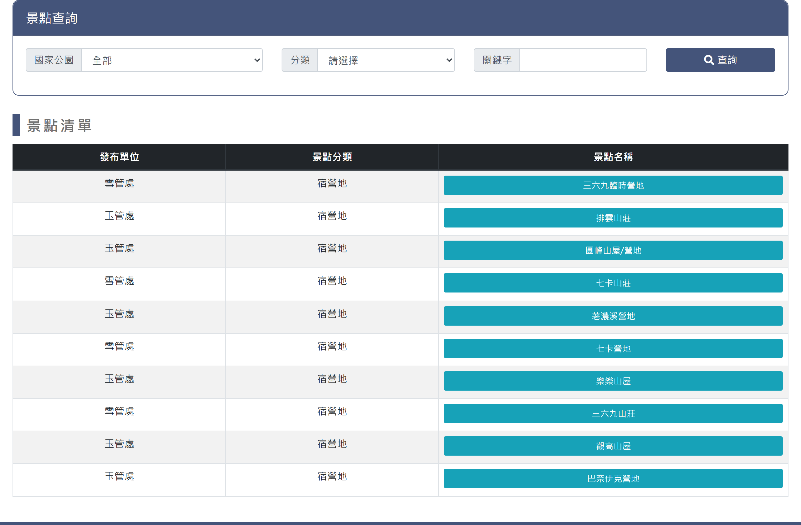
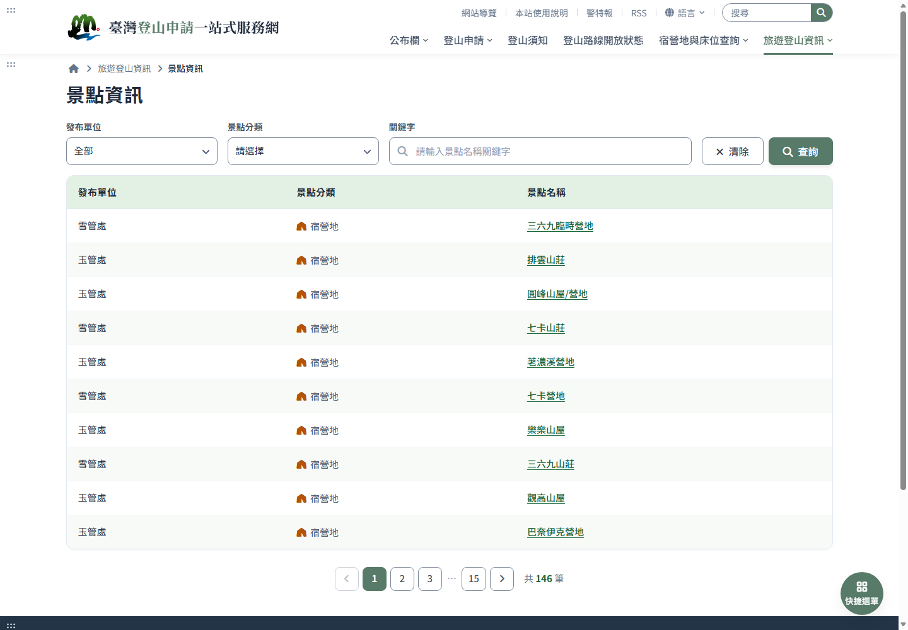
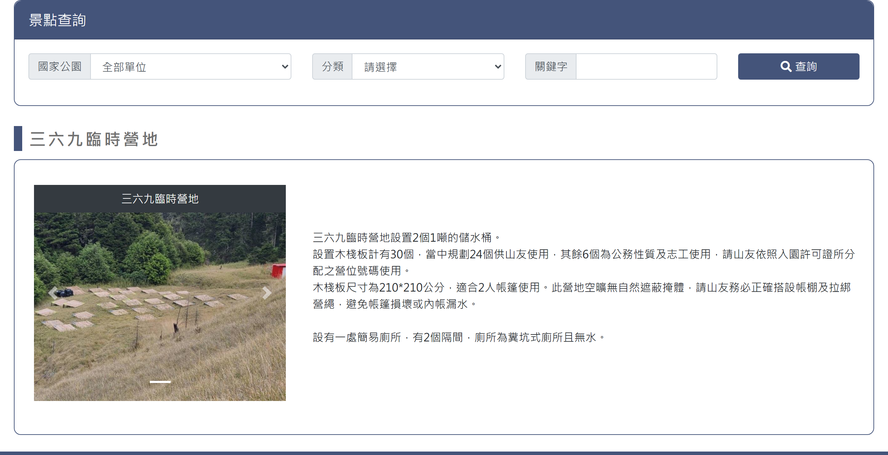
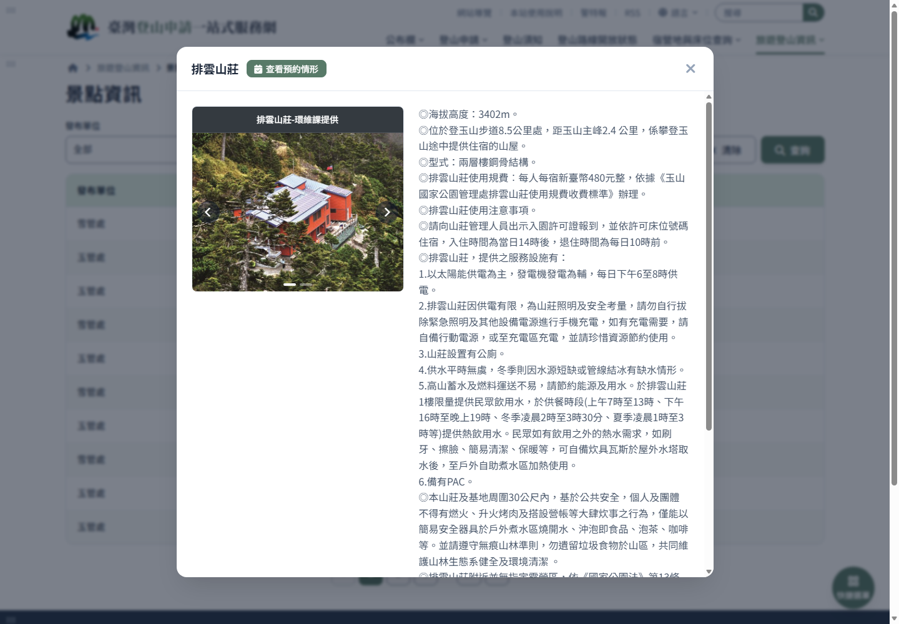

# 景點資訊

> **內容正本**：正式站 `https://hike.taiwan.gov.tw/information_place.aspx`（2026-09-16 實測 HTTP 200）。
> **擷取來源／日期**：`[待確認]` —— 撰寫時未記錄；2026-09-16 補溯源欄位時已無法回溯。
> 核對內容一律以正式站 `hike.taiwan.gov.tw` 為準，**不得改用測試站 `service.skyeyes.tw`**（兩站內容會不一致，理由見 `README.md`「溯源慣例」）。

## 一、列表頁

> 功能路徑：首頁 > 旅遊登山資訊 > 景點資訊  
> 頁面網址：information_place.aspx

- 查詢條件
  - 發布單位：下拉選單，選項為全部、太魯閣國家公園管理處 (太管處)、玉山國家公園管理處 (玉管處)、雪霸國家公園管理處 (雪管處)、國家步道(山屋/營地)、警政署入山、自然保留區、自然保護區、野生動物保護區，預設為全部。
  - 景點分類：下拉選單，選項為請選擇、一般、登山口、宿營地，預設為請選擇。
  - 關鍵字：文字輸入框，模糊查詢景點名稱。
  - 查詢：按鈕，點擊後依設定條件篩選並重新載入列表。
  - 清除：按鈕，清除所有查詢條件重設回預設狀態。
- 景點清單
  - 列表：
    - 欄位：發布單位、景點分類、景點名稱。
    - 景點分類：文字採統一正文色；一般不顯示圖示，登山口顯示藍色健行者圖示，宿營地顯示琥珀色帳篷圖示。
    - 景點名稱：超連結，點擊後就地彈出檢視頁彈窗。
  - 分頁列：翻頁控制項，只有 1 頁時仍維持留存（前後按鈕 disabled）；下方顯示筆數統計，數字顏色與超連結一致。

---

## 二、檢視頁

> 功能路徑：首頁 > 旅遊登山資訊 > 景點資訊 > 景點內容  
> 頁面網址：information_node.aspx?id={景點ID}

- 呈現模式：改版以彈窗（Modal）於列表頁就地開啟，不跳轉獨立頁面。
- 景點內容
  - 景點名稱：彈窗標題。
  - 預約情形：附屬操作按鈕「查看預約情形」（僅玉管處 28 筆具排隊預約機制之宿營地顯示），置於彈窗標題（景點名稱）後方並垂直置中對齊，採主色填滿按鈕（`background: var(--national-700)`、短版尺寸、白字），點擊後另開分頁開啟床位預約查詢頁。
  - 景點照片：圖片輪播（sticky 置於左側視野內；無照片時整段隱藏），圖片上方提供獨立標題列（`var(--gray-800)` 即 `#343a40` 深色底白字、水平居中、無圖示，位於圖片之外不遮擋照片），下方提供左右切換控制與指示點。
  - 景點介紹：富文字 HTML，說明海拔高度、位置里程、結構規費、服務設施、水源狀況、通訊訊號、坐標經緯等。

---

## 內部註記

- 舊系統技術架構：ASP.NET WebForms（`.aspx`）。
- 改版呈現模式：檢視頁改為彈窗（Modal）形式於列表頁就地開啟，保留查詢條件與翻頁狀態。
- 控制項識別碼：
  - 發布單位下拉選單：`ctl00$con$ddlOrg`（`#con_ddlOrg`）。
  - 景點分類下拉選單：`ctl00$con$ddlCon`（`#con_ddlCon`；值 N＝一般、G＝登山口、H＝宿營地）。
  - 關鍵字輸入框：`ctl00$con$keyword`（`#con_keyword`）。
  - 查詢按鈕：`ctl00$con$btnQry`（`#con_btnQry`，觸發 `__doPostBack`）。
  - 排隊預約按鈕：`#con_hlLink`（導向 `bed_6.aspx?node_id={景點ID}`；僅具排隊預約機制之宿營地顯示）。
  - 照片輪播容器：`#con_divpic`（Bootstrap Carousel `#carouselExampleIndicators`）。
- 外部連結及床位排隊預約均以另開新分頁（`target="_blank"`）開啟。
- 舊站全量景點巡檢數據（2026-09-16 爬取 `information_place.aspx?search=yes` 全 15 頁）：
  - 景點總數：146 筆。
  - 文字長度：平均 168 字；最大 1,011 字（排雲山莊），最小 7 字；< 150 字 81 筆 (55.5%)，150~400 字 60 筆 (41.1%)，> 400 字 5 筆 (3.4%)。
  - 照片分佈：無照片 94 筆 (64.4%)，有照片 52 筆 (35.6%)；1 張 41 筆、2 張 9 筆、3 張 1 筆、4 張 1 筆（雪山主峰最多 4 張）。
  - 結構統計：HTML 原生表格 0 筆，含外部超連結 6 筆，含特殊警示說明 1 筆。
- 預約查詢按鈕分析與規格：
  - 舊站全量 146 筆景點皆渲染該按鈕（固定模板 `#con_hlLink`），其中 118 筆 (80.8%) 未帶參數僅導向 `bed_6.aspx` 首頁；僅玉管處 28 筆宿營地帶有具體 `node_id`。
  - 新版規格：僅玉管處此 28 處具排隊預約機制之宿營地在彈窗標題（景點名稱）後方提供短版主色填滿「查看預約情形」按鈕，與標題及關閉按鈕垂直置中，導向 `campsite.html?org=yushan&kind=camp`；其餘 118 筆景點不顯示。
- 輪播呈現規格：
  - 照片圖說置於圖片上方獨立列（`var(--gray-800)` 即 `#343a40` 深色底白字，文字置中無圖示，位於圖片之外完全不遮擋照片畫面）。
  - 輪播容器採 sticky 定位，右側長文滾動時維持固定於視野內。
- 列表視覺規格：
  - 景點分類欄維持自然排版展開不縮窄；文字統一採正文色（`--fg-2`）。
  - 「一般」分類不放圖示；「登山口」採次要導航藍圖示（`--btn-blue`）；「宿營地」採琥珀色帳篷圖示（`--warning-fg`）。
  - 分頁統計筆數之數字顏色比照連結顏色（`--national-800`）。
