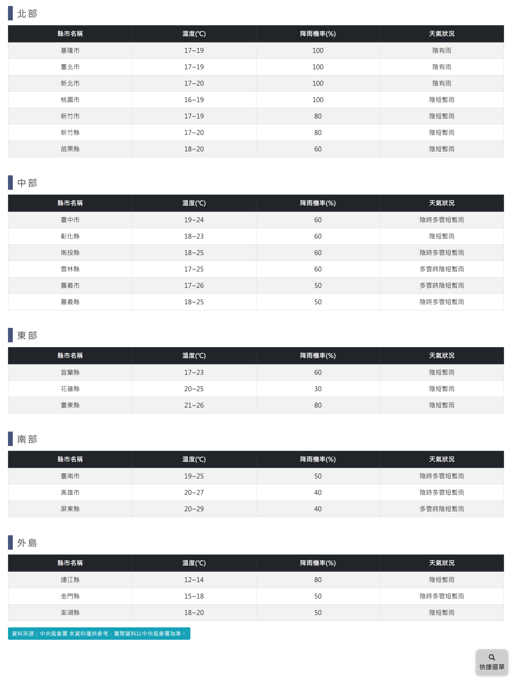

# 各縣市天氣預報

> **內容正本**：正式站 `https://hike.taiwan.gov.tw/information_2.aspx`（2026-09-16 實測 HTTP 200）。
> **擷取來源／日期**：`[待確認]` —— 撰寫時未記錄；2026-09-16 補溯源欄位時已無法回溯。
> 核對內容一律以正式站 `hike.taiwan.gov.tw` 為準，**不得改用測試站 `service.skyeyes.tw`**（兩站內容會不一致，理由見 `README.md`「溯源慣例」）。

## 一、列表頁

> 功能路徑：首頁 > 旅遊登山資訊 > 各縣市天氣預報  
> 頁面網址：information_2.aspx

- 區域天氣清單
  - 列表結構：按北部、中部、東部、南部、外島劃分為 5 個分區表格。
  - 欄位：縣市名稱、溫度(℃)、降雨機率(%)、天氣狀況。
  - 分區涵蓋縣市：
    - 北部：基隆市、臺北市、新北市、桃園市、新竹市、新竹縣、苗栗縣。
    - 中部：臺中市、彰化縣、南投縣、雲林縣、嘉義市、嘉義縣。
    - 東部：宜蘭縣、花蓮縣、臺東縣。
    - 南部：臺南市、高雄市、屏東縣。
    - 外島：連江縣、金門縣、澎湖縣。
- 資料來源：連結按鈕，標示「資料來源：中央氣象署 本資料僅供參考，實際資料以中央氣象署為準。」，點擊後另開分頁開啟[中央氣象署各縣市天氣預報頁面](https://www.cwa.gov.tw/V8/C/W/County/index.html)。

---

## 內部註記

- 舊系統技術架構：ASP.NET WebForms（`.aspx`）。
- 控制項識別碼：
  - 資料來源按鈕：`#con_HyperLink1`（`https://www.cwa.gov.tw/V8/C/W/County/index.html`）。
  - 分區標題樣式：`.block_title`。
- 資料介接：後端排程定期介接中央氣象署預報資料並渲染前端表格。
- 外部資料來源連結以另開新分頁（`target="_blank"`）開啟。
