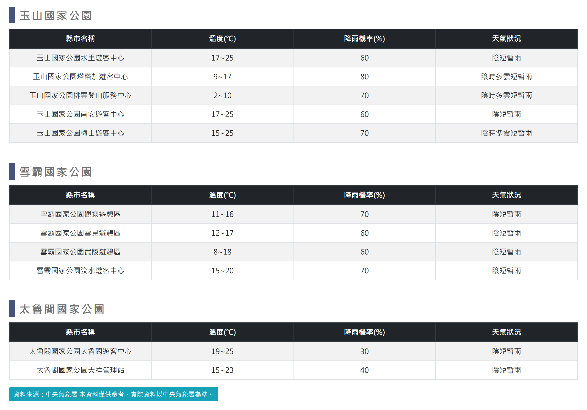

# 國家公園天氣資訊

> **內容正本**：正式站 `https://hike.taiwan.gov.tw/information_3.aspx`（2026-09-16 實測 HTTP 200）。
> **擷取來源／日期**：`[待確認]` —— 撰寫時未記錄；2026-09-16 補溯源欄位時已無法回溯。
> 核對內容一律以正式站 `hike.taiwan.gov.tw` 為準，**不得改用測試站 `service.skyeyes.tw`**（兩站內容會不一致，理由見 `README.md`「溯源慣例」）。

## 一、列表頁

> 功能路徑：首頁 > 旅遊登山資訊 > 國家公園天氣資訊  
> 頁面網址：information_3.aspx

- 國家公園天氣清單
  - 列表結構：按玉山國家公園、雪霸國家公園、太魯閣國家公園劃分為 3 個園區表格。
  - 欄位：地點名稱、溫度(℃)、降雨機率(%)、天氣狀況。
  - 各園區涵蓋地點：
    - 玉山國家公園：水里遊客中心、塔塔加遊客中心、排雲登山服務中心、南安遊客中心、梅山遊客中心。
    - 雪霸國家公園：觀霧遊憩區、雪見遊憩區、武陵遊憩區、汶水遊客中心。
    - 太魯閣國家公園：太魯閣遊客中心、天祥管理站。
- 資料來源：連結按鈕，標示「資料來源：中央氣象署 本資料僅供參考，實際資料以中央氣象署為準。」，點擊後另開分頁開啟[中央氣象署國家公園天氣預報頁面](https://www.cwa.gov.tw/V8/C/L/NatPark/NatPark.html?PID=E012)。

---

## 內部註記

- 舊系統技術架構：ASP.NET WebForms（`.aspx`）。
- 控制項識別碼：
  - 資料來源按鈕：`#con_HyperLink1`（`https://www.cwa.gov.tw/V8/C/L/NatPark/NatPark.html?PID=E012`）。
  - 園區標題樣式：`.block_title`。
- 舊系統表格首欄標題顯示為「縣市名稱」，實為園區遊客中心與管理站點。
- 外部資料來源連結以另開新分頁（`target="_blank"`）開啟。
