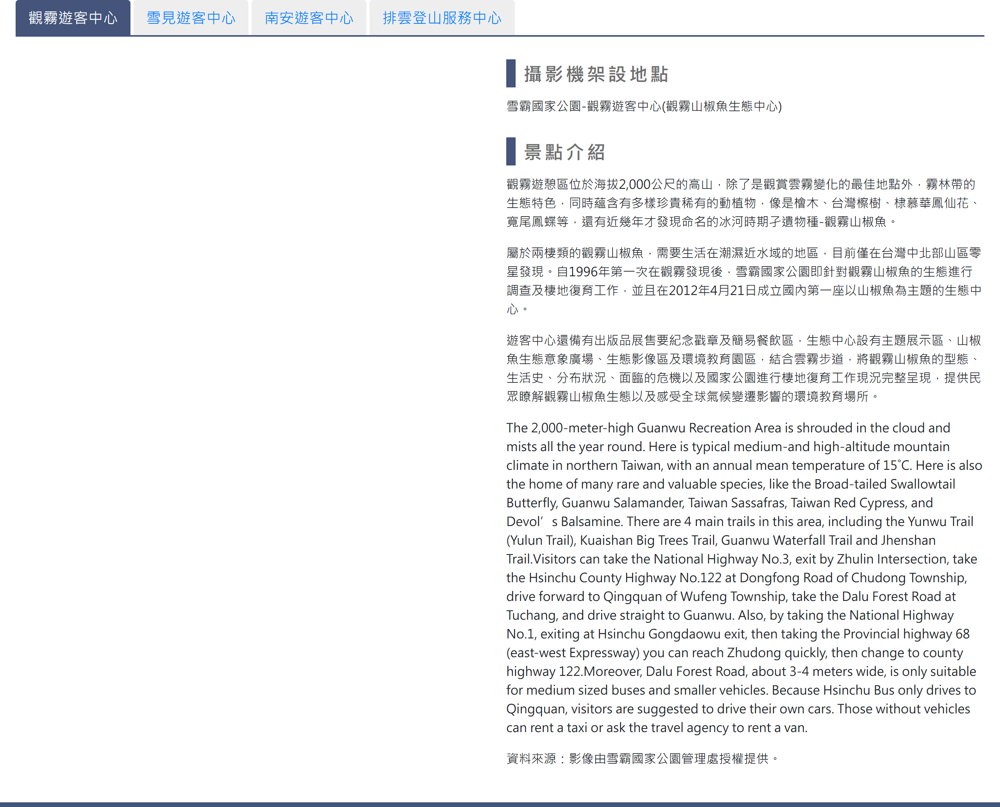

# 即時影像觀看

> **內容正本**：正式站 `https://hike.taiwan.gov.tw/information_4.aspx`（2026-09-16 實測 HTTP 200）。
> **擷取來源／日期**：`[待確認]` —— 撰寫時未記錄；2026-09-16 補溯源欄位時已無法回溯。
> 核對內容一律以正式站 `hike.taiwan.gov.tw` 為準，**不得改用測試站 `service.skyeyes.tw`**（兩站內容會不一致，理由見 `README.md`「溯源慣例」）。

## 一、觀看頁

> 功能路徑：首頁 > 旅遊登山資訊 > 即時影像觀看  
> 頁面網址：information_4.aspx

- 景點頁籤清單（點擊切換顯示對應景點影像與介紹）：
  - 景點項目：觀霧遊客中心、雪見遊客中心、南安遊客中心、排雲登山服務中心，預設為觀霧遊客中心。
- 景點影像內容
  - 即時影像：影片或串流影像顯示（觀霧、雪見為 YouTube 直播嵌入；南安、排雲為網路攝影機 MJPEG 串流影像）。
  - 攝影機架設地點：純文字。
  - 景點介紹：富文字 HTML。

---

## 內部註記

- 舊系統技術架構：ASP.NET WebForms（`.aspx`）。
- 控制項識別碼：
  - 頁籤容器：`.tabs_blue`（DOM 中包含 `#tab_a1` 至 `#tab_a8` 共 8 個頁籤，其中武陵遊客中心 `#tab_a3`、水里遊客中心 `#tab_a4`、塔塔加遊客中心 `#tab_a5`、梅山遊客中心 `#tab_a6` 於前端設為 `display:none` 隱藏，前台實際僅呈現 4 個景點）。
- 前端串流技術：
  - 觀霧、雪見（`#tab_a1`、`#tab_a2`）採 YouTube iframe 嵌入直播，使用 `.embed-responsive-16by9` 容器。
  - 南安、排雲（`#tab_a7`、`#tab_a8`）採 `` 標籤直連網路攝影機 MJPEG 串流（`video.mjpg`）。
