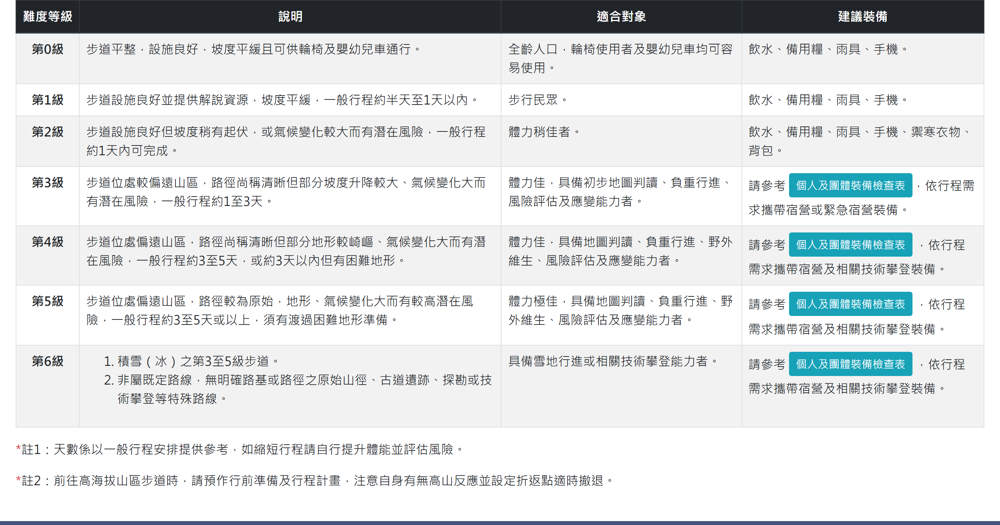

# 國家公園步道分級

> **業務數值核對狀態**（2026-09-16 對正式站 `hike.taiwan.gov.tw`）
> - ✔ **已核對**：「第0級至第6級共 **7 個等級**」—— `information_6.aspx` 實際列出
>   第0～第6級，表格欄位為「難度等級／說明／適合對象／建議裝備」。
> - ✔ **已核對**：「個人及團體裝備檢查表」連結出現在**第3級至第6級**——
>   該頁第3、4、5、6 級的建議裝備欄各有一個連結（`images/個人及團體裝備檢查表.pdf`），
>   第0、1、2 級為純文字無連結。

## 一、說明頁

> 功能路徑：首頁 > 旅遊登山資訊 > 國家公園步道分級  
> 頁面網址：information_6.aspx

- 步道分級對照表
  - 欄位：難度等級、說明、適合對象、建議裝備。
  - 分級項目：第0級至第6級共 7 個等級。
  - 個人及團體裝備檢查表：按鈕（第3級至第6級之建議裝備欄位呈現），點擊後另開分頁開啟 PDF。
- 附註說明：
  - 註1：天數係以一般行程安排提供參考，如縮短行程請自行提升體能並評估風險。
  - 註2：前往高海拔山區步道時，請預作行前準備及行程計畫，注意自身有無高山反應並設定折返點適時撤退。

---

## 內部註記

- 舊系統技術架構：ASP.NET WebForms（`.aspx`）。
- 控制項識別碼：
  - 裝備檢查表連結：`#con_hlFile1`、`#con_HyperLink1`、`#con_HyperLink2`（導向 `images/個人及團體裝備檢查表.pdf`）。
- 附件 PDF 均以另開新分頁（`target="_blank"`）開啟。
