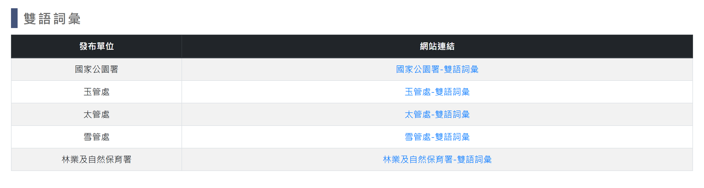

# 雙語詞彙

> **內容正本**：正式站 `https://hike.taiwan.gov.tw/information_8.aspx`（2026-09-16 實測 HTTP 200）。
> **擷取來源／日期**：`[待確認]` —— 撰寫時未記錄；2026-09-16 補溯源欄位時已無法回溯。
> 核對內容一律以正式站 `hike.taiwan.gov.tw` 為準，**不得改用測試站 `service.skyeyes.tw`**（兩站內容會不一致，理由見 `README.md`「溯源慣例」）。

## 一、列表頁

> 功能路徑：首頁 > 旅遊登山資訊 > 雙語詞彙  
> 頁面網址：information_8.aspx

- 雙語詞彙網站清單
  - 欄位：發布單位、網站連結。
  - 機關項目：
    - 國家公園署：[國家公園署-雙語詞彙](https://www.nps.gov.tw/ch/sglarticle/bilingualglossary)。
    - 玉管處：[玉管處-雙語詞彙](https://www.ysnp.gov.tw/BilingualVocabulary/C008000)。
    - 太管處：[太管處-雙語詞彙](https://www.taroko.gov.tw/News.aspx?n=5552&sms=10334)。
    - 雪管處：[雪管處-雙語詞彙](https://www.spnp.gov.tw/cp.aspx?n=14548)。
    - 林業及自然保育署：[林業及自然保育署-雙語詞彙](https://www.forest.gov.tw/bilingual)。
  - 網站連結：超連結，點擊後另開分頁開啟。

---

## 內部註記

- 舊系統技術架構：ASP.NET WebForms（`.aspx`）。
- 控制項識別碼：
  - 區塊標題樣式：`.block_title`。
- 外部機關網站連結均以另開新分頁（`target="_blank"`）開啟。
