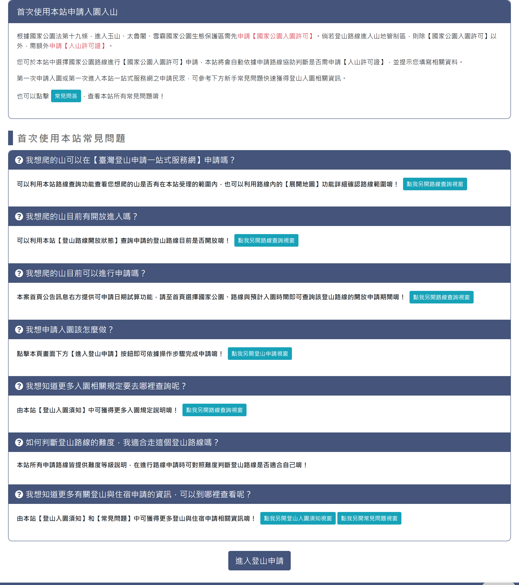

# 本站使用說明

## 一、說明頁

> 功能路徑：首頁 > 本站使用說明  
> 頁面網址：web_illustrate.aspx

- 首次使用本站申請入園入山
  - 說明內文：純文字，說明進入國家公園生態保護區申請規範與系統自動判斷入山許可機制。
  - 常見問答：按鈕，點擊後導向常見問答頁。
- 首次使用本站常見問題
  - 問答卡片清單（常態展開）：
    - 我想爬的山可以在【臺灣登山申請一站式服務網】申請嗎？
      - 解答：說明可利用本站路線查詢或【展開地圖】確認受理範圍。
      - 點我另開路線查詢視窗：按鈕，點擊後另開分頁開啟線上申請頁。
    - 我想爬的山目前有開放進入嗎？
      - 解答：說明可利用本站【登山路線開放狀態】查詢是否開放。
      - 點我另開路線查詢視窗：按鈕，點擊後另開分頁開啟登山路線開放狀態頁。
    - 我想爬的山目前可以進行申請嗎？
      - 解答：說明首頁提供可申請日期試算功能。
      - 點我另開路線查詢視窗：按鈕，點擊後另開分頁開啟首頁。
    - 我想申請入園該怎麼做？
      - 解答：說明點擊頁面下方【進入登山申請】按鈕依步驟完成申請。
      - 點我另開登山申請視窗：按鈕，點擊後另開分頁開啟線上申請頁。
    - 我想知道更多入園相關規定要去哪裡查詢呢？
      - 解答：說明可由本站【登山入園須知】獲得入園規定。
      - 點我另開路線查詢視窗：按鈕，點擊後另開分頁開啟登山須知頁。
    - 如何判斷登山路線的難度，我適合走這個登山路線嗎？
      - 解答：說明本站申請路線皆提供難度等級供對照判斷。
    - 我想知道更多有關登山與住宿申請的資訊，可以到哪裡查看呢？
      - 解答：說明可由本站【登山入園須知】和【常見問題】獲取相關資訊。
      - 點我另開登山入園須知視窗：按鈕，點擊後另開分頁開啟登山須知頁。
      - 點我另開常見問題視窗：按鈕，點擊後另開分頁開啟常見問答頁。
- 進入登山申請：按鈕，點擊後導向線上申請頁。

---

## 內部註記

- 舊系統技術架構：ASP.NET WebForms（`.aspx`）。
- 控制項識別碼：
  - 常見問題容器：`#accordion_member`（容器 ID 雖名為 accordion，但未套用 collapse 摺疊行為與切換按鈕，各項內容 `#collapse_01` 至 `#collapse_07` 均為常態展開呈現）。
  - 進入登山申請按鈕：導向 `apply_1.aspx`。
- 解答內部之輔助引導按鈕均以另開新分頁（`target="_blank"`）開啟。
