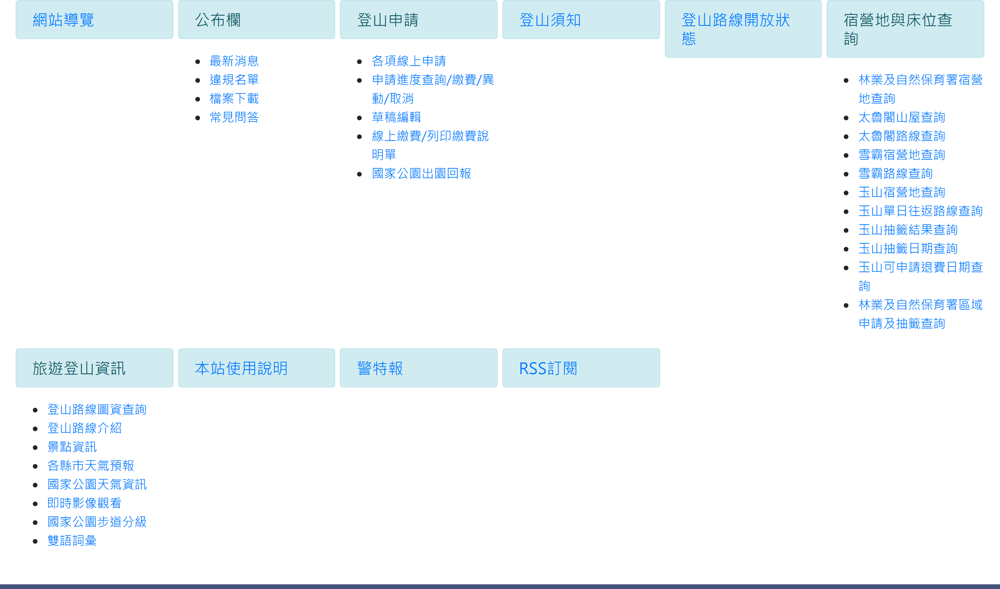

# 網站導覽

> **內容正本**：正式站 `https://hike.taiwan.gov.tw/site_map.aspx`（2026-09-16 實測 HTTP 200）。
> **擷取來源／日期**：`[待確認]` —— 撰寫時未記錄；2026-09-16 補溯源欄位時已無法回溯。
> 核對內容一律以正式站 `hike.taiwan.gov.tw` 為準，**不得改用測試站 `service.skyeyes.tw`**（兩站內容會不一致，理由見 `README.md`「溯源慣例」）。

## 一、列表頁

> 功能路徑：首頁 > 網站導覽  
> 頁面網址：site_map.aspx

- 導覽分類清單
  - 網站導覽：連結，點擊後導向網站導覽頁。
  - 公布欄：包含最新消息、違規名單、檔案下載、常見問答：連結，點擊後導向各對應頁面。
  - 登山申請：包含各項線上申請、申請進度查詢/繳費/異動/取消、草稿編輯、線上繳費/列印繳費說明單、國家公園出園回報：連結，點擊後導向各對應頁面。
  - 登山須知：連結，點擊後導向登山須知頁。
  - 登山路線開放狀態：連結，點擊後導向登山路線開放狀態頁。
  - 宿營地與床位查詢：包含林業及自然保育署宿營地查詢、太魯閣山屋查詢、太魯閣路線查詢、雪霸宿營地查詢、雪霸路線查詢、玉山宿營地查詢、玉山單日往返路線查詢、玉山抽籤結果查詢、玉山抽籤日期查詢、玉山可申請退費日期查詢、林業及自然保育署區域申請及抽籤查詢：連結，點擊後導向各對應頁面。
  - 旅遊登山資訊：包含登山路線圖資查詢、登山路線介紹、景點資訊、各縣市天氣預報、國家公園天氣資訊、即時影像觀看、國家公園步道分級、雙語詞彙：連結，點擊後導向各對應頁面。
  - 本站使用說明：連結，點擊後導向本站使用說明頁。
  - 警特報：連結，點擊後另開分頁開啟 [中央氣象署警特報](https://www.cwa.gov.tw/V8/C/P/Warning/FIFOWS.html)。
  - RSS訂閱：連結，點擊後導向 RSS 訂閱頁。

---

## 內部註記

- 舊系統技術架構：ASP.NET WebForms（`.aspx`）。
- 本功能為全站功能站點索引，除警特報為外部氣象署連結外，其餘皆為站內導向。
