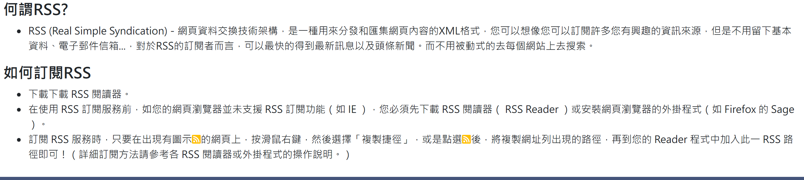

# RSS訂閱

> **內容正本**：正式站 `https://hike.taiwan.gov.tw/RssWeb.aspx`（2026-09-16 實測 HTTP 200）。
> **擷取來源／日期**：`[待確認]` —— 撰寫時未記錄；2026-09-16 補溯源欄位時已無法回溯。
> 核對內容一律以正式站 `hike.taiwan.gov.tw` 為準，**不得改用測試站 `service.skyeyes.tw`**（兩站內容會不一致，理由見 `README.md`「溯源慣例」）。

## 一、說明頁

> 功能路徑：首頁 > RSS訂閱  
> 頁面網址：RssWeb.aspx

- 說明內容
  - 何謂RSS：純文字段落，說明 RSS 網頁資料交換技術架構與資訊匯集機制。
  - 如何訂閱RSS：條列步驟說明，包含下載 RSS 閱讀器或瀏覽器外掛，以及複製 RSS 圖示捷徑路徑加入閱讀器之方式。

---

## 內部註記

- 舊系統技術架構：ASP.NET WebForms（`.aspx`）。
- 本功能為純靜態說明頁，提供民眾瞭解 RSS 運作原理與訂閱步驟。
- 站內實體 RSS Feed 產製端點為 `rss.aspx`。
