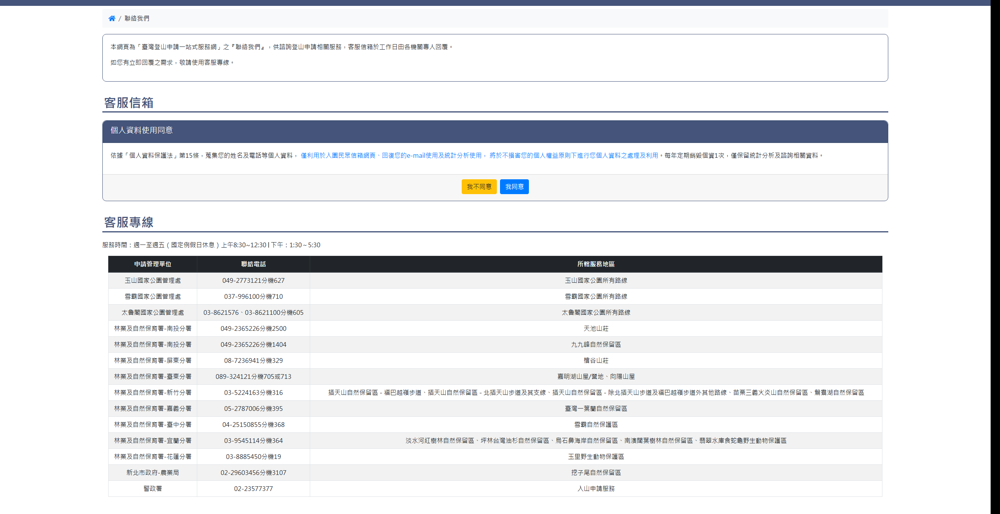
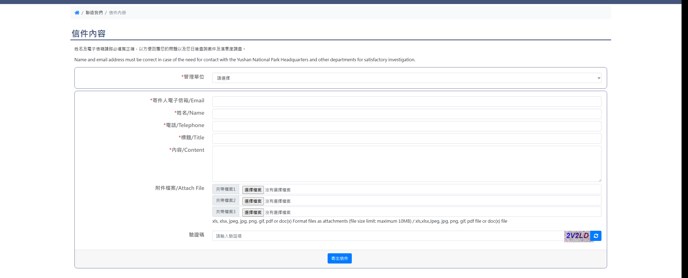

# 聯絡我們

> **內容正本**：正式站 `https://hike.taiwan.gov.tw/mail.aspx`（2026-09-16 實測 HTTP 200）。
> **擷取來源／日期**：`[待確認]` —— 撰寫時未記錄；2026-09-16 補溯源欄位時已無法回溯。
> 核對內容一律以正式站 `hike.taiwan.gov.tw` 為準，**不得改用測試站 `service.skyeyes.tw`**（兩站內容會不一致，理由見 `README.md`「溯源慣例」）。

> **業務數值核對狀態**（2026-09-16 對正式站 `hike.taiwan.gov.tw`）
> - ✔ **已核對**：個資告知全段 —— 2026-09-16 以正式站 `mail.aspx` 逐字比對，
>   原文為「依據「個人資料保護法」**第15條**，蒐集您的姓名及電話等個人資料，
>   僅利用於入園民眾信箱網頁、回復您的e-mail使用及統計分析使用，將於不損害您的個人
>   權益原則下進行您個人資料之處理及利用。**每年定期銷毀個資1次**，僅保留統計分析及
>   諮詢相關資料。」條次與銷毀頻率均與本份一致。
>   **法條本身亦已查證**：個人資料保護法第 15 條確為「公務機關對個人資料之蒐集或處理」
>   的法定要件（全國法規資料庫，2026-09-16）。
>   **與正式站一致，但正式站可能有誤**：第 15 條規範的是「蒐集或處理」，
>   「**利用**」是第 16 條；正式站原文寫第 15 條卻接「利用範圍」。
>   **條次照抄不改**——改了就與正式站不一致（判準見 `README.md`
>   「判『已核對』的兩條界線」第 2 條）。
> - `[待確認]` 附件「**3 組**、單檔上限 **10MB**」與允許副檔名清單：
>   `mail.aspx`／`mail_1.aspx` 的 GET 只回同意條款畫面，**表單本體要按「我同意」
>   postback 後才產生**，靜態抓不到。與 `07_草稿編輯.md` 的 5MB 不同，需一併確認。

## 一、個資同意與客服專線頁

> 功能路徑：首頁 > 聯絡我們  
> 頁面網址：mail.aspx

- 服務說明：純文字，說明供諮詢登山申請相關服務，客服信箱於工作日由各機關專人回覆；具即時回覆需求者使用客服專線。
- 客服信箱（個人資料使用同意）
  - 同意條款說明：純文字，依個人資料保護法第 15 條宣告蒐集姓名及電話之利用範圍（入園民眾信箱網頁、回復 e-mail、統計分析），每年定期銷毀個資 1 次。
  - 我不同意：按鈕，點擊後導向首頁（`web_index.aspx`）。
  - 我同意：按鈕，點擊後導向信件內容填寫頁（`mail_1.aspx`）。
- 客服專線
  - 服務時間說明：純文字，週一至週五（國定例假日休息）上午 8:30~12:30，下午 1:30~5:30。
  - 專線列表：
    - 欄位：申請管理單位、聯絡電話、所轄服務地區。

    | 申請管理單位 | 聯絡電話 | 所轄服務地區 |
    | --- | --- | --- |
    | 玉山國家公園管理處 | 049-2773121分機627 | 玉山國家公園所有路線 |
    | 雪霸國家公園管理處 | 037-996100分機710 | 雪霸國家公園所有路線 |
    | 太魯閣國家公園管理處 | 03-8621576、03-8621100分機605 | 太魯閣國家公園所有路線 |
    | 林業及自然保育署-南投分署 | 049-2365226分機2500 | 天池山莊 |
    | 林業及自然保育署-南投分署 | 049-2365226分機1404 | 九九峰自然保留區 |
    | 林業及自然保育署-屏東分署 | 08-7236941分機329 | 檜谷山莊 |
    | 林業及自然保育署-臺東分署 | 089-324121分機705或713 | 嘉明湖山屋/營地、向陽山屋 |
    | 林業及自然保育署-新竹分署 | 03-5224163分機316 | 插天山自然保留區（福巴越嶺、北插天山步道及其支線、其他路線）、苗栗三義火炎山自然保留區、鴛鴦湖自然保留區 |
    | 林業及自然保育署-嘉義分署 | 05-2787006分機395 | 臺灣一葉蘭自然保留區 |
    | 林業及自然保育署-臺中分署 | 04-25150855分機368 | 雪霸自然保護區 |
    | 林業及自然保育署-宜蘭分署 | 03-9545114分機364 | 淡水河紅樹林、坪林台灣油杉、烏石鼻海岸、南澳闊葉樹林自然保留區、翡翠水庫食蛇龜野生動物保護區 |
    | 林業及自然保育署-花蓮分署 | 03-8885450分機19 | 玉里野生動物保護區 |
    | 新北市政府-農業局 | 02-29603456分機3107 | 挖子尾自然保留區 |
    | 警政署 | 02-23577377 | 入山申請服務 |

---

## 二、信件內容填寫頁

> 功能路徑：首頁 > 聯絡我們 > 信件內容  
> 頁面網址：mail_1.aspx

- 填寫說明：純文字，中英雙語提示姓名與電子信箱填寫正確性要求。
- 信件表單
  - 管理單位：下拉選單，必選。選項為請選擇、太魯閣國家公園管理處、雪霸國家公園管理處、玉山國家公園管理處、自然保留區、自然保護區、野生動物保護區、國家步道(山屋/營地)、警政署入山許可證、系統問題反映，預設為請選擇。未選擇 → 顯示「請選擇國家公園」。
  - 管理單位連動欄位：
    - 選取「雪霸國家公園管理處」→ 顯示「登山申請編號」（單行文字輸入框，選填）。
    - 選取「玉山國家公園管理處」→ 顯示「分類」（核取方塊組，包含領隊異動、進度查詢、排雲繳／退費、其他、玉山E學苑學習問題、感謝回應、外籍遊客、第二次以上來信、入園系統問題、系統使用問題、入園資料異動、入園申請補件、遞補回覆、取消入園(一經取消無法恢復)、違規陳述意見、入園措施建議、一站式網申請建議、入園補報到）與「登山申請編號」（單行文字輸入框，選填）。
    - 選取「自然保留區」→ 顯示「保留區選單」（下拉選單，包含插天山、鴛鴦湖、苗栗三義火炎山等 17 處自然保留區）。
    - 選取「自然保護區」→ 顯示「保護區選單」（下拉選單，包含雪霸、甲仙四德化石等 6 處自然保護區）。
    - 選取「野生動物保護區」→ 顯示「保護區選單」（下拉選單，包含翡翠水庫食蛇龜、玉里等 2 處野生動物保護區）。
    - 選取「國家步道(山屋/營地)」→ 顯示「山屋選單」（下拉選單，選項為請選擇、天池、檜谷、嘉明湖/向陽，必選；未選擇 → 顯示「請選擇山屋」）。
  - 寄件人電子信箱/Email：單行文字輸入框，必填。未填寫 → 顯示「請填寫寄件人電子信箱/Email」；格式不合規範 → 顯示「電子郵件格式錯誤」。
  - 姓名/Name：單行文字輸入框，必填。未填寫 → 顯示「請填寫姓名」。
  - 電話/Telephone：單行文字輸入框，必填。未填寫 → 顯示「請填寫電話」。
  - 標題/Title：單行文字輸入框，必填。未填寫 → 顯示「請填寫標題」。
  - 內容/Content：多行文字輸入框（高度 5 列），必填。未填寫 → 顯示「請填寫內容」。
  - 附件檔案/Attach File：檔案選取框共 3 組（夾帶檔案1、夾帶檔案2、夾帶檔案3），選填。格式限制：xls、xlsx、jpeg、jpg、png、gif、pdf、doc、docx；單檔容量上限：10MB。`[待確認]`
  - 驗證碼：文字輸入框，必填。附圖形驗證碼及重新整理按鈕。
  - 寄出信件：按鈕，點擊後觸發前端欄位必填與格式檢核，通過後送出（依指示不執行實際送出測試）。

---

## 內部註記

- 舊系統技術架構：ASP.NET WebForms（`.aspx`）。
- 控制項識別碼：
  - 同意頁（`mail.aspx`）：
    - 我不同意按鈕：`ctl00$con$HyperLink1`（`#con_HyperLink1`，超連結導向 `web_index.aspx`）。
    - 我同意按鈕：`ctl00$con$HyperLink2`（`#con_HyperLink2`，超連結導向 `mail_1.aspx`）。
  - 信件內容頁（`mail_1.aspx`）：
    - 管理單位下拉選單：`ctl00$con$ddlOrg`（`#con_ddlOrg`，`onchange` 觸發 `__doPostBack`，非同步更新 UpdatePanel `#con_upOrg` 與 `#con_upCate17`）。
    - 保留/保護區下拉選單：`ctl00$con$ddlroom2`（`#con_ddlroom2`）。
    - 山屋下拉選單：`ctl00$con$ddlroom`（`#con_ddlroom`）。
    - 登山申請編號：`ctl00$con$txSerial`（`#con_txSerial`）。
    - 玉山信件分類：`ctl00$con$cblMailcate`（`#con_cblMailcate`，項號 0 至 17）。
    - 寄件人電子信箱：`ctl00$con$txEmail`（`#con_txEmail`）。
    - 姓名：`ctl00$con$txName`（`#con_txName`）。
    - 電話：`ctl00$con$txTel`（`#con_txTel`）。
    - 標題：`ctl00$con$txTitle`（`#con_txTitle`）。
    - 內容：`ctl00$con$txContent`（`#con_txContent`）。
    - 附件檔案：`ctl00$con$fuFile`、`ctl00$con$fuFile2`、`ctl00$con$fuFile3`。
    - 驗證碼輸入框：`ctl00$con$vcode`（`#con_vcode`）。
    - 驗證碼圖形：`#con_imgcode`（`CheckImageCode.aspx`）。
    - 寄出信件按鈕：`ctl00$con$btnSend`（`#btnSend`，點擊調用 `disableButtonOnce()`，驗證群組為 `validate`）。
- 前端檢核規則：
  - ASP.NET 驗證群組：`validate`。
  - 電子郵件格式正規表達式：`\w+([-+.']\w+)*@\w+([-.]\w+)*\.\w+([-.]\w+)*`。
  - 驗證碼更新函式：`changevcode()`，重新請求 `CheckImageCode.aspx`。
