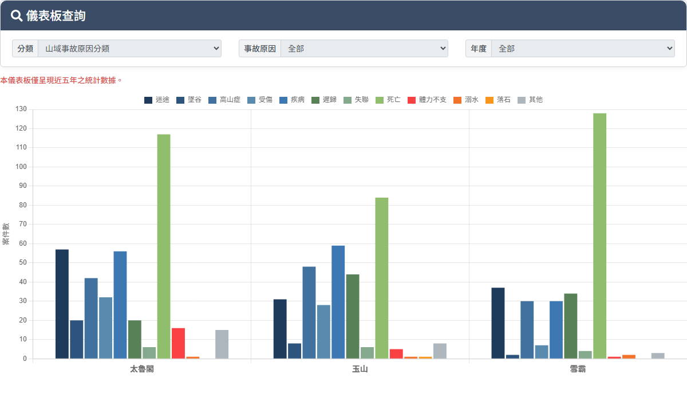

# 山域事故統計儀表板

## 一、展示頁

> 功能路徑：首頁 > 山域事故統計儀表板 / 快捷選單 > 學習登山者 > 山域事故儀表板  
> 頁面網址：MountainDashboard.aspx

- 查詢條件
  - 分類：下拉選單，選項為山域事故原因分類（預設）、山域事故登山路線分類、申請/實際入園隊伍數及總人數；變更時觸發 PostBack 更新次層篩選項目與圖表。
  - 次層篩選（依分類動態顯示）：
    - 分類為「山域事故原因分類」時顯示「事故原因」：下拉選單，選項為全部（預設）、迷路、遲歸、墜谷、疲勞、高山症、疾病、落石、創傷、天氣惡劣、動物攻擊、落雷、其它、不明；選定後即時更新圖表。
    - 分類為「山域事故登山路線分類」時顯示「登山路線」：下拉選單，選項依各機關路線動態載入。
    - 分類為「申請/實際入園隊伍數及總人數」時顯示對應入園維度篩選。
  - 年度：下拉選單，選項為全部（預設）、109、110、111、112、113、114（近五年與當年度）；選定後即時更新圖表。
  - 資料範圍提示：紅字標註「本儀表板僅呈現近五年之統計數據。」
- 統計圖表
  - 圖表型態：長條圖（Bar Chart，由 Chart.js 渲染至 Canvas）。
  - 橫軸（X 軸）：國家公園管理處（太魯閣、玉山、雪霸）。
  - 縱軸（Y 軸）：案件數（件）或人數/隊伍數。
  - 圖例說明：依原因、路線或年度顯示色標圖例，點擊圖例項可切換顯示/隱藏該數據組。

---

## 內部註記

- 舊系統技術架構：ASP.NET WebForms（`.aspx`）＋ UpdatePanel（`con_UpdatePanel2`）。
- 圖表套件：Chart.js（`js/chart.js`）。
- 控制項識別碼：
  - 分類下拉選單：`ctl00$con$MountainAccType`（`#con_MountainAccType`）。
  - 事故原因下拉選單：`ctl00$con$ddlReason`（`#con_ddlReason`，容器 `#con_pnlReason`）。
  - 年度下拉選單：`ctl00$con$ddlYear`（`#con_ddlYear`，容器 `#con_Panel1`）。
  - 圖表資料隱藏欄位：`ctl00$con$hfChartData`（`#con_hfChartData`，儲存圖表 JSON 字串）。
  - 圖表型態隱藏欄位：`ctl00$con$hfChartDataType`（`#con_hfChartDataType`）。
  - 圖表容器：`#chartContainer`，畫布 `#accidentChart`。
- 前端繪圖邏輯：
  - 頁面載入或 UpdatePanel 異步更新結束後，調用 `loadChartFromHiddenField()`。
  - 讀取 `#con_hfChartData` 之 JSON 字串解析為 `{ labels, colors, parks }`。
  - 依 `#con_hfChartDataType` 呼叫對應渲染函式：
    - 一般/原因：`initOrUpdateChart(chartData)`。
    - 路線（值為 "C"）：`initOrUpdateChart2(chartData)`。
    - 隊伍數及人數（陣列）：`initOrUpdateChart3(chartData)`。
