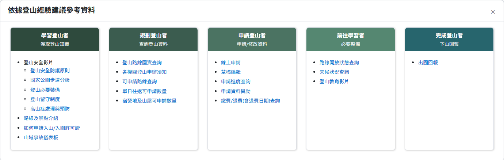

# 快捷選單

## 一、快捷選單-彈窗頁

> 功能路徑：全站右側浮動快捷按鈕 > 依據登山經驗建議參考資料  
> 頁面網址：全站共用元件（點擊浮動按鈕觸發 Bootstrap Modal `#search_modal`）

- 入口控制：常駐於全站右側中央浮動標籤「依據登山經驗建議參考資料」，點擊後開啟引導彈窗。
- 彈窗標題：依據登山經驗建議參考資料。
- 導引身分清單與功能連結：
  - 學習登山者（獲取登山知識）：
    - 登山安全影片：外部超連結，另開分頁開啟安全宣導影片。
    - 登山安全防護原則：導向 [登山須知](09_登山須知.md)（`notice.aspx`）。
    - 國家公園步道分級：導向 [國家公園步道分級](28_國家公園步道分級.md)（`information_6.aspx`）。
    - 登山必要裝備：導向 [登山須知](09_登山須知.md)（`notice.aspx`）。
    - 登山留守制度：導向 [登山須知](09_登山須知.md)（`notice.aspx`）。
    - 高山症處理與預防：導向 [登山須知](09_登山須知.md)（`notice.aspx`）。
    - 路線及景點介紹：導向 [景點資訊](24_景點資訊.md)（`information_place.aspx`）與 [登山路線介紹](23_登山路線介紹.md)（`information_1.aspx`）。
    - 如何申請入山/入園許可證：導向 [網站使用說明](30_本站使用說明.md)（`web_illustrate.aspx`）。
    - 山域事故儀表板：導向 [山域事故統計儀表板](35_山域事故統計儀表板.md)（`MountainDashboard.aspx`）。
  - 規劃登山者（查詢登山資料）：
    - 登山路線圖資查詢：導向 [登山路線圖資查詢](22_登山路線圖資查詢.md)（`web_map2.aspx`）。
    - 各機關登山申辦須知：導向 [登山須知](09_登山須知.md)（`notice.aspx`）。
    - 可申請路線查詢：導向 [登山路線開放狀態](10_登山路線開放狀態.md)（`open.aspx`）。
    - 單日往返可申請數量：導向 [玉山單日往返查詢](17_玉山單日往返路線查詢.md)（`bed_7.aspx`）。
    - 宿營地及山屋可申請數量：導向 [宿營地及山屋查詢](11_林業及自然保育署宿營地查詢.md)（`bed_0.aspx`）。
  - 申請登山者（申請/修改資料）：
    - 線上申請：導向 [草稿編輯](07_草稿編輯.md) 線上申請步驟（`apply_1.aspx`）。
    - 草稿編輯：導向 [草稿編輯](07_草稿編輯.md)（`apply_2_1.aspx`）。
    - 申請進度查詢：導向 [申請進度查詢與許可證下載](06a_申請進度查詢與許可證下載.md)（`applySearch.aspx`）。
    - 申請資料異動：導向 [申請資料異動及取消](06d_申請資料異動及取消.md)（`applySearch.aspx`）。
    - 繳費/退費(含退費日期)查詢：導向 [線上繳費(排雲山莊)](線上繳費(排雲山莊).md) 與 [線上申請退費(排雲山莊)](線上申請退費(排雲山莊).md)（`paySearch.aspx`）。
  - 前往學習者（必要整備）：
    - 路線開放狀態查詢：導向 [登山路線開放狀態](10_登山路線開放狀態.md)（`open.aspx`）。
    - 天候狀況查詢：導向 [氣象資訊](26_國家公園天氣資訊.md)（`information_3.aspx`）。
    - 登山教育影片：外部超連結，另開分頁開啟登山教育影音平台。
  - 完成登山者（下山回報）：
    - 出園回報：導向 [國家公園出園回報](08_國家公園出園回報.md)（`apply_6.aspx`）。
- 關閉：按鈕（右上角叉號圖示及點擊遮罩外圍），點擊後關閉彈窗並返回原瀏覽頁面。

---

## 內部註記

- 舊系統技術架構：全站 MasterPage（`site.master`）共用浮動面板與 Bootstrap Modal。
- 控制項識別碼：
  - 右側常駐浮動按鈕：`.quick_menu` / `#quick_menu`。
  - 彈窗容器：`#search_modal`（class：`modal fade`）。
  - 關閉按鈕：`.close`（帶 `data-dismiss="modal"` 屬性）。
  - 彈窗遮罩：Bootstrap Modal Backdrop（`.modal-backdrop`）。
