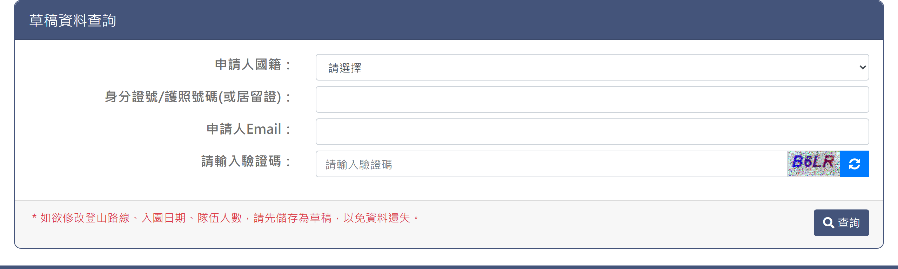

# 草稿編輯

## 一、查詢頁

> 功能路徑：首頁 > 登山申請 > 草稿編輯  
> 頁面網址：apply_2_1.aspx

- 草稿資料查詢
  - 申請人國籍：下拉選單，選項為請選擇、中華民國、國外，預設為請選擇。
  - 身分證號/護照號碼(或居留證)：文字輸入框；國籍為中華民國時檢核身分證字號或居留證號規則，國外時不檢核。
  - 申請人Email：文字輸入框，檢核 Email 格式。
  - 請輸入驗證碼：文字輸入框，附圖形驗證碼及重新整理按鈕。
  - 填寫提醒：純文字，紅字標註「＊如欲修改登山路線、入園日期、隊伍人數，請先儲存為草稿，以免資料遺失。」
  - 查詢：按鈕，點擊後清除前後空白並檢核必填欄位、證號規則、Email 格式與驗證碼；檢核通過後送出查詢。

---

## 內部註記

- 舊系統技術架構：ASP.NET WebForms（`.aspx`）。
- 控制項識別碼：
  - 申請人國籍：`ctl00$con$apply_nation`（`#con_apply_nation`）。
  - 身分證號/護照號碼(或居留證)：`ctl00$con$apply_sid`（`#con_apply_sid`）。
  - 申請人Email：`ctl00$con$apply_email`（`#con_apply_email`）。
  - 驗證碼輸入框：`ctl00$con$vcode`（`#con_vcode`）。
  - 驗證碼圖形：`#con_imgcode`（`CheckImageCode.aspx`）。
  - 查詢按鈕：`ctl00$con$btnappok`（`#con_btnappok`，觸發 `WebForm_DoPostBackWithOptions`，驗證群組 `validateapp`）。
- 前端檢核演算法：
  - 送出前呼叫 `trimdata()` 清除身分證號及 Email 前後空白。
  - `Check_sid()` 函式：包含 `UserNO()` 驗證本國身分證格式（首碼英文、次碼 1 或 2，加權檢查碼模 10），以及 `UserNO2()` 驗證居留證格式。
  - 驗證碼更新函式：`changevcode()`，累加計數重新請求 `CheckImageCode.aspx?a={i}`。
